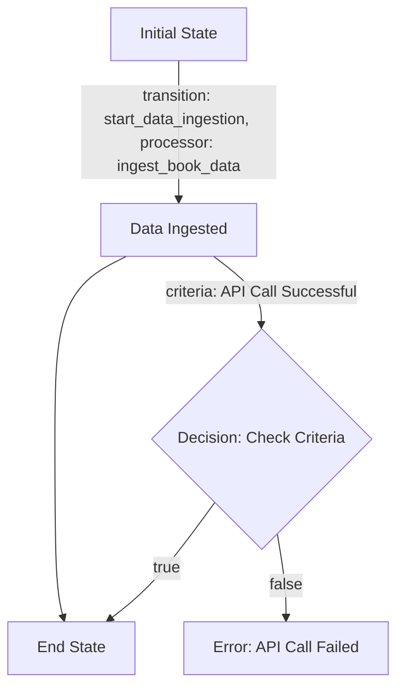
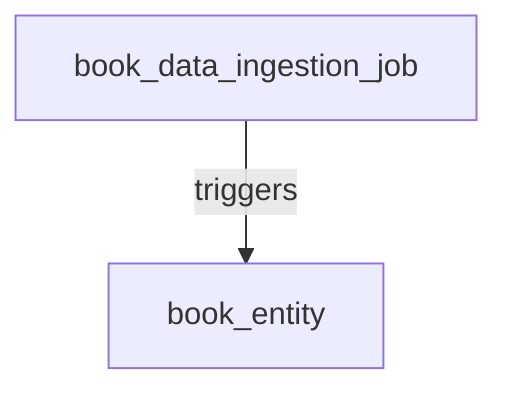
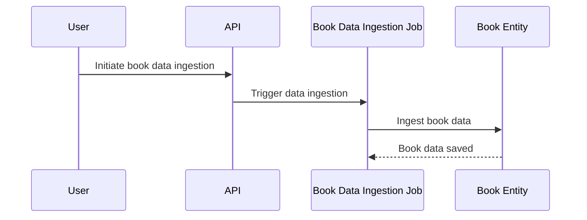

# Product Requirements Document (PRD) for Cyoda Design

## Introduction

This document provides an overview of the Cyoda-based application designed to manage the ingestion and enrichment of book data via an API. It explains how the Cyoda design aligns with the specified requirements, focusing on the structure of entities, workflows, and the event-driven architecture that powers the application. The design is represented in a Cyoda JSON format, which is translated into a human-readable document for clarity.

## What is Cyoda?

Cyoda is a serverless, event-driven framework that facilitates the management of workflows through entities representing jobs and data. Each entity has a defined state, and transitions between states are governed by events that occur within the system, enabling a responsive and scalable architecture.

### Cyoda Entity Database

In the Cyoda ecosystem, entities are fundamental components that represent processes and data. The Cyoda design JSON outlines several entities for our application:

1. **Book Data Ingestion Job (`book_data_ingestion_job`)**:
   - **Type**: JOB
   - **Source**: API_REQUEST
   - **Description**: This job is responsible for ingesting book data from the specified API.

2. **Book Entity (`book_entity`)**:
   - **Type**: EXTERNAL_SOURCES_PULL_BASED_RAW_DATA
   - **Source**: ENTITY_EVENT
   - **Description**: This entity stores the raw data of books that have been ingested by the ingestion job.

### Workflow Overview

The workflows in Cyoda define the processes tied to each job entity. The `book_data_ingestion_job` includes the following transition:

- **Start Data Ingestion**: This transition triggers the ingestion of book data from the API and creates the `book_entity`.

### Event-Driven Approach

An event-driven architecture allows the application to respond automatically to changes or triggers. In this specific requirement, the following events occur:

- **Data Ingestion**: Triggered by the job, which fetches the list of books from the API.
- **Saving Entities**: The raw data of books is saved as `book_entity`.

This approach promotes scalability and efficiency by allowing the application to handle each process step automatically without manual intervention.

### Flowchart for Book Data Ingestion Workflow

### Entity Relationships Diagram

### Sequence Diagram

## Actors Involved

- **User**: Initiates the API call for book data ingestion.
- **API**: Responsible for triggering the book data ingestion job.
- **Book Data Ingestion Job**: Central to managing the workflow of book data processing.
- **Book Entity**: Stores the ingested book data.

## Conclusion

The Cyoda design effectively aligns with the requirements for creating a robust application for fetching and enriching book data. By utilizing the event-driven model, the application efficiently manages state transitions of each entity involved, from data ingestion to saving the entities. The outlined entities, workflows, and events comprehensively cover the needs of the application.

This PRD serves as a foundation for implementation and development, guiding the technical team through the specifics of the Cyoda architecture while providing clarity for users who may be new to the Cyoda framework.