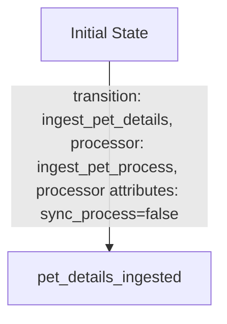
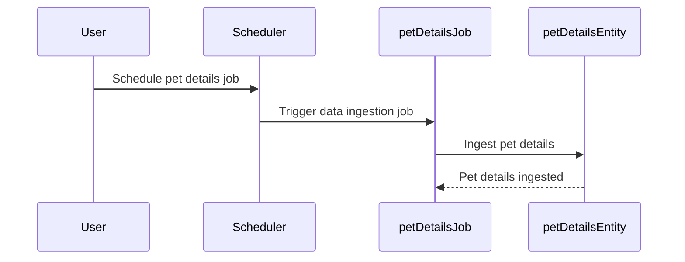
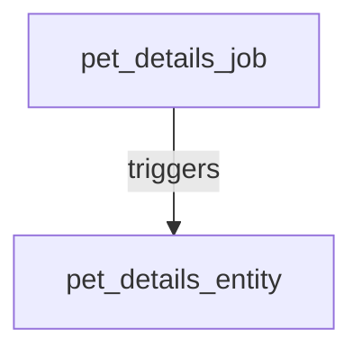

# Product Requirements Document (PRD) for Cyoda Design

## Introduction

This document outlines the Cyoda-based application designed to retrieve pet details based on different statuses: available, sold, and pending. It details how the Cyoda design aligns with the specified requirements, focusing on the structure of entities, workflows, and the event-driven architecture that powers the application. The design is represented in a Cyoda JSON format and is translated into a human-readable document for clarity.

## Cyoda Design Overview

The Cyoda design JSON describes a structured approach to managing workflows through entities that represent jobs and data. Each entity has a defined state, and transitions between states are governed by events that occur within the system, enabling a responsive and scalable architecture.

### Key Components of the Design

1. **Entities**: 
   - **pet_details_job** (JOB): This entity is responsible for ingesting pet details based on their statuses.
   - **pet_details_entity** (EXTERNAL_SOURCES_PULL_BASED_RAW_DATA): This entity stores the ingested pet details.

2. **Workflows**: The `pet_details_job` involves a single transition that initiates the ingestion of pet details from an API.

3. **Event-Driven Architecture**: The design leverages an event-driven model where the `pet_details_job` triggers the creation of `pet_details_entity` when data ingestion occurs.

## Workflows and Flowcharts

### Workflow Flowchart for pet_details_job

### Sequence Diagram

### Entity Relationships Diagram

## Conclusion

The Cyoda design effectively meets the requirements for building an application that retrieves pet details. By utilizing an event-driven architecture, the application can efficiently manage state transitions of each entity involved, from job initiation to data ingestion. The outlined entities, workflows, and events comprehensively cover the needs of the application, ensuring a smooth and automated process.

This PRD serves as a foundation for implementation and development, guiding the technical team through the specifics of the Cyoda architecture while providing clarity for users new to the Cyoda framework.