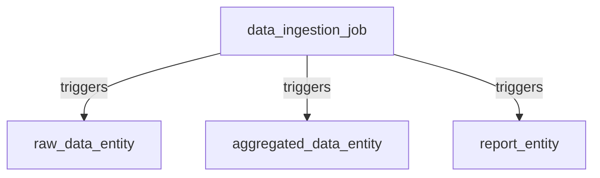
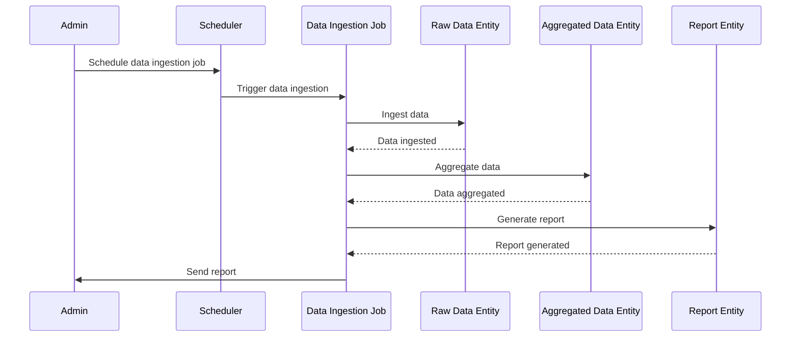

# Product Requirements Document (PRD) for Cyoda Design

## Introduction

This document provides an overview of the Cyoda-based application designed to manage data ingestion, aggregation, report generation, and email notification. It explains how the Cyoda design aligns with the specified requirements, focusing on the structure of entities, workflows, and the event-driven architecture that powers the application.

## What is Cyoda?

Cyoda is a serverless, event-driven framework that facilitates the management of workflows through entities representing jobs and data. Each entity has a defined state, and transitions between states are governed by events that occur within the system, enabling a responsive and scalable architecture.

### Cyoda Entity Database

In the Cyoda ecosystem, entities are fundamental components that represent processes and data. The following entities are defined in our application:

1. **Data Ingestion Job (`data_ingestion_job`)**:
   - **Type**: JOB
   - **Source**: SCHEDULED
   - **Description**: This job is responsible for ingesting data from specified sources at scheduled intervals (once a day). It initiates the data ingestion workflow and triggers the creation of raw data.

2. **Raw Data Entity (`raw_data_entity`)**:
   - **Type**: EXTERNAL_SOURCES_PULL_BASED_RAW_DATA
   - **Source**: ENTITY_EVENT
   - **Description**: This entity stores the raw data that has been ingested by the data ingestion job. It is created as a result of the data ingestion process.

3. **Aggregated Data Entity (`aggregated_data_entity`)**:
   - **Type**: SECONDARY_DATA
   - **Source**: ENTITY_EVENT
   - **Description**: This entity holds the aggregated data derived from the raw data for reporting purposes. It is created from the raw data entity.

4. **Report Entity (`report_entity`)**:
   - **Type**: SECONDARY_DATA
   - **Source**: ENTITY_EVENT
   - **Description**: This entity contains the generated report that is sent to the admin via email after aggregation of data.

### Entity Diagram

```mermaid
graph TD;
    A[data_ingestion_job] -->|triggers| B[raw_data_entity];
    A -->|triggers| C[aggregated_data_entity];
    A -->|triggers| D[report_entity];
```

## Workflow Overview

The workflows in Cyoda define how each job entity operates through a series of transitions. The `data_ingestion_job` includes a singular workflow that outlines the following transition:

- **Start Data Ingestion**: This transition starts the data ingestion process from the specified data source, capturing the raw data and marking the state as "data_ingested".

### Sequence Diagram

```mermaid
sequenceDiagram
    participant Admin
    participant Scheduler
    participant Data Ingestion Job
    participant Raw Data Entity
    participant Aggregated Data Entity
    participant Report Entity

    Admin->>Scheduler: Schedule data ingestion job
    Scheduler->>Data Ingestion Job: Trigger data ingestion
    Data Ingestion Job->>Raw Data Entity: Ingest data
    Raw Data Entity-->>Data Ingestion Job: Data ingested
    Data Ingestion Job->>Aggregated Data Entity: Aggregate data
    Aggregated Data Entity-->>Data Ingestion Job: Data aggregated
    Data Ingestion Job->>Report Entity: Generate report
    Report Entity-->>Data Ingestion Job: Report generated
    Data Ingestion Job->>Admin: Send report
```

## Event-Driven Approach

An event-driven architecture allows the application to respond automatically to changes or triggers. In this specific requirement, the following events occur:

1. **Data Ingestion**: The data ingestion job is triggered on a scheduled basis, automatically initiating the process of fetching data from the specified source.
2. **Data Aggregation**: Once the data ingestion is complete, an event signals the need to aggregate the ingested data.
3. **Report Generation and Sending**: After the aggregation is finalized, another event triggers the creation of the report and sending it to the admin's email.

This approach promotes scalability and efficiency by allowing the application to handle each process step automatically without manual intervention.

### Actors Involved

- **Admin**: The recipient of the generated reports via email.
- **Scheduler**: Responsible for triggering the data ingestion job as per the defined schedule.
- **Data Ingestion Job**: Central entity managing the workflow of data processing.
- **Raw Data Entity**: Stores the ingested raw data.
- **Aggregated Data Entity**: Holds the processed and aggregated data.
- **Report Entity**: Contains the generated report.

## Conclusion

The Cyoda design effectively aligns with the requirements for creating a robust data processing application. By utilizing the event-driven model, the application efficiently manages state transitions of each entity involved, from data ingestion to report delivery. The outlined entities, workflows, and events comprehensively cover the needs of the application, ensuring a smooth and automated process.

This PRD serves as a foundation for implementation and development, guiding the technical team through the specifics of the Cyoda architecture while providing clarity for users who may be new to the Cyoda framework.