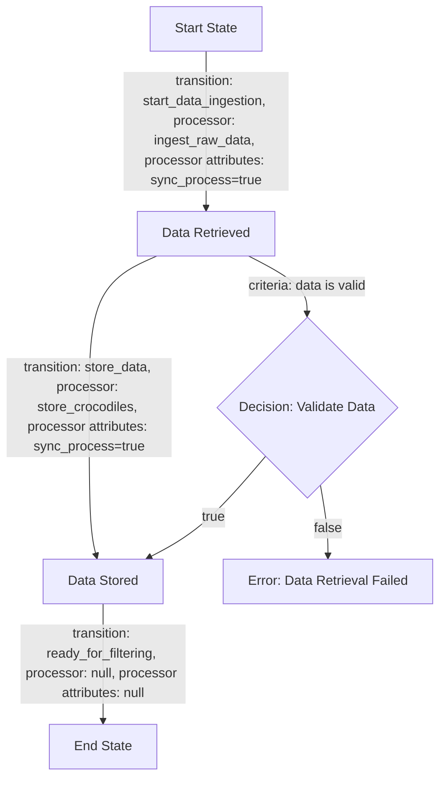

Sure! Here's the complete Product Requirements Document (PRD) for your crocodile data management application, incorporating all the discussed elements and examples.

---

# Product Requirements Document (PRD) for Crocodile Data Management Application

## Introduction

This document outlines the requirements for a Crocodile Data Management Application designed to ingest, store, and manage data about crocodiles. The application will retrieve data from an external API, allow for user-defined filtering, and provide an efficient way to manage crocodile information.

## Overview

### Goals
- To fetch data about crocodiles from the provided API.
- To store this data in a structured format.
- To enable users to filter the data based on specific criteria (name, sex, age).

### Target Audience
- Administrators who manage the crocodile data.
- Users who wish to filter and view crocodile information.

## Key Features

1. **Data Ingestion**: Automatically fetches and stores crocodile data from the API.
2. **Data Storage**: Maintains data in a structured format for efficient access.
3. **User Filtering**: Allows users to filter the crocodile data by name, sex, and age.

## Entity Definitions

### 1. Crocodile Entity
- **Type**: DATA
- **Source**: EXTERNAL_SOURCES_PULL_BASED_RAW_DATA
- **Example Data**:
    ```json
    {
      "id": 1,
      "name": "Bert",
      "sex": "M",
      "date_of_birth": "2010-06-27",
      "age": 14
    }
    ```

### 2. Filter Criteria Entity
- **Type**: CONFIG
- **Source**: USER_INPUT
- **Example Data**:
    ```json
    {
      "name": "Bert",
      "sex": "M",
      "minAge": 0,
      "maxAge": 20
    }
    ```

## Workflows

### Crocodile Data Ingestion Job Workflow

This workflow manages the process of retrieving and storing crocodile data.

**Flowchart for the Crocodile Data Ingestion Job Workflow**

```mermaid
flowchart TD
   A[Start State] -->|transition: start_data_ingestion, processor: ingest_raw_data, processor attributes: sync_process=true| B[Data Retrieved]
   B -->|transition: store_data, processor: store_crocodiles, processor attributes: sync_process=true| C[Data Stored]
   C -->|transition: ready_for_filtering, processor: null, processor attributes: null| D[End State]

   %% Decision point for data validation
   B -->|criteria: data is valid| D1{Decision: Validate Data}
   D1 -->|true| C
   D1 -->|false| E[Error: Data Retrieval Failed]

   class A,B,C,D,D1 automated;
```

### Workflow Launch Information
- The workflow is initiated on a scheduled basis or through user action.
- It fetches data from the API, validates it, and stores it in the Crocodile entity.

## Event-Driven Architecture

The application implements an event-driven approach where:
- Events are emitted when a Crocodile entity is created or updated, notifying other components of the application.
- These events trigger workflows for further processing or user notifications.

## Conclusion

The Crocodile Data Management Application is designed to efficiently manage data ingestion, storage, and filtering of crocodile information. By leveraging an event-driven architecture and clear entity definitions, the application will provide a seamless experience for users.

This PRD serves as a foundation for development and implementation, ensuring all team members are aligned with the project's goals and requirements.

---

Feel free to reach out if you need any modifications or additional sections included!