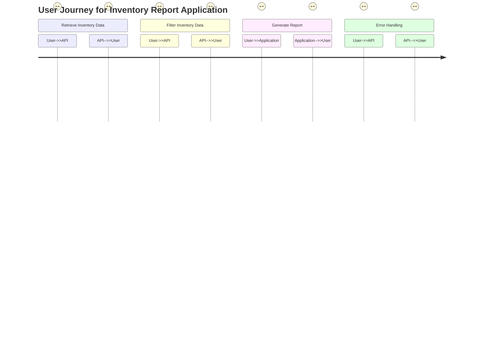
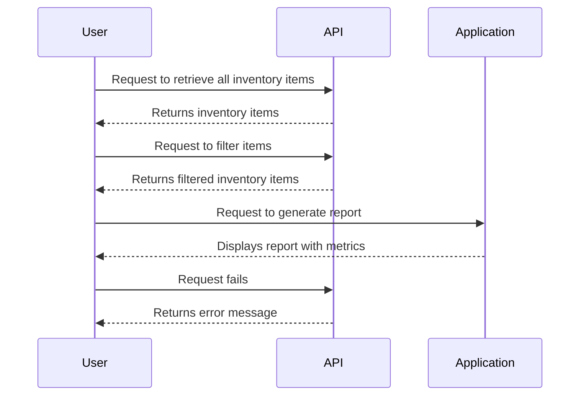
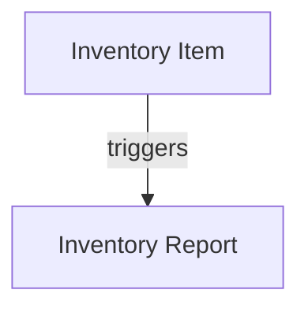
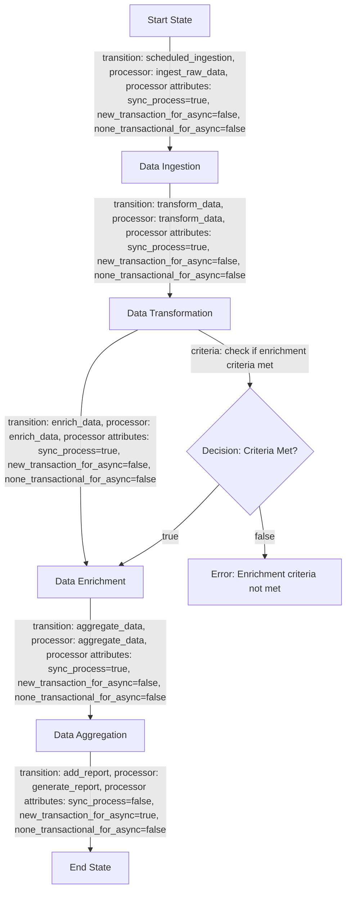

Sure! Here’s a complete Product Requirements Document (PRD) for your inventory report application. It covers all the necessary aspects, including introduction, user requirements, entities, workflows, and more.

---

# Product Requirements Document (PRD) for Inventory Report Application

## Introduction

This document outlines the requirements for an application designed to generate reports based on inventory data retrieved from the SwaggerHub API. The application will analyze inventory items, calculate key metrics, and present the information in a user-friendly format.

## User Requirements

### User Stories

1. **As a user**, I want to retrieve all inventory items from the API so that I can see the complete inventory list.
2. **As a user**, I want to filter inventory items based on specific criteria (like category, price range, etc.) so that I can focus on relevant data.
3. **As a user**, I want to view key metrics like total number of items, average price, and total value in the reports so that I can understand the inventory at a glance.
4. **As a user**, I want to see the reports presented in a table or chart format so that the information is easy to read.
5. **As a user**, I want to receive clear error messages if something goes wrong when retrieving data so that I know how to fix the issue.

### User Journey Diagram


```mermaid
journey
    title User Journey for Inventory Report Application
    section Retrieve Inventory Data
      User->>API: Request to retrieve all inventory items
      API-->>User: Returns inventory items
    section Filter Inventory Data
      User->>API: Request to filter items
      API-->>User: Returns filtered inventory items
    section Generate Report
      User->>Application: Request to generate report
      Application-->>User: Displays report with metrics
    section Error Handling
      User->>API: Request fails
      API-->>User: Returns error message
```

### Sequence Diagram


```mermaid
sequenceDiagram
    participant User
    participant API
    participant Application

    User->>API: Request to retrieve all inventory items
    API-->>User: Returns inventory items
    User->>API: Request to filter items
    API-->>User: Returns filtered inventory items
    User->>Application: Request to generate report
    Application-->>User: Displays report with metrics
    User->>API: Request fails
    API-->>User: Returns error message
```

## Entities Outline

### Entities

1. **Inventory Item**
   - **Type**: `RAW_DATA`
   - **Source**: `EXTERNAL_SOURCES_PULL_BASED_RAW_DATA`
   - **Description**: Holds the raw data retrieved from the SwaggerHub API, representing individual inventory items.
   - **Example JSON**:
   ```json
   {
     "id": "1",
     "name": "Sample Inventory Item",
     "category": "Electronics",
     "price": 299.99,
     "quantity": 50,
     "description": "High-quality electronic item.",
     "timestamp": "2023-10-10T10:00:00Z"
   }
   ```

2. **Inventory Report**
   - **Type**: `SECONDARY_DATA`
   - **Source**: `ENTITY_EVENT`
   - **Description**: Stores the generated reports summarizing key metrics.
   - **Example JSON**:
   ```json
   {
     "id": "report_2023-10-10",
     "date_generated": "2023-10-10T10:00:00Z",
     "total_items": 100,
     "average_price": 150.00,
     "total_value": 15000.00,
     "metrics": [
       {
         "category": "Electronics",
         "item_count": 50,
         "average_price": 299.99
       },
       {
         "category": "Apparel",
         "item_count": 50,
         "average_price": 50.00
       }
     ]
   }
   ```

### Entities Diagram


```mermaid
graph TD;
    A[Inventory Item] -->|triggers| B[Inventory Report];
```

## Proposed Workflow for Inventory Report Job

### Workflow Launching Information

- The workflow is launched on a scheduled basis (e.g., daily) or via a user-triggered event, such as a request for a report.

### Inventory Report Job Workflow


```mermaid
flowchart TD
   A[Start State] -->|transition: scheduled_ingestion, processor: ingest_raw_data, processor attributes: sync_process=true, new_transaction_for_async=false, none_transactional_for_async=false| B[Data Ingestion]
   B -->|transition: transform_data, processor: transform_data, processor attributes: sync_process=true, new_transaction_for_async=false, none_transactional_for_async=false| C[Data Transformation]
   C -->|transition: enrich_data, processor: enrich_data, processor attributes: sync_process=true, new_transaction_for_async=false, none_transactional_for_async=false| D[Data Enrichment]
   D -->|transition: aggregate_data, processor: aggregate_data, processor attributes: sync_process=true, new_transaction_for_async=false, none_transactional_for_async=false| E[Data Aggregation]
   E -->|transition: add_report, processor: generate_report, processor attributes: sync_process=false, new_transaction_for_async=true, none_transactional_for_async=false| F[End State]

   %% Decision point for criteria
   C -->|criteria: check if enrichment criteria met| D1{Decision: Criteria Met?}
   D1 -->|true| D
   D1 -->|false| E1[Error: Enrichment criteria not met]

   class A,B,C,D,E,F automated;
```

## Conclusion

This PRD effectively captures the requirements for the inventory report application, including user needs, workflows, and entity definitions. The proposed design ensures the application can efficiently generate inventory reports while providing a user-friendly interface.

If you have any suggestions, changes, or additional details you'd like to include, just let me know! 😊