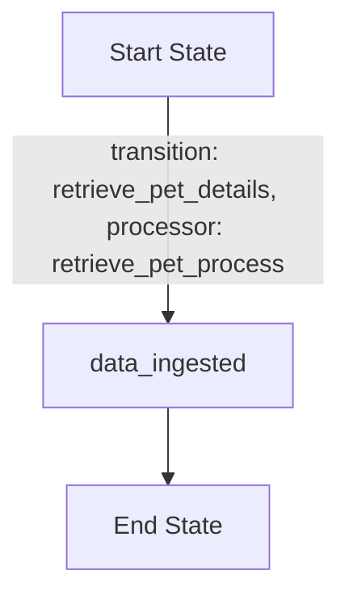
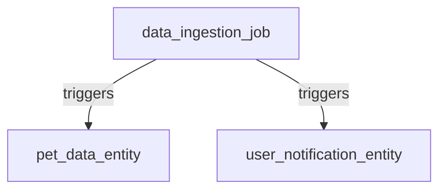
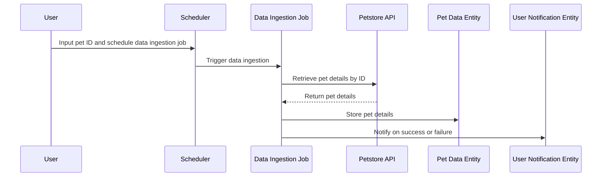

# Product Requirements Document (PRD) for Cyoda Design

## Introduction

This document outlines the Cyoda-based application designed to retrieve pet details from the Petstore API. The application includes functionality for data ingestion, user interaction, and notifications. It explains how the Cyoda design corresponds with the specified requirements, detailing the structure of entities, workflows, and the event-driven architecture that powers the application.

## What is Cyoda?

Cyoda is a serverless, event-driven framework that facilitates the management of workflows through entities representing jobs and data. Each entity has a defined state, and transitions between states are governed by events within the system, enabling a responsive and scalable architecture.

### Cyoda Entity Database

The Cyoda design JSON outlines the following entities for our application:

1. **Data Ingestion Job (`data_ingestion_job`)**:
   - **Type**: JOB
   - **Source**: SCHEDULED
   - **Description**: This job is responsible for retrieving pet details from the Petstore API using a specific pet ID.
   - **Workflow**: Contains one transition to ingest data.

2. **Pet Data Entity (`pet_data_entity`)**:
   - **Type**: EXTERNAL_SOURCES_PULL_BASED_RAW_DATA
   - **Source**: ENTITY_EVENT
   - **Description**: This entity stores the raw pet data retrieved from the Petstore API.

3. **User Notification Entity (`user_notification_entity`)**:
   - **Type**: SECONDARY_DATA
   - **Source**: ENTITY_EVENT
   - **Description**: This entity sends notifications to users, informing them if an invalid pet ID is entered.

### Event-Driven Approach

The event-driven architecture allows the application to respond automatically to changes or triggers. Specifically, the application will:

1. Utilize an event to trigger the data ingestion job when a user inputs a new pet ID.
2. Retrieve pet details from the Petstore API and store the data in the `pet_data_entity`.
3. Notify users through the `user_notification_entity` if an invalid pet ID is provided.

This approach enhances scalability and efficiency by enabling automatic processing without manual intervention.

## Workflow Overview

### Flowchart for Data Ingestion Job Workflow

```mermaid
flowchart TD
    A[Start State] -->|transition: retrieve_pet_details, processor: retrieve_pet_process| B[data_ingested]
    B --> C[End State]

    class A,B,C automated;
```

### Entity Diagram

```mermaid
graph TD;
    A[data_ingestion_job] -->|triggers| B[pet_data_entity];
    A -->|triggers| C[user_notification_entity];
```

### Sequence Diagram

```mermaid
sequenceDiagram
    participant User
    participant Scheduler
    participant Data Ingestion Job
    participant Petstore API
    participant Pet Data Entity
    participant User Notification Entity

    User->>Scheduler: Input pet ID and schedule data ingestion job
    Scheduler->>Data Ingestion Job: Trigger data ingestion
    Data Ingestion Job->>Petstore API: Retrieve pet details by ID
    Petstore API-->>Data Ingestion Job: Return pet details
    Data Ingestion Job->>Pet Data Entity: Store pet details
    Data Ingestion Job->>User Notification Entity: Notify on success or failure
```

### Actors Involved

- **User**: Inputs a pet ID and triggers data ingestion.
- **Scheduler**: Manages the scheduling of the data ingestion job.
- **Data Ingestion Job**: Central entity managing the workflow of retrieving pet details.
- **Petstore API**: Source for retrieving pet data.
- **Pet Data Entity**: Stores the retrieved pet data.
- **User Notification Entity**: Sends notifications to the user.

## Conclusion

The Cyoda design effectively aligns with the requirements for creating a responsive application to retrieve pet details from the Petstore API. By utilizing the event-driven model, the application can efficiently manage state transitions of each entity involved, from data ingestion to user notifications. The outlined entities, workflows, and events comprehensively cover the needs of the application, ensuring a smooth and automated process.

This PRD serves as a foundation for implementation and development, guiding the technical team through the specifics of the Cyoda architecture while providing clarity for users who may be new to the Cyoda framework.