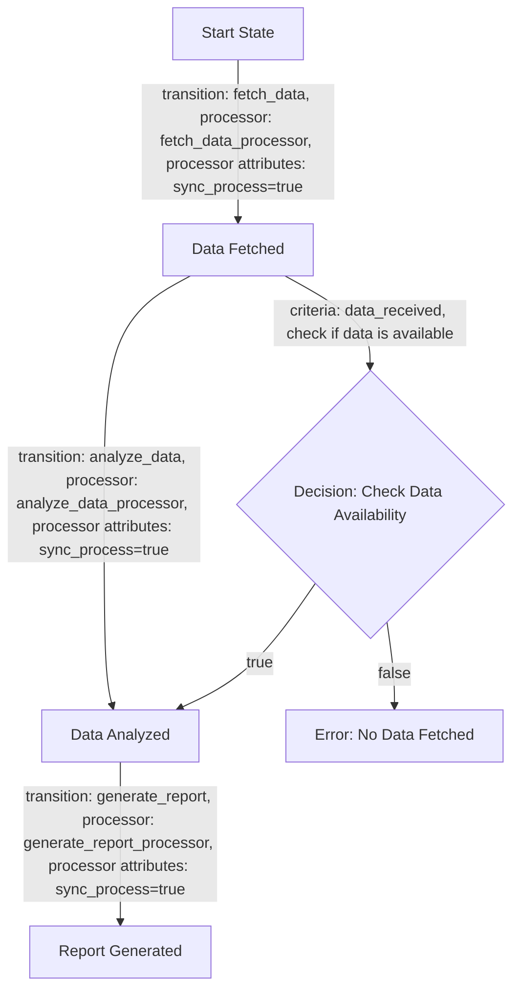

Sure! Here’s a complete Product Requirements Document (PRD) based on your requirement to download and analyze London Houses Data, along with the workflows and entities we've discussed.

---

# Product Requirements Document (PRD) for London Houses Data Application

## Introduction

This document outlines the application designed to download data about houses in London, analyze it, and generate a report based on the analysis. It explains the structure of entities, workflows, and the event-driven architecture that powers the application.

## What is Cyoda?

Cyoda is a serverless, event-driven framework that facilitates the management of workflows through entities representing jobs and data. Each entity has a defined state, and transitions between states are governed by events that occur within the system, enabling a responsive and scalable architecture.

## Entities Overview

### 1. Data Download Entity
- **Name**: `london_houses_data`
- **Type**: `EXTERNAL_SOURCES_PULL_BASED_RAW_DATA`
- **Source**: `API_REQUEST`
- **Description**: Stores raw data downloaded from the houses data source.
- **JSON Example**:
```json
{
  "entity_name": "london_houses_data",
  "entity_type": "EXTERNAL_SOURCES_PULL_BASED_RAW_DATA",
  "entity_source": "API_REQUEST",
  "data": {
    "url": "https://example.com/api/london_houses",
    "method": "GET",
    "headers": {
      "accept": "application/json"
    },
    "status": "fetched",
    "fetched_at": "2023-10-01T10:00:00Z"
  }
}
```

### 2. Data Analysis Entity
- **Name**: `analyzed_houses_data`
- **Type**: `SECONDARY_DATA`
- **Source**: `ENTITY_EVENT`
- **Description**: Contains the transformed and analyzed data from the `london_houses_data`.
- **JSON Example**:
```json
{
  "entity_name": "analyzed_houses_data",
  "entity_type": "SECONDARY_DATA",
  "entity_source": "ENTITY_EVENT",
  "data": {
    "analysis_results": {
      "average_price": 500000,
      "most_common_type": "Detached",
      "total_properties": 150
    },
    "analyzed_at": "2023-10-01T10:05:00Z"
  }
}
```

### 3. Report Entity
- **Name**: `houses_report`
- **Type**: `SECONDARY_DATA`
- **Source**: `ENTITY_EVENT`
- **Description**: Holds the generated report based on the analyzed data.
- **JSON Example**:
```json
{
  "entity_name": "houses_report",
  "entity_type": "SECONDARY_DATA",
  "entity_source": "ENTITY_EVENT",
  "data": {
    "report_id": "report_2023_london_houses",
    "generated_at": "2023-10-01T10:10:00Z",
    "report_summary": "This report provides an overview of the London housing market.",
    "report_content": {
      "average_price": 500000,
      "most_common_type": "Detached",
      "total_properties": 150
    }
  }
}
```

## Proposed Workflow

### Orchestration Entity: `data_download_orchestration`
- **Type**: `API_REQUEST`
- **Workflow**: This workflow will handle the entire process by triggering the download of London Houses Data, running analysis, and generating the report.

#### Workflow Transitions
1. **Fetch Data**: This transition initiates the fetching of data from the external API.
2. **Analyze Data**: This transition processes and analyzes the data using pandas.
3. **Generate Report**: This transition creates a report based on the analyzed data.

### Flowchart Representation of the Workflow


```mermaid
flowchart TD
   A[Start State] -->|transition: fetch_data, processor: fetch_data_processor, processor attributes: sync_process=true| B[Data Fetched]
   B -->|transition: analyze_data, processor: analyze_data_processor, processor attributes: sync_process=true| C[Data Analyzed]
   C -->|transition: generate_report, processor: generate_report_processor, processor attributes: sync_process=true| D[Report Generated]

   %% Decision point for criteria
   B -->|criteria: data_received, check if data is available| D1{Decision: Check Data Availability}
   D1 -->|true| C
   D1 -->|false| E[Error: No Data Fetched]

   class A,B,C,D,D1,E automated;
```

## Event-Driven Architecture

In this application, when an entity is saved or updated, it emits an event. For example:
- When the `london_houses_data` is fetched, it triggers an event that leads to the creation of `analyzed_houses_data`.
- Once the analysis is complete, another event triggers the creation of `houses_report`.

This means that the application can react to changes automatically, ensuring a smooth workflow.

## Conclusion

This PRD outlines a structured approach to building the application for downloading, analyzing, and reporting on London Houses Data, utilizing the capabilities of the Cyoda framework. By leveraging event-driven architecture and clear workflows, the application can operate efficiently and responsively.

Let me know if you have any questions or need any further adjustments! I'm here for you! 😊