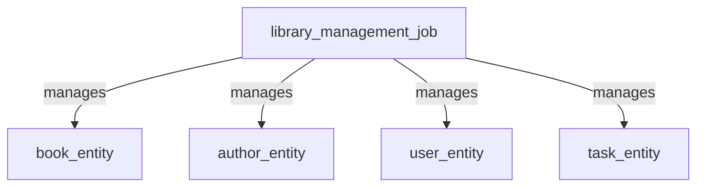
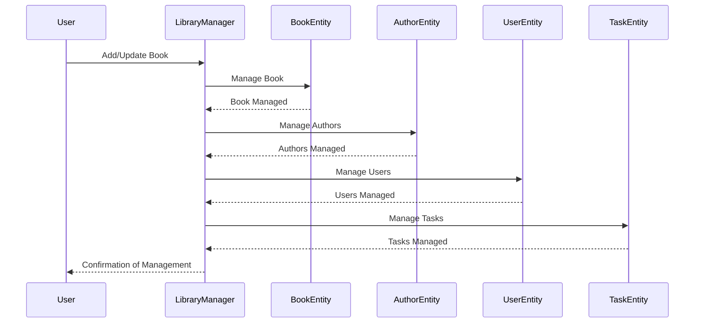

# Product Requirement Document (PRD) for Library Manager Pro

## Overview

The Library Manager Pro is a comprehensive library management system designed to facilitate the management of books, authors, users, and tasks effectively. This document outlines the Cyoda design that supports the functionalities outlined in the requirements, employing an event-driven architecture to orchestrate workflows.

## What is Cyoda?

Cyoda is an event-driven application platform that manages workflows through entity events. Each entity represents a specific data type or operation and transitions between states based on defined triggers. In Cyoda, entities are the building blocks of the application, and they can be linked to create complex workflows.

### Cyoda Entity Database
- **Entity**: An entity can represent various data types, such as jobs, raw data, or secondary data. It includes metadata and specific attributes relevant to its function.
- **External Sources**: Entities may also represent data sourced from external systems, such as APIs, which can be pulled or pushed based on events.
- **Workflows**: Workflows define how entities interact, evolve, and respond to various events, acting like state machines that manage the lifecycle of each entity.

## Event-Driven Architecture

In the context of Library Manager Pro, the event-driven approach enables the system to respond dynamically to changes and actions. Each user action, such as adding or updating a book, triggers an event that activates the corresponding workflow.

### How It Works
1. **Triggers**: User actions or scheduled events trigger workflows.
2. **State Transitions**: Each entity transitions between states (e.g., from "None" to "books_managed") based on the defined workflow.
3. **Processes**: Each transition is associated with a process that carries out specific operations, such as managing books, authors, users, and tasks.
4. **Event Emission**: When entities are created, modified, or deleted, events are emitted, which can trigger further workflows or actions.

## Cyoda Design JSON Explained

The Cyoda design JSON defines the entities and workflows for the Library Manager Pro application as follows:

### Entities

1. **library_management_job**: 
   - **Type**: JOB
   - **Source**: SCHEDULED
   - **Description**: This job orchestrates the entire management of the library components. It triggers workflows for managing books, authors, users, and tasks.

2. **book_entity**:
   - **Type**: EXTERNAL_SOURCES_PULL_BASED_RAW_DATA
   - **Source**: ENTITY_EVENT
   - **Description**: Represents the data related to books in the library. It will be populated by the job when books are managed.

3. **author_entity**:
   - **Type**: EXTERNAL_SOURCES_PULL_BASED_RAW_DATA
   - **Source**: ENTITY_EVENT
   - **Description**: Represents the data for authors linked to the books.

4. **user_entity**:
   - **Type**: EXTERNAL_SOURCES_PULL_BASED_RAW_DATA
   - **Source**: ENTITY_EVENT
   - **Description**: Represents the users who interact with the library system.

5. **task_entity**:
   - **Type**: EXTERNAL_SOURCES_PULL_BASED_RAW_DATA
   - **Source**: ENTITY_EVENT
   - **Description**: Represents tasks assigned to users in the library management system.

### Workflows

Each job and entity has defined workflows that specify the transitions and processes:
- The **library_management_job** manages transitions for handling books, authors, users, and tasks through a sequential process where each step must be completed before proceeding to the next.

### Diagrams

#### Entity Diagram

```mermaid
graph TD;
    A[library_management_job]
    A -->|manages| B[book_entity]
    A -->|manages| C[author_entity]
    A -->|manages| D[user_entity]
    A -->|manages| E[task_entity]
```

#### Sequence Diagram

```mermaid
sequenceDiagram
    participant User
    participant LibraryManager
    participant BookEntity
    participant AuthorEntity
    participant UserEntity
    participant TaskEntity

    User->>LibraryManager: Add/Update Book
    LibraryManager->>BookEntity: Manage Book
    BookEntity-->>LibraryManager: Book Managed
    LibraryManager->>AuthorEntity: Manage Authors
    AuthorEntity-->>LibraryManager: Authors Managed
    LibraryManager->>UserEntity: Manage Users
    UserEntity-->>LibraryManager: Users Managed
    LibraryManager->>TaskEntity: Manage Tasks
    TaskEntity-->>LibraryManager: Tasks Managed
    LibraryManager-->>User: Confirmation of Management
```

## Conclusion

The Cyoda design for the Library Manager Pro effectively aligns with the requirements by leveraging an event-driven architecture that promotes scalability and responsiveness. Each component—jobs, entities, transitions, and workflows—collaborates to create a seamless library management experience, enabling users to efficiently manage books, authors, users, and tasks through intuitive interactions with the system. 

This document serves as a foundational overview of the Cyoda design and its alignment with the business goals of the Library Manager Pro application.