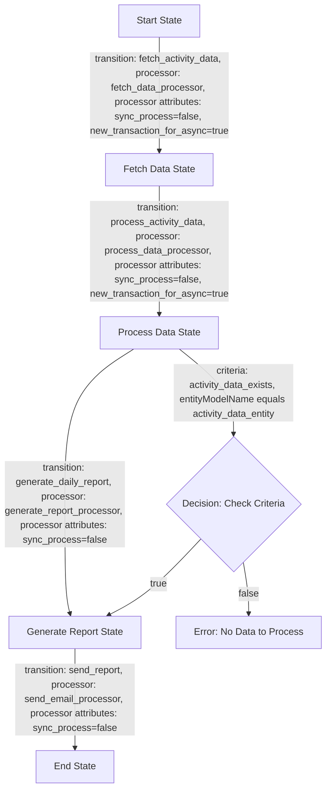

Sure! Here’s a complete Product Requirements Document (PRD) for your Activity Tracker Application based on the requirements and proposed structures we've discussed:

# Product Requirements Document (PRD) for Activity Tracker Application

## Introduction

This document provides an overview of the Activity Tracker Application designed to manage user activity tracking, data ingestion, processing, reporting, and email notification. The application fetches user activity data from a specified API, analyzes it for patterns, generates daily reports, and sends those reports to the admin.

## Requirements Overview

### Key Functional Requirements
1. **Data Ingestion**: Fetch activity data for users from the API `https://fakerestapi.azurewebsites.net/index.html`.
2. **Data Processing**: Analyze the data to identify patterns in user activity (e.g., frequency, types of activities).
3. **Reporting**: Generate daily reports summarizing user activities, highlighting trends and anomalies.
4. **Publishing**: Send the daily reports to the admin email.
5. **Scheduling**: The data ingestion process should run every day.

## Proposed Entities

### 1. Activity Data Entity
```json
{
  "id": "string",
  "title": "string",
  "dueDate": "string",
  "completed": "boolean",
  "ingested_at": "string"
}
```

### 2. Processed Data Entity
```json
{
  "activity_id": "string",
  "frequency": "integer",
  "types_of_activities": ["string"],
  "generated_at": "string"
}
```

### 3. Daily Report Entity
```json
{
  "report_id": "string",
  "generated_at": "string",
  "total_activities": "integer",
  "completed_activities": "integer",
  "pending_activities": "integer",
  "activity_summary": [
    {
      "activity_id": "string",
      "title": "string",
      "due_date": "string",
      "status": "string"
    }
  ],
  "comments": "string"
}
```

### 4. Orchestration Entity
```json
{
  "job_id": "string",
  "start_time": "string",
  "status": "string",
  "activities_fetched": "integer",
  "error_message": "string",
  "metadata": {
    "api_url": "string",
    "ingestion_at": "string"
  }
}
```

## Proposed Workflow

### Orchestration Entity Workflow
The orchestration entity will control the workflow of fetching, processing, and reporting data.

#### Workflow Diagram

```mermaid
flowchart TD
   A[Start State] -->|transition: fetch_activity_data, processor: fetch_data_processor, processor attributes: sync_process=false, new_transaction_for_async=true| B[Fetch Data State]
   B -->|transition: process_activity_data, processor: process_data_processor, processor attributes: sync_process=false, new_transaction_for_async=true| C[Process Data State]
   C -->|transition: generate_daily_report, processor: generate_report_processor, processor attributes: sync_process=false| D[Generate Report State]
   D -->|transition: send_report, processor: send_email_processor, processor attributes: sync_process=false| E[End State]

   %% Decision point for criteria
   C -->|criteria: activity_data_exists, entityModelName equals activity_data_entity| D1{Decision: Check Criteria}
   D1 -->|true| D
   D1 -->|false| F[Error: No Data to Process]

   class A,B,C,D,D1 automated;
```

### Workflow Launch
- The workflow is initiated by a scheduled event, triggering the `fetch_activity_data` transition at a predefined time (e.g., daily at midnight).
- Each transition has an associated processor responsible for executing the logic of that step.
- A decision point checks if activity data exists before proceeding to generate the report.

## Conclusion

This PRD outlines the structure of the Activity Tracker Application, including the entities, workflows, and overall functionality. The design supports an automated process for ingesting activity data, analyzing it, generating reports, and notifying the admin through email. 

The proposed solution is designed to be scalable and efficient, ensuring that the application can handle daily data ingestion and reporting seamlessly.

---

Feel free to ask if you need any revisions or further details! 😊