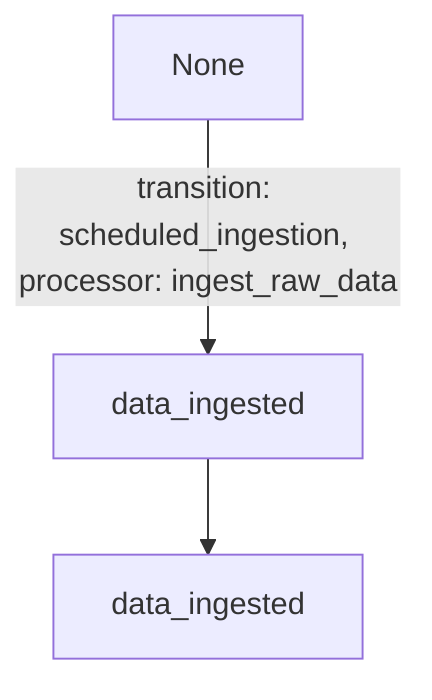
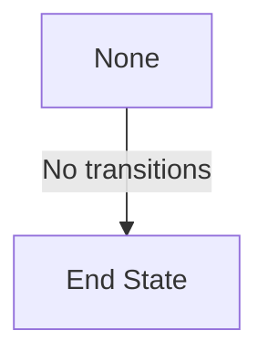
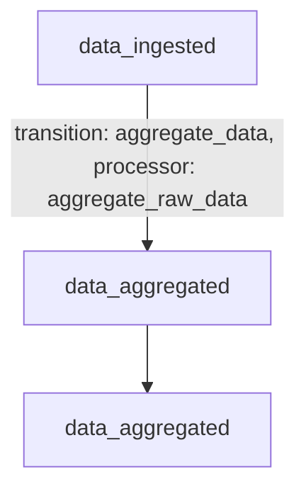
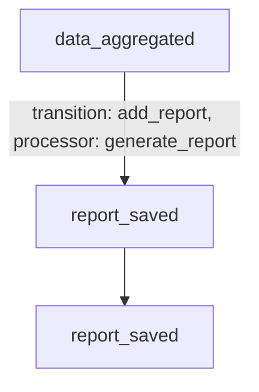
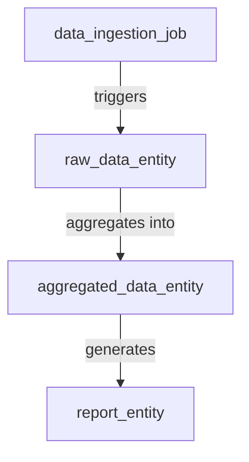
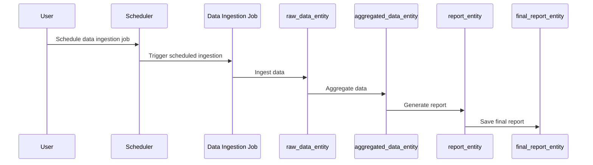
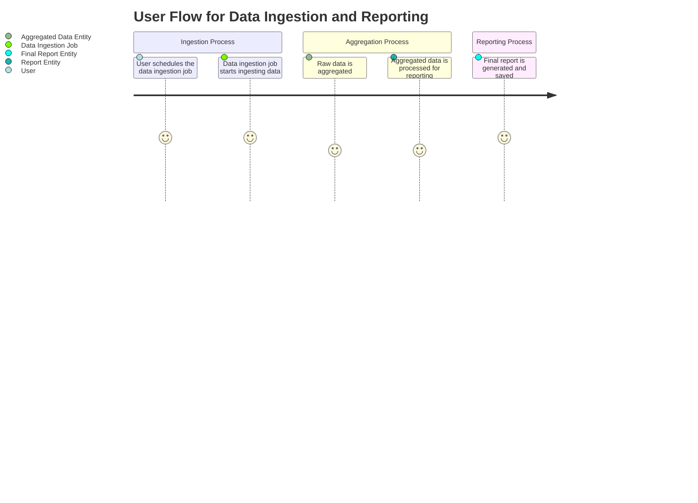

# Cyoda Design Document

## Overview

This document outlines the Cyoda design based on the requirement to develop an application that ingests data from a specified data source, aggregates that data, and saves the aggregated data to a report. The design has been structured in a way that aligns with Cyoda's event-driven architecture, utilizing entities, workflows, and transitions to manage the processing lifecycle effectively.

## Entities and Workflows

The Cyoda design consists of four primary entities:

1. **Data Ingestion Job**: This JOB entity is responsible for scheduling and managing the ingestion of data from the specified data source.
2. **Raw Data Entity**: This EXTERNAL_SOURCES_PULL_BASED_RAW_DATA entity stores the ingested raw data that will be processed further.
3. **Aggregated Data Entity**: This SECONDARY_DATA entity represents the data after it has been aggregated from raw data.
4. **Report Entity**: This SECONDARY_DATA entity is created from the aggregated data and represents the final report generated.

The design includes the following workflows for the entities that contain transitions:

### Data Ingestion Job Workflow

```mermaid
flowchart TD
    A[None] -->|transition: scheduled_ingestion, processor: ingest_raw_data| B[data_ingested]
    B --> D[data_ingested]

    class A,B,D automated;
```

### Raw Data Entity Workflow

```mermaid
flowchart TD
    A[None] -->|No transitions| B[End State]

    class A,B automated;
```

### Aggregated Data Entity Workflow

```mermaid
flowchart TD
    A[data_ingested] -->|transition: aggregate_data, processor: aggregate_raw_data| B[data_aggregated]
    B --> D[data_aggregated]

    class A,B,D automated;
```

### Report Entity Workflow

```mermaid
flowchart TD
    A[data_aggregated] -->|transition: add_report, processor: generate_report| B[report_saved]
    B --> D[report_saved]

    class A,B,D automated;
```

## Entity Relationship Diagram

```mermaid
graph TD;
    A[data_ingestion_job] -->|triggers| B[raw_data_entity];
    B -->|aggregates into| C[aggregated_data_entity];
    C -->|generates| D[report_entity];
```

## Sequence Diagram

```mermaid
sequenceDiagram
    participant User
    participant Scheduler
    participant Data Ingestion Job

    User->>Scheduler: Schedule data ingestion job
    Scheduler->>Data Ingestion Job: Trigger scheduled ingestion
    Data Ingestion Job->>raw_data_entity: Ingest data
    raw_data_entity->>aggregated_data_entity: Aggregate data
    aggregated_data_entity->>report_entity: Generate report
    report_entity->>final_report_entity: Save final report
```

## User Journey

```mermaid
journey
    title User Flow for Data Ingestion and Reporting
    section Ingestion Process
      User schedules the data ingestion job: 5: User
      Data ingestion job starts ingesting data: 5: Data Ingestion Job
    section Aggregation Process
      Raw data is aggregated: 4: Aggregated Data Entity
      Aggregated data is processed for reporting: 4: Report Entity
    section Reporting Process
      Final report is generated and saved: 5: Final Report Entity
```

## Conclusion

The Cyoda design is structured to effectively handle the requirements of data ingestion, aggregation, and reporting. Utilizing entities and workflows allows for seamless transitions between states in an event-driven manner, ensuring that data is processed correctly and efficiently. The accompanying diagrams visually represent the flow of processes and the relationships between entities, providing a comprehensive understanding of the design.