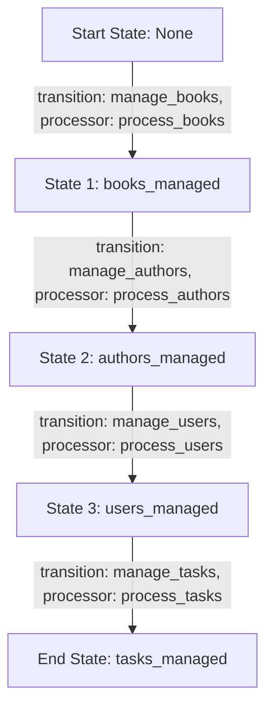
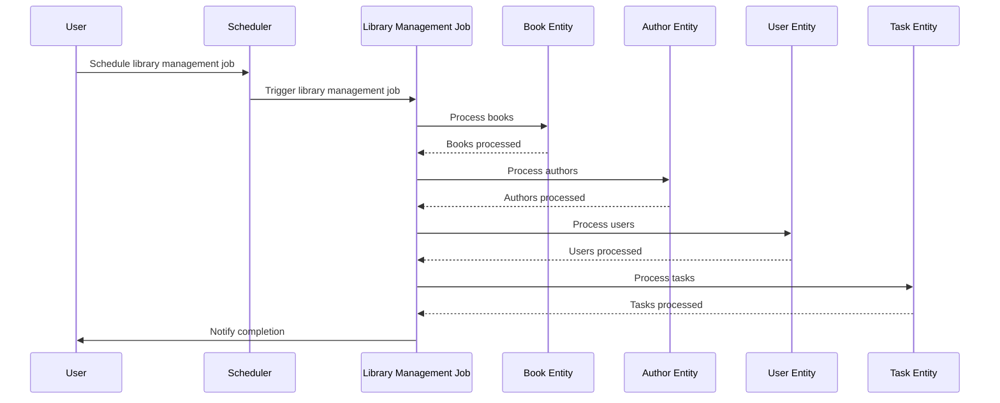

# Product Requirements Document (PRD) for Library Manager Pro

## Introduction

This document outlines the design and architecture of the "Library Manager Pro" application, a comprehensive library management system. It details the Cyoda-based design that integrates with the FakeRest API to manage books, authors, users, and tasks effectively. The Cyoda design JSON is translated into a human-readable format, presenting the entities, workflows, and how they align with the specified requirements.

## What is Cyoda?

Cyoda is a serverless, event-driven framework that orchestrates workflows through entities representing jobs and data. Each entity has a defined state, and transitions between these states are governed by events within the system, enabling a responsive and scalable architecture.

### Cyoda Entity Database

The Cyoda design for the Library Manager Pro application consists of several entities, each with its own defined workflows and transitions:

1. **Library Management Job (`library_management_job`)**:
   - **Type**: JOB
   - **Source**: SCHEDULED
   - **Description**: Orchestrates the overall management of books, authors, users, and tasks.

2. **Book Entity (`book_entity`)**:
   - **Type**: EXTERNAL_SOURCES_PULL_BASED_RAW_DATA
   - **Source**: ENTITY_EVENT
   - **Description**: Represents the raw data for books managed through the application.

3. **Author Entity (`author_entity`)**:
   - **Type**: EXTERNAL_SOURCES_PULL_BASED_RAW_DATA
   - **Source**: ENTITY_EVENT
   - **Description**: Represents the raw data for authors managed through the application.

4. **User Entity (`user_entity`)**:
   - **Type**: EXTERNAL_SOURCES_PULL_BASED_RAW_DATA
   - **Source**: ENTITY_EVENT
   - **Description**: Represents the raw data for users managed through the application.

5. **Task Entity (`task_entity`)**:
   - **Type**: EXTERNAL_SOURCES_PULL_BASED_RAW_DATA
   - **Source**: ENTITY_EVENT
   - **Description**: Represents the raw data for tasks assigned to users.

### Workflow Overview

Each entity has defined workflows that facilitate the management of its associated data. Below are the flowcharts representing the workflows for the entities with transitions.

#### Library Management Job Workflow

```mermaid
flowchart TD
    A[Start State: None] -->|transition: manage_books, processor: process_books| B[State 1: books_managed]
    B -->|transition: manage_authors, processor: process_authors| C[State 2: authors_managed]
    C -->|transition: manage_users, processor: process_users| D[State 3: users_managed]
    D -->|transition: manage_tasks, processor: process_tasks| E[End State: tasks_managed]

    class A,B,C,D automated;
```

### Sequence Diagram

The following sequence diagram illustrates the interactions between various components when the Library Management Job is triggered to manage books, authors, users, and tasks.

```mermaid
sequenceDiagram
    participant User
    participant Scheduler
    participant Library Management Job
    participant Book Entity
    participant Author Entity
    participant User Entity
    participant Task Entity

    User->>Scheduler: Schedule library management job
    Scheduler->>Library Management Job: Trigger library management job
    Library Management Job->>Book Entity: Process books
    Book Entity-->>Library Management Job: Books processed
    Library Management Job->>Author Entity: Process authors
    Author Entity-->>Library Management Job: Authors processed
    Library Management Job->>User Entity: Process users
    User Entity-->>Library Management Job: Users processed
    Library Management Job->>Task Entity: Process tasks
    Task Entity-->>Library Management Job: Tasks processed
    Library Management Job->>User: Notify completion
```

### Event-Driven Approach

The Cyoda design employs an event-driven architecture that allows the application to automatically react to changes or triggers. Events are emitted when entities are created, modified, or deleted, which in turn advance workflows and move entities through their defined transitions.

### Actors Involved

- **User**: Initiates the scheduling of the library management job.
- **Scheduler**: Responsible for triggering the library management job at predefined times.
- **Library Management Job**: Central to managing the workflow of books, authors, users, and tasks.
- **Book Entity**: Stores and processes book-related data.
- **Author Entity**: Stores and processes author-related data.
- **User Entity**: Stores and processes user-related data.
- **Task Entity**: Stores and processes task-related data.

## Conclusion

The Cyoda design for the Library Manager Pro application effectively aligns with the requirements for creating a robust library management system. By utilizing the event-driven model, the application can efficiently manage state transitions of each entity, from the management of books to the processing of tasks. The outlined entities, workflows, and events comprehensively cover the needs of the application, ensuring a smooth and automated process.

This PRD serves as a foundation for implementation and development, guiding the technical team through the specifics of the Cyoda architecture while providing clarity for users who may be new to the Cyoda framework.