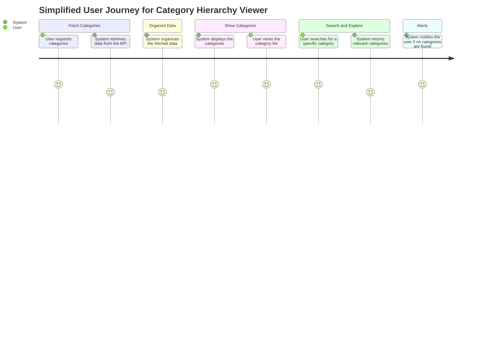
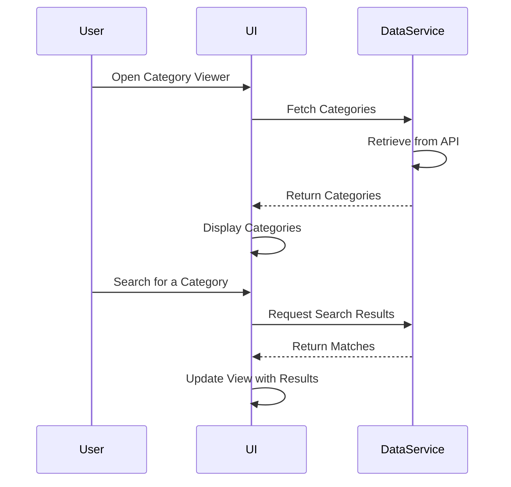
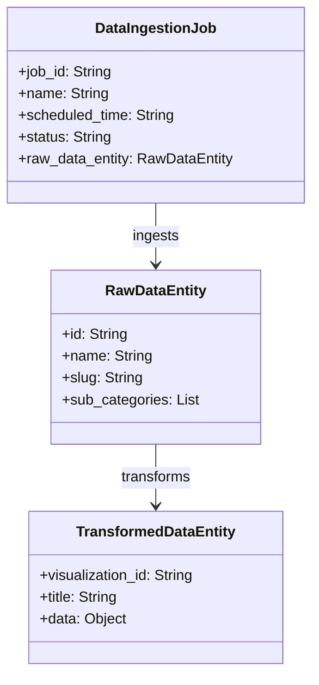
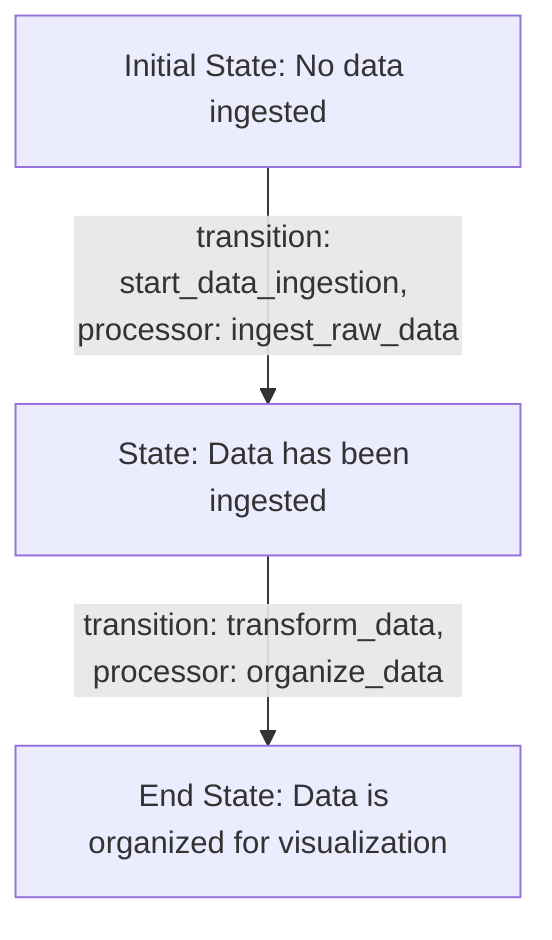

Here’s the complete Product Requirements Document (PRD) for the **Category Hierarchy Viewer Application**. This document includes all relevant sections, such as the overview, detailed requirement, user stories, journey and sequence diagrams, entity outlines, and the associated workflows and flowcharts.

---

# Product Requirements Document (PRD) for Category Hierarchy Viewer Application

## Overview
The **Category Hierarchy Viewer Application** aims to visualize category hierarchies using data from the Practice Software Testing API. This application will enable users to retrieve, transform, and display category data in a user-friendly manner, facilitating interactions and searches for specific categories.

## Detailed Requirement
The user requires an application that can:
1. **Retrieve** the complete category tree structure from the specified API.
2. **Transform** the raw category data into a hierarchical format suitable for visualization.
3. **Display** the category hierarchy in a tree view, allowing exploration of sub-categories.
4. **Search** for specific categories by name or ID.
5. **Notify** users when selected categories do not exist.

## User Stories
1. **As a User**, I want to retrieve the complete category tree structure from the API so that I can view all available categories.
2. **As a User**, I want to convert raw category data into a hierarchical tree structure for better visualization of categories and sub-categories.
3. **As a User**, I want to present the category hierarchy in a tree view, allowing me to explore sub-categories and access related category IDs.
4. **As a User**, I want to search for specific categories by name or category ID so that I can quickly find the information I need.
5. **As a User**, I want to receive notifications when a selected category or sub-category does not exist, ensuring I am aware of any issues with the data.

## Journey Diagram

```mermaid
journey
    title Simplified User Journey for Category Hierarchy Viewer
    section Fetch Categories
      User requests categories: 5: User
      System retrieves data from the API: 4: System
    section Organize Data
      System organizes the fetched data: 4: System
    section Show Categories
      System displays the categories: 5: System
      User views the category list: 5: User
    section Search and Explore
      User searches for a specific category: 5: User
      System returns relevant categories: 4: System
    section Alerts
      System notifies the user if no categories are found: 5: System
```

## Sequence Diagram

```mermaid
sequenceDiagram
    participant User
    participant UI
    participant DataService
    User->>UI: Open Category Viewer
    UI->>DataService: Fetch Categories
    DataService->>DataService: Retrieve from API
    DataService-->>UI: Return Categories
    UI->>UI: Display Categories
    User->>UI: Search for a Category
    UI->>DataService: Request Search Results
    DataService-->>UI: Return Matches
    UI->>UI: Update View with Results
```

## Outline of Entities

1. **Data Ingestion Job**
   - **Description**: Responsible for fetching the category tree from the Practice Software Testing API.
   - **Example JSON Model**:
     ```json
     {
       "job_id": "job_001",
       "name": "data_ingestion_job",
       "scheduled_time": "2023-10-01T10:00:00Z",
       "status": "completed",
       "raw_data_entity": {
         "id": "01JKR602ZXDRRXNZ1M5Y1T4496",
         "name": "Hand Tools",
         "sub_categories": [...]
       }
     }
     ```
   - **Saving Method**: Saved through an ENTITY_EVENT triggered by the workflow.

2. **Raw Data Entity**
   - **Description**: Represents the unprocessed data retrieved from the API, containing the category information.
   - **Example JSON Model**:
     ```json
     {
       "id": "01JKR602ZXDRRXNZ1M5Y1T4496",
       "name": "Hand Tools",
       "slug": "hand-tools",
       "sub_categories": [
         {
           "id": "01JKR60308DYZWDKN07F15F1MS",
           "name": "Hammer",
           "slug": "hammer"
         }
       ]
     }
     ```
   - **Saving Method**: Saved directly via an API call during the data ingestion process.

3. **Transformed Data Entity**
   - **Description**: Contains the organized data structured for visualization, derived from the raw data entity.
   - **Example JSON Model**:
     ```json
     {
       "visualization_id": "viz_001",
       "title": "Category Hierarchy Visualization",
       "data": {
         "categories": [
           {
             "name": "Hand Tools",
             "sub_categories": ["Hammer", "Hand Saw", "Wrench"]
           }
         ]
       }
     }
     ```
   - **Saving Method**: Saved as a SECONDARY_DATA entity through the workflow of the Raw Data Entity.

### Entities Diagram

```mermaid
classDiagram
    class DataIngestionJob {
        +job_id: String
        +name: String
        +scheduled_time: String
        +status: String
        +raw_data_entity: RawDataEntity
    }
    class RawDataEntity {
        +id: String
        +name: String
        +slug: String
        +sub_categories: List
    }
    class TransformedDataEntity {
        +visualization_id: String
        +title: String
        +data: Object
    }
    DataIngestionJob --> RawDataEntity: ingests
    RawDataEntity --> TransformedDataEntity: transforms
```

### Workflows and Flowcharts

1. **Workflow for Data Ingestion Job**

```mermaid
flowchart TD
  A[Initial State: No data ingested] -->|transition: start_data_ingestion, processor: ingest_raw_data| B[State: Data has been ingested]
  B -->|transition: transform_data, processor: organize_data| C[End State: Data is organized for visualization]
```

---

### Conclusion

This PRD comprehensively outlines the requirements, user stories, diagrams, entity details, and workflows for the Category Hierarchy Viewer Application. If you have any further questions or need additional modifications, please let me know! I'm here to ensure that this document meets your expectations perfectly.