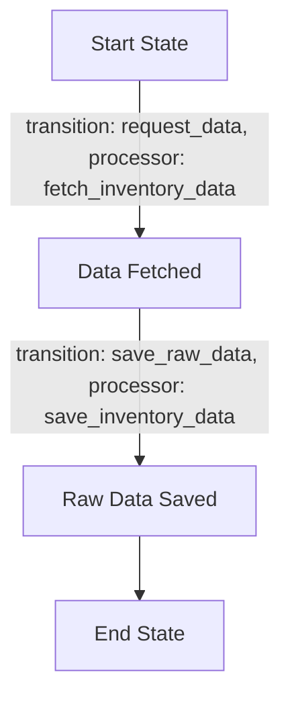
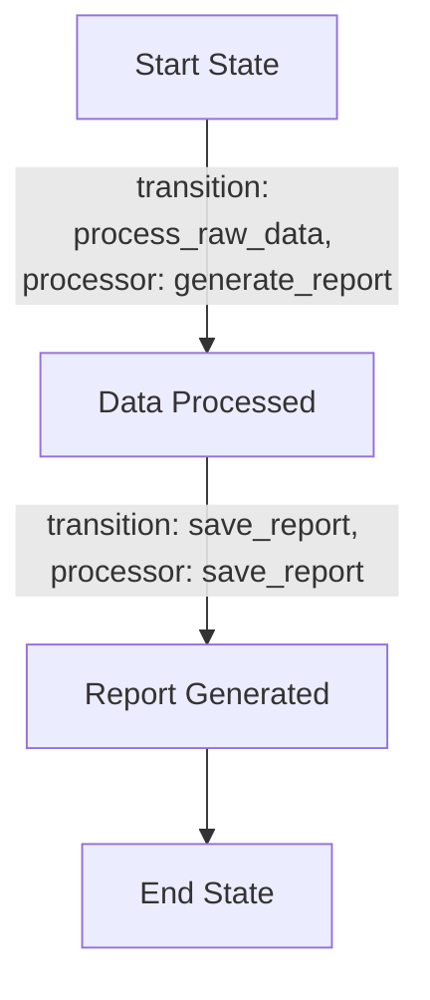
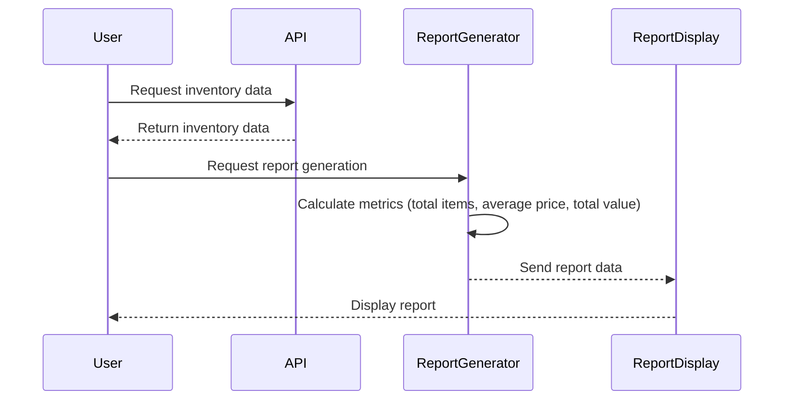

Sure! Here’s a complete Product Requirements Document (PRD) for your inventory reporting application, structured clearly and concisely:

---

# Product Requirements Document (PRD) for Inventory Reporting Application

## Introduction

This document outlines the requirements for an Inventory Reporting Application that leverages the SwaggerHub API to generate comprehensive reports on inventory data. The application will allow users to retrieve, process, and visualize key metrics derived from the inventory data, presenting them in a user-friendly format.

## User Requirements

### User Stories

1. **As a user**, I want to retrieve all inventory items from the API so that I can generate reports.
2. **As a user**, I want to filter inventory items based on specific criteria so that I can focus on relevant data.
3. **As a user**, I want to see key metrics in the report (total number of items, average price, total value) so that I can understand the inventory performance.
4. **As a user**, I want the reports to be presented in a user-friendly format (e.g., tables or charts) so that I can easily interpret the data.
5. **As a user**, I want to receive error messages if something goes wrong during data retrieval or report generation so that I can address any issues promptly.

## Entities Overview

### 1. Entity: Inventory Data
- **Description**: Stores raw inventory data retrieved from the SwaggerHub API.
- **Save Method**: Directly via an API call.
  
**Example JSON Data Model**:
```json
{
  "id": "abc123",
  "name": "Widget Adapter",
  "release_date": "2016-08-29T09:12:33.001Z",
  "manufacturer": {
    "name": "ACME Corporation",
    "home_page": "https://www.acme-corp.com",
    "phone": "408-867-5309"
  },
  "quantity_available": 75,
  "price": 29.99
}
```

### 2. Entity: Raw Inventory Data
- **Description**: Represents unprocessed data retrieved from the API.
- **Save Method**: Through the workflow of the Inventory Data entity (trigger an ENTITY_EVENT).

**Example JSON Data Model**:
```json
{
  "raw_id": "raw_001",
  "inventory_id": "abc123",
  "created_at": "2023-10-02T05:00:00Z",
  "raw_data": {...}
}
```

### 3. Entity: Report
- **Description**: Represents generated reports summarizing key metrics.
- **Save Method**: Through a workflow that triggers after processing the Raw Inventory Data (trigger an ENTITY_EVENT).

**Example JSON Data Model**:
```json
{
  "report_id": "report_2023_10_02",
  "generated_at": "2023-10-02T05:15:00Z",
  "metrics": {
    "total_items": 150,
    "average_price": 29.99,
    "total_value": 4498.5
  },
  "summary": "This report summarizes the inventory data processed for the day."
}
```

## Workflows Overview

### Workflow for Inventory Data Entity


```mermaid
flowchart TD
  A[Start State] -->|transition: request_data, processor: fetch_inventory_data| B[Data Fetched]
  B -->|transition: save_raw_data, processor: save_inventory_data| C[Raw Data Saved]
  C --> D[End State]
```

### Workflow for Raw Inventory Data Entity


```mermaid
flowchart TD
  A[Start State] -->|transition: process_raw_data, processor: generate_report| B[Data Processed]
  B -->|transition: save_report, processor: save_report| C[Report Generated]
  C --> D[End State]
```

## User Journey


```mermaid
journey
    title User Journey for Inventory Reporting
    section Retrieving Inventory Data
      User initiates data retrieval: 5: User
      API returns inventory data: 5: API
    section Generating Reports
      User requests report generation: 5: User
      System processes data and generates metrics: 5: System
      System presents report in user-friendly format: 5: System
    section Error Handling
      If data retrieval fails, user receives error: 5: System
```

## Sequence Diagram


```mermaid
sequenceDiagram
    participant User
    participant API
    participant ReportGenerator
    participant ReportDisplay

    User->>API: Request inventory data
    API-->>User: Return inventory data
    User->>ReportGenerator: Request report generation
    ReportGenerator->>ReportGenerator: Calculate metrics (total items, average price, total value)
    ReportGenerator-->>ReportDisplay: Send report data
    ReportDisplay-->>User: Display report
```

## Conclusion

The Inventory Reporting Application will effectively meet the user requirements outlined in this document. By utilizing the SwaggerHub API for data retrieval and implementing well-defined workflows, the application will facilitate the generation of insightful reports while ensuring a user-friendly experience.

---

How does this PRD look to you? If there are any changes or additional details you would like to include, just let me know!