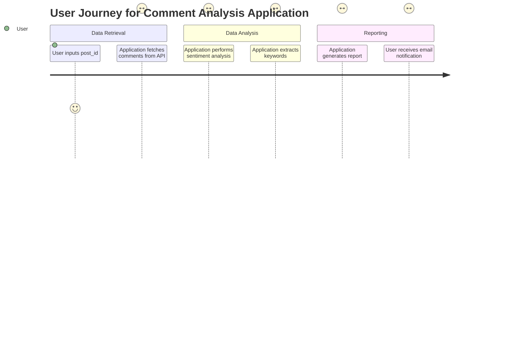
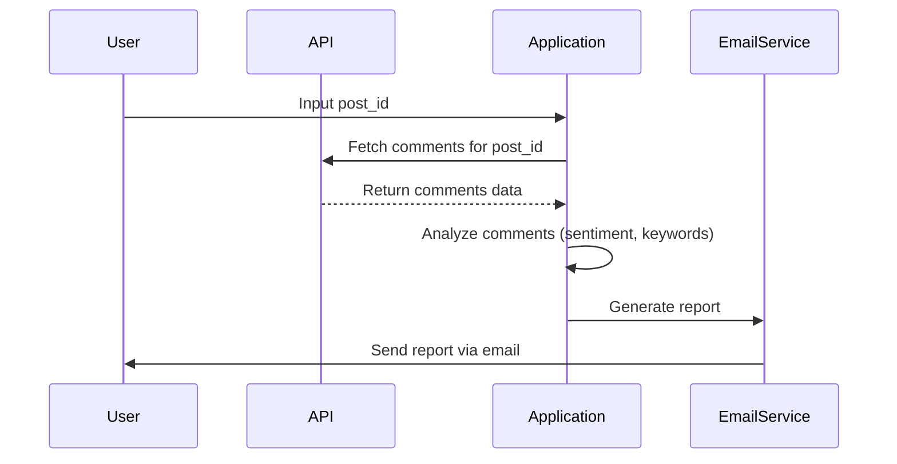
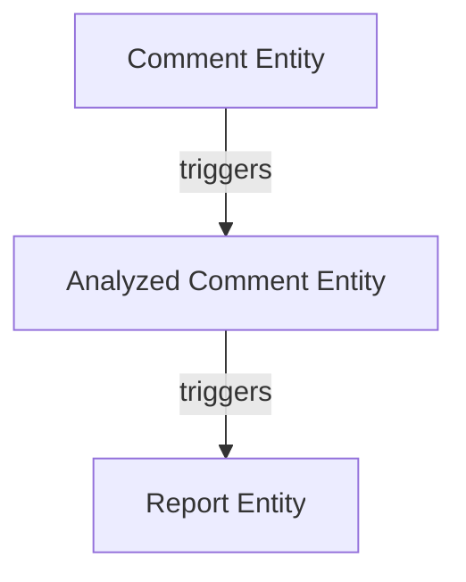
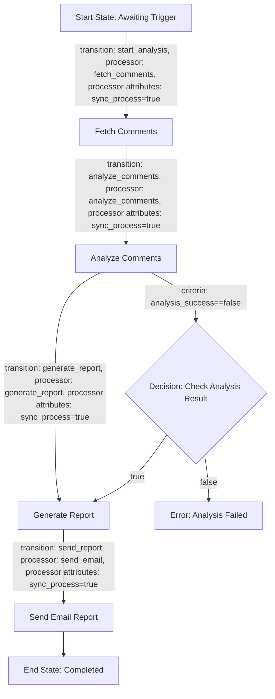

Sure! Here’s a complete Product Requirements Document (PRD) that incorporates all the elements we've discussed regarding your comment analysis application.

# Product Requirements Document (PRD) for Comment Analysis Application

## Introduction

This document provides a comprehensive overview of the Comment Analysis Application designed to ingest comments data from an API, perform analysis, and generate reports that are sent via email. This PRD outlines the requirements, entity structures, workflows, and processes involved in the application.

## What is the Comment Analysis Application?

The Comment Analysis Application is designed to help users analyze comments associated with specific posts by performing sentiment analysis, keyword extraction, and generating a summary report via email. It interacts with an external API to fetch comments based on a provided `post_id`.

## User Requirements

### User Stories
1. **As a user**, I want to input a `post_id` so that I can retrieve comments related to that specific post from the API.
2. **As a user**, I want the application to analyze comments by performing sentiment analysis and keyword extraction so that I can understand the overall tone and key topics of the comments.
3. **As a user**, I want to receive an email report summarizing the analysis results so that I can easily share insights with others.

### Journey Diagram

```mermaid
journey
    title User Journey for Comment Analysis Application
    section Data Retrieval
      User inputs post_id: 5: User
      Application fetches comments from API: Application
    section Data Analysis
      Application performs sentiment analysis: Application
      Application extracts keywords: Application
    section Reporting
      Application generates report: Application
      User receives email notification: User
```

### Sequence Diagram

```mermaid
sequenceDiagram
    participant User
    participant API
    participant Application
    participant EmailService

    User->>Application: Input post_id
    Application->>API: Fetch comments for post_id
    API-->>Application: Return comments data
    Application->>Application: Analyze comments (sentiment, keywords)
    Application->>EmailService: Generate report
    EmailService->>User: Send report via email
```

## Entities Outline

### Comment Entity
- **Type**: RAW_DATA
- **Source**: API_REQUEST
- **Description**: Represents individual comments fetched from the API.

### Analyzed Comment Entity
- **Type**: SECONDARY_DATA
- **Source**: ENTITY_EVENT
- **Description**: Contains the results of sentiment analysis and keyword extraction for the comments.

### Report Entity
- **Type**: SECONDARY_DATA
- **Source**: ENTITY_EVENT
- **Description**: Stores the final report generated from the analysis results.

### Entities Diagram

```mermaid
graph TD;
    A[Comment Entity] -->|triggers| B[Analyzed Comment Entity];
    B -->|triggers| C[Report Entity];
```

## Proposed Workflows

### Comment Analysis Job Workflow
- **Purpose**: To orchestrate the process of fetching comments, analyzing them, and sending a report via email.

#### Workflow Launch
The workflow is launched when a trigger event occurs, such as a scheduled job or an API request.

#### Flowchart

```mermaid
flowchart TD
   A[Start State: Awaiting Trigger] -->|transition: start_analysis, processor: fetch_comments, processor attributes: sync_process=true| B[Fetch Comments]
   B -->|transition: analyze_comments, processor: analyze_comments, processor attributes: sync_process=true| C[Analyze Comments]
   C -->|transition: generate_report, processor: generate_report, processor attributes: sync_process=true| D[Generate Report]
   D -->|transition: send_report, processor: send_email, processor attributes: sync_process=true| E[Send Email Report]
   E --> F[End State: Completed]

   %% Decision point for error handling
   C -->|criteria: analysis_success==false| D1{Decision: Check Analysis Result}
   D1 -->|true| D
   D1 -->|false| E1[Error: Analysis Failed]

   class A,B,C,D,E,D1 automated;
```

## Conclusion

The Comment Analysis Application is developed to provide users with insightful analysis of comments related to specific posts through a simple and intuitive workflow. The outlined entities, workflows, and events comprehensively cover the needs of the application, ensuring a smooth and automated process.

This PRD serves as a foundation for implementation and development, guiding the technical team through the specifics of the application while providing clarity for users who may be new to the process.

---

Feel free to ask if you need any further modifications or additions! I'm here to help! 😊