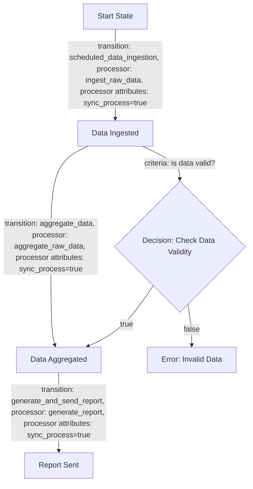
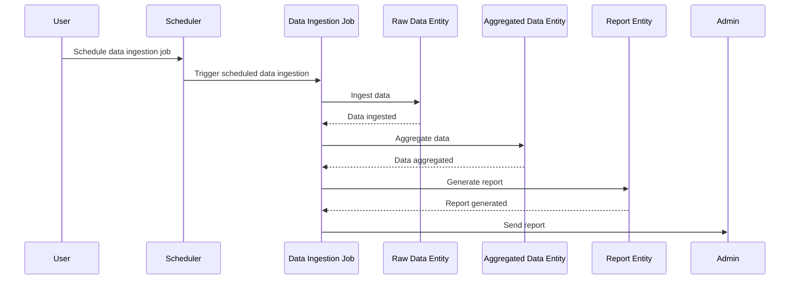
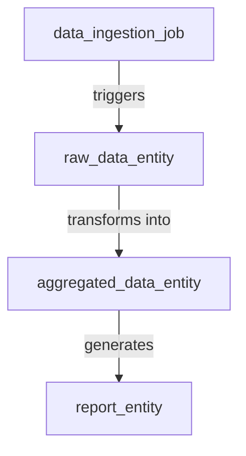

# Product Requirements Document (PRD) for Cyoda Design

## Introduction

This document provides an overview of the Cyoda-based application designed to manage data ingestion, aggregation, report generation, and email notification. It explains how the Cyoda design aligns with the specified requirements, focusing on the structure of entities, workflows, and the event-driven architecture that powers the application. The design is represented in a Cyoda JSON format which is translated into a human-readable document for clarity.

## Cyoda Design JSON Explanation

The Cyoda design JSON defines the following entities and their workflows:

1. **Data Ingestion Job (`data_ingestion_job`)**:
   - **Type**: JOB
   - **Source**: SCHEDULED
   - **Description**: This job is responsible for ingesting data from specified sources at scheduled intervals (once a day) and orchestrating the overall workflow.

2. **Raw Data Entity (`raw_data_entity`)**:
   - **Type**: EXTERNAL_SOURCES_PULL_BASED_RAW_DATA
   - **Source**: ENTITY_EVENT
   - **Description**: This entity stores the raw data that has been ingested by the data ingestion job.

3. **Aggregated Data Entity (`aggregated_data_entity`)**:
   - **Type**: SECONDARY_DATA
   - **Source**: ENTITY_EVENT
   - **Description**: This entity holds the aggregated data derived from the raw data for reporting purposes.

4. **Report Entity (`report_entity`)**:
   - **Type**: SECONDARY_DATA
   - **Source**: ENTITY_EVENT
   - **Description**: This entity contains the generated report that is sent to the admin via email.

### Workflow Overview

The workflows in Cyoda define how each job entity operates through a series of transitions. Each workflow consists of states and transitions that specify how an entity changes its state as events occur. The `data_ingestion_job` includes the following transitions:

- **Scheduled Data Ingestion**: This transition starts the data ingestion process from the specified data source.
- **Aggregate Data**: After ingestion, this transition aggregates the raw data.
- **Generate and Send Report**: Finally, this transition creates a report from the aggregated data and sends it to the admin's email.

## Mermaid Diagrams

### Flowchart for `data_ingestion_workflow`

```mermaid
flowchart TD
    A[Start State] -->|transition: scheduled_data_ingestion, processor: ingest_raw_data, processor attributes: sync_process=true| B[Data Ingested]
    B -->|transition: aggregate_data, processor: aggregate_raw_data, processor attributes: sync_process=true| C[Data Aggregated]
    C -->|transition: generate_and_send_report, processor: generate_report, processor attributes: sync_process=true| D[Report Sent]

    %% Decision point for criteria (if necessary)
    B -->|criteria: is data valid?| D1{Decision: Check Data Validity}
    D1 -->|true| C
    D1 -->|false| E[Error: Invalid Data]

    class A,B,C,D,D1 automated;
```

### Sequence Diagram

```mermaid
sequenceDiagram
    participant User
    participant Scheduler
    participant Data Ingestion Job
    participant Raw Data Entity
    participant Aggregated Data Entity
    participant Report Entity
    participant Admin

    User->>Scheduler: Schedule data ingestion job
    Scheduler->>Data Ingestion Job: Trigger scheduled data ingestion
    Data Ingestion Job->>Raw Data Entity: Ingest data
    Raw Data Entity-->>Data Ingestion Job: Data ingested
    Data Ingestion Job->>Aggregated Data Entity: Aggregate data
    Aggregated Data Entity-->>Data Ingestion Job: Data aggregated
    Data Ingestion Job->>Report Entity: Generate report
    Report Entity-->>Data Ingestion Job: Report generated
    Data Ingestion Job->>Admin: Send report
```

### Entity Relationships Diagram

```mermaid
graph TD;
    A[data_ingestion_job] -->|triggers| B[raw_data_entity];
    B -->|transforms into| C[aggregated_data_entity];
    C -->|generates| D[report_entity];
```

## Conclusion

The Cyoda design effectively aligns with the requirements for creating a robust data processing application. By utilizing the event-driven model, the application efficiently manages state transitions of each entity involved, from data ingestion to report delivery. The outlined entities, workflows, and events comprehensively cover the needs of the application, ensuring a smooth and automated process.

This PRD serves as a foundation for implementation and development, guiding the technical team through the specifics of the Cyoda architecture while providing clarity for users who may be new to the Cyoda framework.