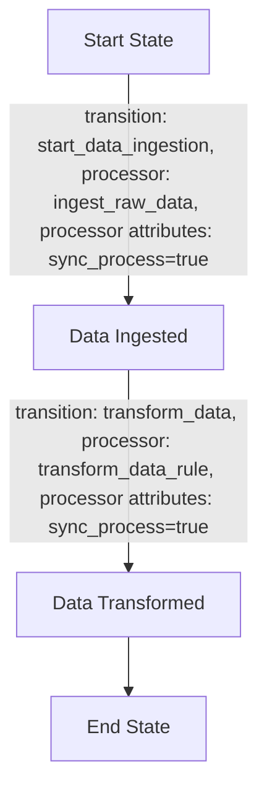
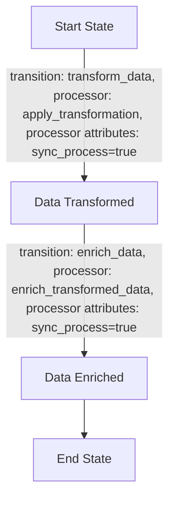
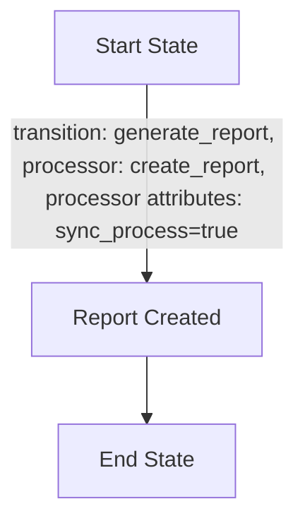
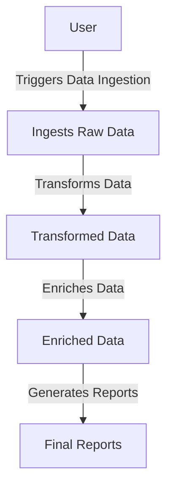
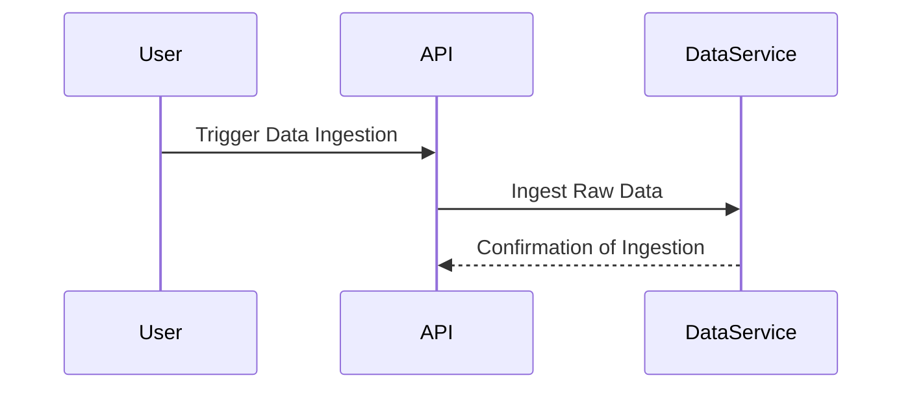
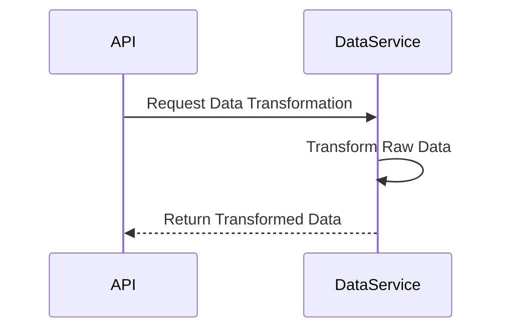
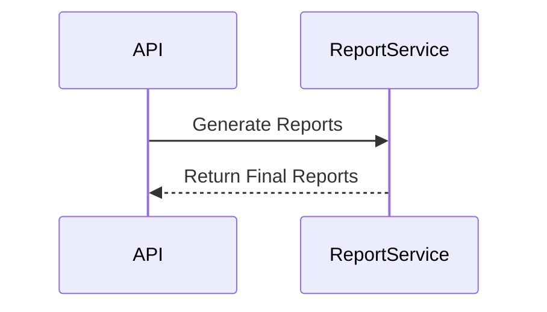

Sure! Here’s a complete Product Requirements Document (PRD) based on our previous discussions. I’ll structure it to include all necessary sections for clarity and organization. 

# Product Requirements Document (PRD)

## Project Overview
The goal of this project is to develop an event-driven workflow application using Cyoda's architecture. This application will manage workflows that involve data ingestion, transformation, enrichment, and reporting.

## Tools
- Cyoda Application Builder
- Event-Driven Architecture

## Requirements

### User Requirements
1. **As a user**, I want to trigger data ingestion so that I can gather raw data from external sources.
2. **As a data analyst**, I want to transform the ingested data into a usable format so that I can analyze it effectively.
3. **As a user**, I want to enrich the transformed data with additional information to gain further insights.
4. **As a decision-maker**, I want to generate reports from the aggregated data to facilitate informed decisions.

### Entities
1. **User**
   - **Attributes**: 
     - user_id: string
     - name: string
     - email: string
   - **Saved via**: API call
   
2. **RawData**
   - **Attributes**: 
     - raw_data_id: string
     - source: string
     - content: string
   - **Saved via**: ENTITY_EVENT triggered by User
   
3. **TransformedData**
   - **Attributes**: 
     - transformed_data_id: string
     - raw_data_id: string
     - transformation_rule: string
   - **Saved via**: Workflow triggered by RawData ingestion
   
4. **EnrichedData**
   - **Attributes**: 
     - enriched_data_id: string
     - transformed_data_id: string
     - additional_info: string
   - **Saved via**: Workflow triggered by TransformedData
   
5. **Report**
   - **Attributes**: 
     - report_id: string
     - aggregated_data: string
     - generated_on: string
   - **Saved via**: API call after EnrichedData processing

### Workflows
1. **Ingest Raw Data Workflow**

```mermaid
flowchart TD
  A[Start State] -->|transition: start_data_ingestion, processor: ingest_raw_data, processor attributes: sync_process=true| B[Data Ingested]
  B -->|transition: transform_data, processor: transform_data_rule, processor attributes: sync_process=true| C[Data Transformed]
  C --> D[End State]
```

2. **Transform Data Workflow**

```mermaid
flowchart TD
  A[Start State] -->|transition: transform_data, processor: apply_transformation, processor attributes: sync_process=true| B[Data Transformed]
  B -->|transition: enrich_data, processor: enrich_transformed_data, processor attributes: sync_process=true| C[Data Enriched]
  C --> D[End State]
```

3. **Generate Report Workflow**

```mermaid
flowchart TD
  A[Start State] -->|transition: generate_report, processor: create_report, processor attributes: sync_process=true| B[Report Created]
  B --> D[End State]
```

### User Journey

```mermaid
graph TD;
    A[User] -->|Triggers Data Ingestion| B[Ingests Raw Data]
    B -->|Transforms Data| C[Transformed Data]
    C -->|Enriches Data| D[Enriched Data]
    D -->|Generates Reports| E[Final Reports]
```

### Sequence Diagrams
1. **Ingest Raw Data Sequence**

```mermaid
sequenceDiagram
    participant User
    participant API
    participant DataService

    User->>API: Trigger Data Ingestion
    API->>DataService: Ingest Raw Data
    DataService-->>API: Confirmation of Ingestion
```

2. **Transform Data Sequence**

```mermaid
sequenceDiagram
    participant API
    participant DataService

    API->>DataService: Request Data Transformation
    DataService->>DataService: Transform Raw Data
    DataService-->>API: Return Transformed Data
```

3. **Generate Report Sequence**

```mermaid
sequenceDiagram
    participant API
    participant ReportService

    API->>ReportService: Generate Reports
    ReportService-->>API: Return Final Reports
```

## Conclusion
This PRD outlines the key requirements for building the Cyoda application that manages event-driven workflows for data processing and reporting. The defined entities, workflows, user journeys, and sequence diagrams provide a clear roadmap for development.

Feel free to suggest any changes or additions! 😊