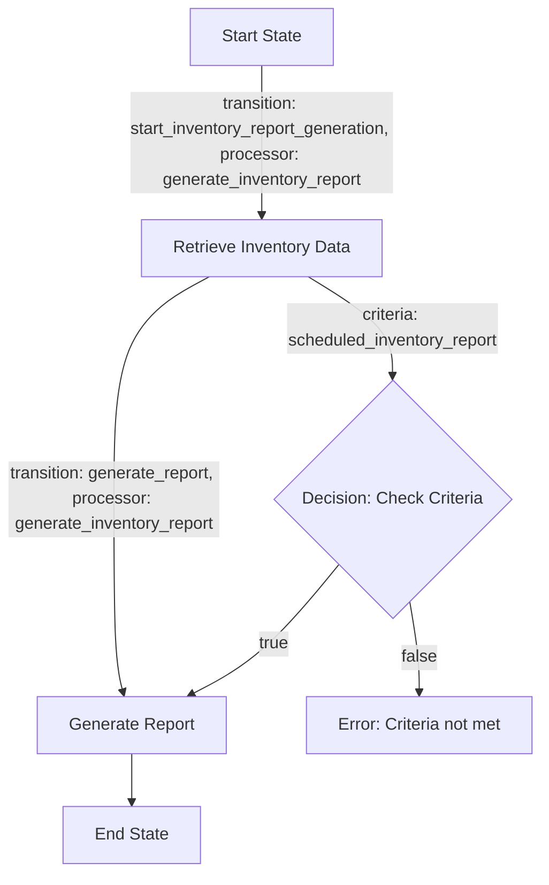
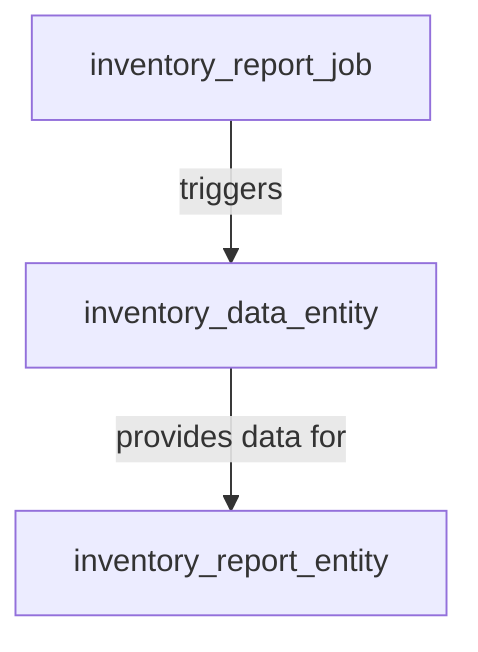
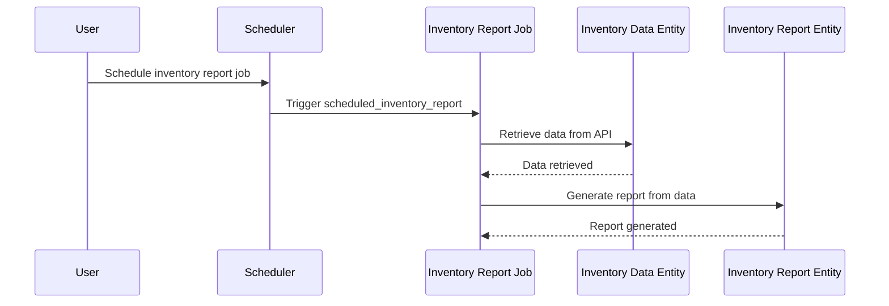

# Product Requirements Document (PRD) for Improved Cyoda Design

## Introduction

This document outlines the improved Cyoda-based application designed to generate reports on inventory data using the SwaggerHub API. The updated design includes a refined Cyoda JSON representation that defines the application's structure, focusing on the entities involved and their workflows. It explains how the Cyoda design aligns with the stated requirements, emphasizing the event-driven architecture and state transitions.

## Cyoda Design Overview

### What is Cyoda?

Cyoda is a serverless, event-driven framework that facilitates the management of workflows through entities representing jobs and data. Each entity has a defined state, and transitions between states are governed by events that occur within the system.

### Cyoda Entity Database

The improved Cyoda design JSON consists of several entities that capture the application's core functionalities:

1. **Inventory Report Job (`inventory_report_job`)**:
   - **Type**: JOB
   - **Source**: SCHEDULED
   - **Description**: Responsible for generating inventory reports by retrieving data from the SwaggerHub API periodically.

2. **Inventory Report Entity (`inventory_report_entity`)**:
   - **Type**: SECONDARY_DATA
   - **Source**: ENTITY_EVENT
   - **Description**: Contains the generated inventory report summarizing key metrics such as total items, average price, and total value.

3. **Inventory Data Entity (`inventory_data_entity`)**:
   - **Type**: EXTERNAL_SOURCES_PULL_BASED_RAW_DATA
   - **Source**: ENTITY_EVENT
   - **Description**: Stores the raw inventory data retrieved from the SwaggerHub API.

### Entity Workflows

The following workflows are defined within the entities:

#### Inventory Report Job Workflow

```mermaid
flowchart TD
    A[Start State] -->|transition: start_inventory_report_generation, processor: generate_inventory_report| B[Retrieve Inventory Data]
    B -->|transition: generate_report, processor: generate_inventory_report| C[Generate Report]
    C --> D[End State]

    %% Decision point for criteria
    B -->|criteria: scheduled_inventory_report| D1{Decision: Check Criteria}
    D1 -->|true| C
    D1 -->|false| E[Error: Criteria not met]

    class A,B,C,D,D1 automated;
```

### Overall Workflow

```mermaid
graph TD;
    A[inventory_report_job] -->|triggers| B[inventory_data_entity];
    B -->|provides data for| C[inventory_report_entity];
```

### Sequence Diagram

```mermaid
sequenceDiagram
    participant User
    participant Scheduler
    participant Inventory Report Job
    participant Inventory Data Entity
    participant Inventory Report Entity

    User->>Scheduler: Schedule inventory report job
    Scheduler->>Inventory Report Job: Trigger scheduled_inventory_report
    Inventory Report Job->>Inventory Data Entity: Retrieve data from API
    Inventory Data Entity-->>Inventory Report Job: Data retrieved
    Inventory Report Job->>Inventory Report Entity: Generate report from data
    Inventory Report Entity-->>Inventory Report Job: Report generated
```

## Event-Driven Approach

The application employs an event-driven architecture, where events trigger workflows. Key events include:

1. **Scheduled Job Trigger**: The job is initiated based on a predefined schedule.
2. **Data Retrieval**: After the job starts, it retrieves inventory data from the API.
3. **Report Generation**: The retrieved data is processed to generate the inventory report.

This architecture promotes scalability and efficiency, allowing for automated data processing and report generation without manual intervention.

## Conclusion

The improved Cyoda design effectively aligns with the requirements for generating inventory reports. The outlined entities, workflows, and events comprehensively cover the application's needs, ensuring a smooth and automated reporting process. This PRD serves as a foundation for implementation and development, guiding the technical team through the specifics of the Cyoda architecture while providing clarity for users new to the Cyoda framework.