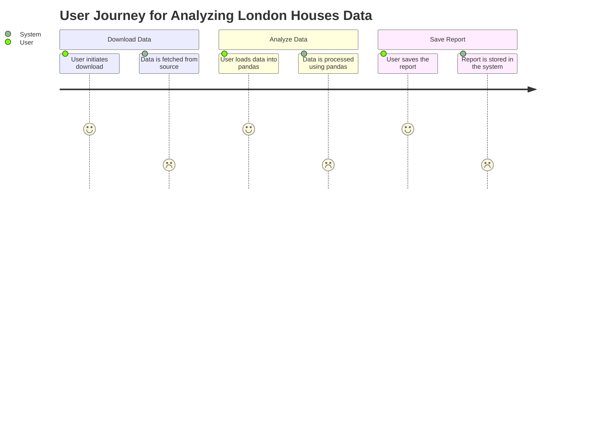
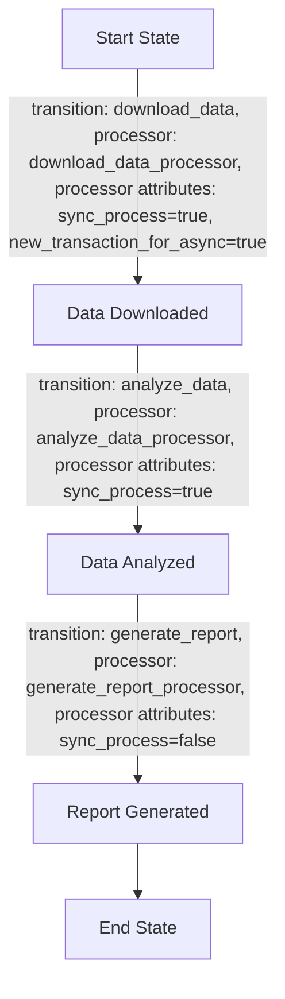

Sure thing! Here’s a complete Product Requirements Document (PRD) based on your requirements for downloading, analyzing, and reporting on London Houses Data.

---

# Product Requirements Document (PRD) for London Houses Data Analysis

## Introduction

This document outlines the requirements for an application designed to download, analyze, and report on London Houses Data. The application will utilize pandas for data analysis and provide a streamlined workflow to generate insights.

## What is the Objective?

The primary objective is to enable users to download house data from London, analyze it using pandas, and generate a comprehensive report that summarizes the findings.

## User Stories

1. **As a user**, I want to download London Houses Data so that I can analyze it for trends and insights.
2. **As a user**, I want to use pandas to process and analyze the data so I can extract useful information.
3. **As a user**, I want to save the report generated from my analysis so that I can refer back to it or share it with others.

## Journey Diagram


```mermaid
journey
    title User Journey for Analyzing London Houses Data
    section Download Data
      User initiates download: 5: User
      Data is fetched from source: 2: System
    section Analyze Data
      User loads data into pandas: 5: User
      Data is processed using pandas: 2: System
    section Save Report
      User saves the report: 5: User
      Report is stored in the system: 2: System
```

## Entity Outline

1. **Data Entity: London Houses Data**
   - **Description**: Stores the raw data for houses in London.
   - **Storage Method**: Directly via API call (downloaded from an external source).
   - **Example JSON**:
   ```json
   {
     "id": 1,
     "property_type": "Detached",
     "price": 800000,
     "bedrooms": 4,
     "location": "London, UK",
     "description": "...",
     "date_listed": "2023-10-01T00:00:00Z"
   }
   ```

2. **Processed Data Entity: Analyzed Data**
   - **Description**: Contains the processed data after analysis using pandas.
   - **Storage Method**: Through workflow, triggered after the analysis.
   - **Example JSON**:
   ```json
   {
     "id": 1,
     "average_price": 750000,
     "median_price": 720000,
     "price_distribution": "...",
     "analysis_date": "2023-10-02T00:00:00Z"
   }
   ```

3. **Report Entity: Analysis Report**
   - **Description**: Stores the final report generated from the analyzed data.
   - **Storage Method**: Directly via API call after report generation.
   - **Example JSON**:
   ```json
   {
     "report_id": "report_2023_10_01",
     "generated_at": "2023-10-02T10:05:00Z",
     "report_title": "London Houses Data Analysis",
     "summary": "...",
     "detailed_analysis": "...",
     "recipient_email": "user@example.com"
   }
   ```

## Combined Workflow

### Workflow for Downloading Data, Analyzing It, and Generating a Report


```mermaid
flowchart TD
  A[Start State] -->|transition: download_data, processor: download_data_processor, processor attributes: sync_process=true, new_transaction_for_async=true| B[Data Downloaded]
  B -->|transition: analyze_data, processor: analyze_data_processor, processor attributes: sync_process=true| C[Data Analyzed]
  C -->|transition: generate_report, processor: generate_report_processor, processor attributes: sync_process=false| D[Report Generated]
  D --> E[End State]
class A,B,C,D automated;
```

## Conclusion

This PRD outlines the necessary components and processes for the London Houses Data Analysis application. By following the specified user stories, journey, and entity outlines, the application will effectively meet user needs in downloading, analyzing, and reporting on housing data in London.

---

Let me know if you want to add or change anything in this PRD! Happy to help! 😊