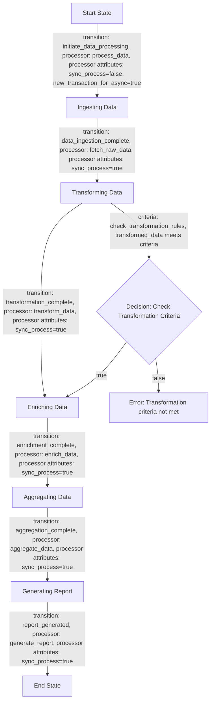

Sure! Here’s a complete Product Requirements Document (PRD) that outlines your Cyoda-based application, including entities, workflows, and diagrams. 

# Product Requirements Document (PRD) for Cyoda Design

## Introduction
This document provides an overview of the Cyoda-based application designed to manage data ingestion, transformation, aggregation, report generation, and email notification. It explains how the Cyoda design aligns with the specified requirements, focusing on the structure of entities, workflows, and the event-driven architecture that powers the application.

## What is Cyoda?
Cyoda is an event-driven framework that facilitates the management of workflows through entities representing jobs and data. Each entity has a defined state, and transitions between states are governed by events that occur within the system, enabling a responsive and scalable architecture.

## Proposed Entities

1. **Data Ingestion Job**
   ```json
   {
     "entity_name": "data_ingestion_job",
     "entity_type": "JOB",
     "entity_source": "SCHEDULED",
     "parameters": {
       "schedule_time": "2023-10-01T10:00:00Z",
       "api_endpoint": "https://api.example.com/data",
       "authentication_token": "your_token_here"
     },
     "status": "pending",
     "created_at": "2023-10-01T10:00:00Z"
   }
   ```

2. **Raw Data**
   ```json
   {
     "entity_name": "raw_data",
     "entity_type": "EXTERNAL_SOURCES_PULL_BASED_RAW_DATA",
     "entity_source": "ENTITY_EVENT",
     "data": [
       {
         "id": 1,
         "title": "Activity 1",
         "due_date": "2025-01-22T21:36:27.6587562+00:00",
         "completed": false
       },
       {
         "id": 2,
         "title": "Activity 2",
         "due_date": "2025-01-22T22:36:27.6587592+00:00",
         "completed": true
       }
     ],
     "ingested_at": "2023-10-01T10:01:00Z"
   }
   ```

3. **Transformed Data**
   ```json
   {
     "entity_name": "transformed_data",
     "entity_type": "SECONDARY_DATA",
     "entity_source": "ENTITY_EVENT",
     "raw_data_id": 1,
     "transformed_data": {
       "id": 1,
       "title": "Activity 1 - Transformed",
       "due_date": "2025-01-22T21:36:27.6587562+00:00",
       "status": "Pending",
       "additional_info": "Some additional data or transformations applied."
     },
     "transformed_at": "2023-10-01T10:02:00Z"
   }
   ```

4. **Aggregated Data**
   ```json
   {
     "entity_name": "aggregated_data",
     "entity_type": "SECONDARY_DATA",
     "entity_source": "ENTITY_EVENT",
     "summary": {
       "total_activities": 2,
       "completed_activities": 1,
       "pending_activities": 1
     },
     "activity_details": [
       {
         "activity_id": 1,
         "title": "Activity 1 - Aggregated",
         "status": "Pending"
       },
       {
         "activity_id": 2,
         "title": "Activity 2 - Aggregated",
         "status": "Completed"
       }
     ],
     "aggregated_at": "2023-10-01T10:03:00Z"
   }
   ```

5. **Report**
   ```json
   {
     "entity_name": "report",
     "entity_type": "SECONDARY_DATA",
     "entity_source": "ENTITY_EVENT",
     "report_id": "report_2023_10_01",
     "generated_at": "2023-10-01T10:05:00Z",
     "report_title": "Monthly Data Overview",
     "total_entries": 150,
     "successful_ingests": 145,
     "failed_ingests": 5,
     "activities_summary": [
       {
         "activity_id": 1,
         "title": "Activity 1",
         "status": "Pending"
       },
       {
         "activity_id": 2,
         "title": "Activity 2",
         "status": "Completed"
       }
     ],
     "overall_status": "Partially Completed",
     "comments": "This report summarizes the data ingestion activities for the month."
   }
   ```

6. **Data Processing Orchestrator**
   ```json
   {
     "entity_name": "data_processing_orchestrator",
     "entity_type": "API_REQUEST",
     "entity_source": "API_REQUEST",
     "parameters": {
       "data_ingestion_job_id": "data_ingestion_job_id_here",
       "raw_data_id": "raw_data_id_here",
       "transformation_rules": "specific_rules_here"
     },
     "status": "initiated",
     "initiated_at": "2023-10-01T10:00:00Z"
   }
   ```

## Proposed Workflows

### Workflow for Data Processing Orchestrator
#### Workflow Flowchart

```mermaid
flowchart TD
   A[Start State] -->|transition: initiate_data_processing, processor: process_data, processor attributes: sync_process=false, new_transaction_for_async=true| B[Ingesting Data]
   B -->|transition: data_ingestion_complete, processor: fetch_raw_data, processor attributes: sync_process=true| C[Transforming Data]
   C -->|transition: transformation_complete, processor: transform_data, processor attributes: sync_process=true| D[Enriching Data]
   D -->|transition: enrichment_complete, processor: enrich_data, processor attributes: sync_process=true| E[Aggregating Data]
   E -->|transition: aggregation_complete, processor: aggregate_data, processor attributes: sync_process=true| F[Generating Report]
   F -->|transition: report_generated, processor: generate_report, processor attributes: sync_process=true| G[End State]

   %% Decision point for criteria
   C -->|criteria: check_transformation_rules, transformed_data meets criteria| D1{Decision: Check Transformation Criteria}
   D1 -->|true| D
   D1 -->|false| E1[Error: Transformation criteria not met]

   class A,B,C,D,E,F,G,D1 automated;
```

## Conclusion
The proposed PRD outlines a structured approach for creating a robust data processing application using the Cyoda framework. The defined entities capture all essential aspects of data ingestion, transformation, aggregation, and reporting. The workflow for the data processing orchestrator allows for a clear understanding of how to manage the data lifecycle from start to finish.

This document serves as a comprehensive guide for implementation and development, ensuring all stakeholders are aligned on the system's architecture and operational flow.

Let me know if you need any changes or if there's anything else you'd like to add! 😊