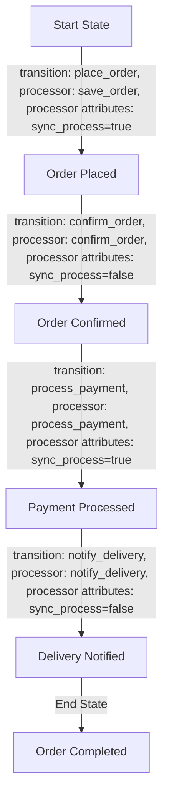

Sure! Here's a complete Product Requirements Document (PRD) for your online pizza ordering system, integrating all the elements we've discussed:

---

# Product Requirements Document (PRD)

## Project Title: Online Pizza Ordering System

### Overview

The Online Pizza Ordering System is designed to streamline the process of ordering pizza from various restaurants. Customers will be able to select a restaurant, view the menu, place orders, and make payments, all while receiving real-time updates about their order status. 

### Objectives

- Provide customers with a user-friendly interface to select restaurants and view menus.
- Facilitate the order placement process and ensure confirmations are sent effectively.
- Integrate a secure payment gateway for processing customer payments.
- Enable reliable delivery management to ensure timely orders.

### Functional Requirements

1. **Customer Management**
   - Customers should be able to create and manage their profiles.
   - A customer can store their delivery address and payment information.

2. **Restaurant Management**
   - Restaurants can register and maintain their menu items.
   - The system should fetch and display updated menus from the restaurant database.

3. **Order Management**
   - Customers can place orders for selected menu items.
   - The system should confirm and notify both the customer and the restaurant of the order status.

4. **Payment Processing**
   - Customers can make payments through a secure payment gateway.
   - The system should provide real-time payment confirmation.

5. **Delivery Management**
   - Delivery personnel should receive notifications about new orders and their status.
   - Customers should be informed about the delivery status of their orders.

### User Stories

1. As a **Customer**, I want to select a restaurant, so that I can view its menu and place an order.
2. As a **Customer**, I want to view the menu items, so that I can choose what I would like to order.
3. As a **Customer**, I want to place an order, so that my selected items are sent to the restaurant for preparation.
4. As a **Customer**, I want to receive an order confirmation, so that I know my order has been accepted.
5. As a **Customer**, I want to make a payment, so that it can be processed.
6. As a **Customer**, I want to receive a payment confirmation, so that I know my payment was successful.
7. As a **Customer**, I want to receive my order through a delivery person, so that I can enjoy my pizza.

### Entities

1. **Customer**
   - **JSON Model**: 
     ```json
     {
       "id": "cust123",
       "name": "John Doe",
       "contact": "+123456789",
       "address": "123 Pizza St"
     }
     ```
   - **Save Method**: Directly via API call.

2. **Restaurant**
   - **JSON Model**: 
     ```json
     {
       "id": "rest001",
       "name": "Pizza Place",
       "location": "Downtown",
       "menu": []
     }
     ```
   - **Save Method**: Directly via API call.

3. **Menu**
   - **JSON Model**: 
     ```json
     {
       "id": "menu001",
       "restaurantId": "rest001",
       "items": [
         {
           "id": "item001",
           "name": "Margherita",
           "description": "...",
           "price": 9.99
         }
       ]
     }
     ```
   - **Save Method**: Fetched through the restaurant entity via ENTITY_EVENT.

4. **Order**
   - **JSON Model**: 
     ```json
     {
       "id": "order001",
       "customerId": "cust123",
       "restaurantId": "rest001",
       "items": [
         {
           "id": "item001",
           "name": "Margherita",
           "price": 9.99
         }
       ],
       "status": "Confirmed"
     }
     ```
   - **Save Method**: Workflow event after a customer places an order.

5. **Payment**
   - **JSON Model**: 
     ```json
     {
       "id": "pay001",
       "orderId": "order001",
       "amount": 9.99,
       "status": "Success"
     }
     ```
   - **Save Method**: Directly via API call after order confirmation.

6. **Delivery**
   - **JSON Model**: 
     ```json
     {
       "id": "deliv001",
       "orderId": "order001",
       "deliveryPersonId": "deliv123",
       "status": "Out for delivery"
     }
     ```
   - **Save Method**: Generated through the order entity via ENTITY_EVENT.

### Workflows

#### Order Placement Workflow


```mermaid
flowchart TD
  A[Start State] -->|transition: place_order, processor: save_order, processor attributes: sync_process=true| B[Order Placed]
  B -->|transition: confirm_order, processor: confirm_order, processor attributes: sync_process=false| C[Order Confirmed]
  C -->|transition: process_payment, processor: process_payment, processor attributes: sync_process=true| D[Payment Processed]
  D -->|transition: notify_delivery, processor: notify_delivery, processor attributes: sync_process=false| E[Delivery Notified]
  E -->|End State| F[Order Completed]
class A,B,C,D,E,F automated;
```

### Additional Considerations

- **APIs**: The application will expose various APIs for customer registration, restaurant management, order placement, and payment processing.
- **High Availability (HA)**: The system should be designed to ensure uptime and reliability.
- **Persistence**: Data will be persisted in a database to maintain order history and customer interactions.

### Conclusion

This PRD outlines the essential features and requirements for the Online Pizza Ordering System. It serves as a foundation for development and ensures that all stakeholders are aligned on the project's objectives and functionality. 

Please let me know if there’s anything else you’d like to add or modify!