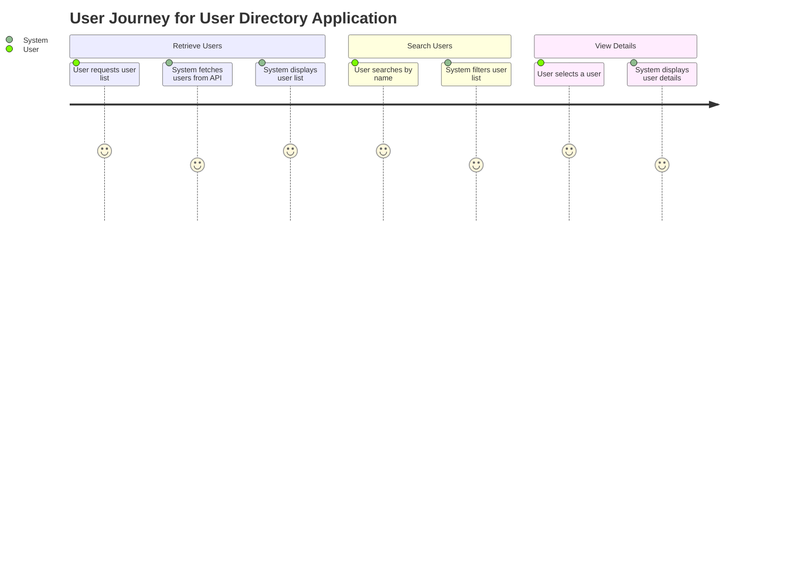
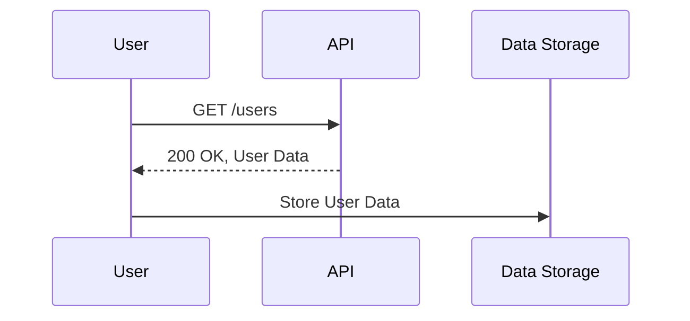
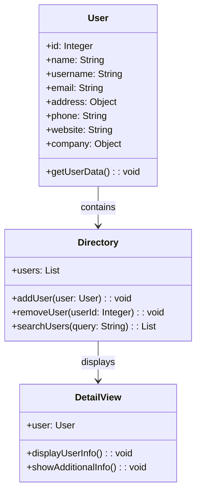
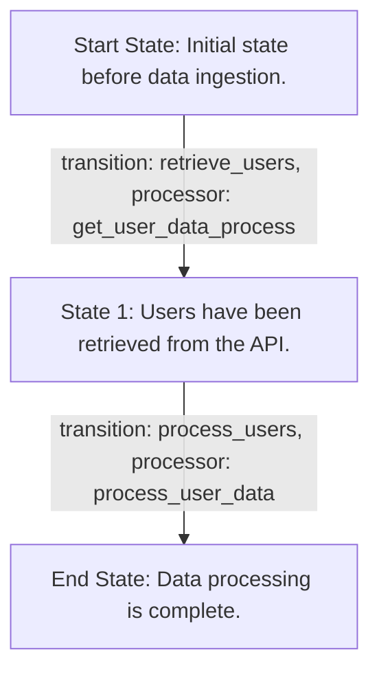

### Product Requirement Document (PRD) for User Directory Application

---

#### **Introduction**
The User Directory Application aims to create a user-friendly interface that allows users to view, search, and manage contact information for individuals. This application will integrate with an external API to retrieve user data and provide functionalities for displaying detailed information and performing searches.

---

#### **Objectives**
- To develop an application that lists users along with their basic contact details.
- To enable users to search for specific contacts by name or email.
- To provide detailed views of individual user data, including addresses and company information.
- To ensure data persistence for managing user information effectively.

---

#### **User Requirement Overview**
**Requirement Summary**: The application will create a simple user directory that lists all users with their basic contact details. It will integrate with an API to retrieve user data and provide functionalities for searching and viewing details.

**Key Features**:
1. **Data Ingestion**: Retrieve and display user data, including name, email, phone number, and website.
2. **User Interaction**: Allow users to search and filter the directory by name or email.
3. **Detail View**: Include a view for each user that shows their address and company information.
4. **Data Persistence**: Store the retrieved user data for future access and management.

---

#### **User Stories**
1. **As a user**, I want to retrieve a list of users from the API so that I can view their basic contact information.
2. **As a user**, I want to search for specific users by name or email, so that I can quickly find the information I need.
3. **As a user**, I want to view detailed information about a selected user, including their address and company details.
4. **As a developer**, I want to store the retrieved user data in a persistent format, so that it can be accessed and managed later.

---

#### **Journey Diagram**

```mermaid
journey
    title User Journey for User Directory Application
    section Retrieve Users
      User requests user list: 5: User
      System fetches users from API: 4: System
      System displays user list: 5: System
    section Search Users
      User searches by name: 5: User
      System filters user list: 4: System
    section View Details
      User selects a user: 5: User
      System displays user details: 4: System
```

---

#### **Sequence Diagram**

```mermaid
sequenceDiagram
    participant U as User
    participant A as API
    participant D as Data Storage
    U->>A: GET /users
    A-->>U: 200 OK, User Data
    U->>D: Store User Data
```

---

#### **Entities Overview**
1. **User Entity**: Represents the user data retrieved from the API.
   - **Saving Mechanism**: Saved directly via an API call when fetching from the user directory.

2. **Directory Entity**: Represents the collection of users displayed in the directory.
   - **Saving Mechanism**: Derived from the User Entity and does not require separate saving.

3. **Detail View Entity**: Represents the detailed information view for a selected user.
   - **Saving Mechanism**: Generated dynamically when a user selects a specific entry from the directory.

---

#### **Entities Diagram**

```mermaid
classDiagram
    class User {
        +id: Integer
        +name: String
        +username: String
        +email: String
        +address: Object
        +phone: String
        +website: String
        +company: Object
        +getUserData(): void
    }
    class Directory {
        +users: List<User>
        +addUser(user: User): void
        +removeUser(userId: Integer): void
        +searchUsers(query: String): List<User>
    }
    class DetailView {
        +user: User
        +displayUserInfo(): void
        +showAdditionalInfo(): void
    }
    User --> Directory: contains
    Directory --> DetailView: displays
```

---

#### **JSON Examples of Data Models**
1. **User Entity JSON Example**:
```json
{
  "id": 1,
  "name": "Leanne Graham",
  "username": "Bret",
  "email": "Sincere@april.biz",
  "address": {
    "street": "Kulas Light",
    "suite": "Apt. 556",
    "city": "Gwenborough",
    "zipcode": "92998-3874",
    "geo": {
      "lat": "-37.3159",
      "lng": "81.1496"
    }
  },
  "phone": "1-770-736-8031 x56442",
  "website": "hildegard.org",
  "company": {
    "name": "Romaguera-Crona",
    "catchPhrase": "Multi-layered client-server neural-net",
    "bs": "harness real-time e-markets"
  }
}
```

2. **Directory Entity JSON Example**:
```json
{
  "users": [
    {
      "id": 1,
      "name": "Leanne Graham",
      "username": "Bret",
      "email": "Sincere@april.biz"
    },
    {
      "id": 2,
      "name": "Ervin Howell",
      "username": "Antonette",
      "email": "Shanna@melissa.tv"
    }
  ]
}
```

3. **Detail View Entity JSON Example**:
```json
{
  "user": {
    "id": 1,
    "name": "Leanne Graham",
    "username": "Bret",
    "email": "Sincere@april.biz",
    "address": {
      "street": "Kulas Light",
      "suite": "Apt. 556",
      "city": "Gwenborough",
      "zipcode": "92998-3874"
    },
    "phone": "1-770-736-8031 x56442",
    "website": "hildegard.org",
    "company": {
      "name": "Romaguera-Crona",
      "catchPhrase": "Multi-layered client-server neural-net",
      "bs": "harness real-time e-markets"
    }
  }
}
```

---

#### **Workflows and Flowcharts**
1. **User Entity Workflow**:

```mermaid
flowchart TD
  A[Start State: Initial state before data ingestion.] -->|transition: retrieve_users, processor: get_user_data_process| B[State 1: Users have been retrieved from the API.]
  B -->|transition: process_users, processor: process_user_data| C[End State: Data processing is complete.]
```

---

### Conclusion
This PRD provides a comprehensive overview of the User Directory application's requirement, including user stories, journey and sequence diagrams, entity outlines, and workflow visualizations. By organizing the information in this manner, we can ensure that the development process is aligned with the users' needs and that the application is designed for optimal functionality.

If you have any further questions or if there are specific areas you would like me to expand upon, please let me know! I'm here to assist you and ensure that we achieve the best possible outcome for this project.