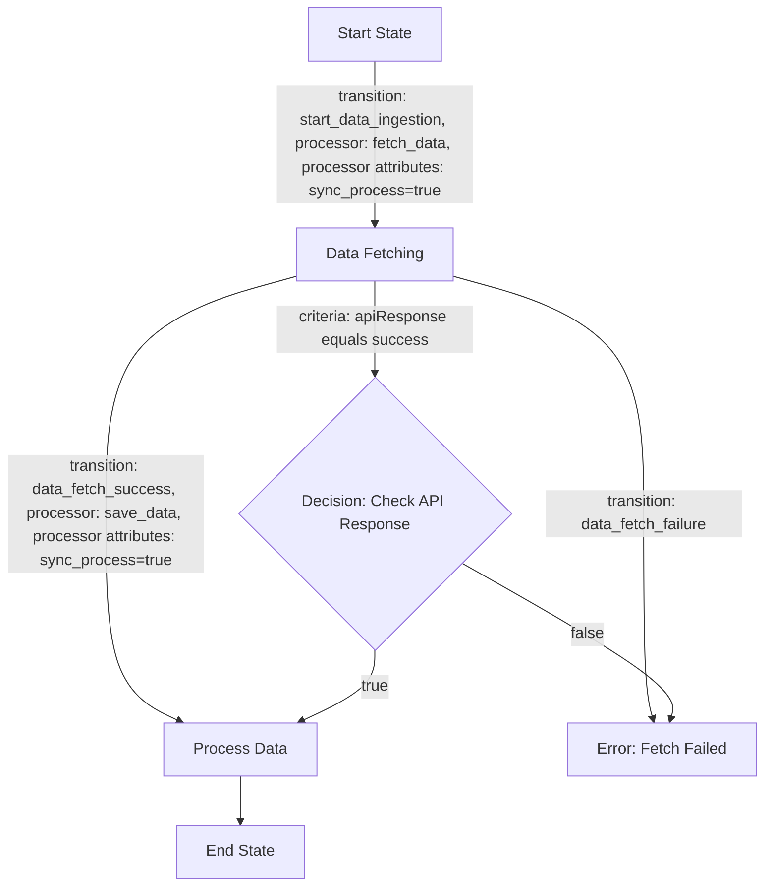

Sure! Here’s a complete Product Requirements Document (PRD) for your Inventory Management by Category application.

# Product Requirements Document (PRD) for Inventory Management by Category Application

## Introduction

This document outlines the requirements for an Inventory Management by Category application designed to manage inventory data using category data sourced from an external API. The application will implement features for data ingestion, transformation, display, user interaction, and reporting to ensure efficient inventory management.

## Objectives

- To ingest inventory levels categorized by `categoryID` and structured within the category tree.
- To transform inventory data to highlight stock levels and popular items.
- To present an overview of inventory by category, including available stock and sales trends.
- To enable user exploration of inventory using the category tree and view details by `categoryID`.
- To provide monthly inventory reports categorized by tree levels.

## Proposed Entities

1. **Category Entity**
   - **Schema**:
     ```json
     {
       "categoryID": "string",
       "categoryName": "string",
       "parentCategory": "string",
       "stockLevel": "integer",
       "createdAt": "string",
       "updatedAt": "string"
     }
     ```

2. **Inventory Item Entity**
   - **Schema**:
     ```json
     {
       "itemID": "string",
       "itemName": "string",
       "categoryID": "string",
       "stockLevel": "integer",
       "salesTrend": "float",
       "createdAt": "string",
       "updatedAt": "string"
     }
     ```

3. **Monthly Report Entity**
   - **Schema**:
     ```json
     {
       "reportID": "string",
       "generatedDate": "string",
       "reportData": {
         "categoryReports": [
           {
             "categoryID": "string",
             "stockLevel": "integer",
             "totalSales": "float"
           }
         ]
       },
       "createdAt": "string",
       "updatedAt": "string"
     }
     ```

4. **Data Ingestion Orchestration Entity**
   - **Schema**:
     ```json
     {
       "orchestrationID": "string",
       "apiEndpoint": "string",
       "scheduledTime": "string",
       "lastFetchTime": "string",
       "status": "string",
       "createdAt": "string",
       "updatedAt": "string"
     }
     ```

## Proposed Workflow

### Workflow for Data Ingestion Orchestration Entity

- **Workflow Name**: Data Ingestion Workflow
- **Launch Mechanism**: Triggered by a scheduled time or an event, initiating the data retrieval process from the API.

### Flowchart Representation


```mermaid
flowchart TD
   A[Start State] -->|transition: start_data_ingestion, processor: fetch_data, processor attributes: sync_process=true| B[Data Fetching]
   B -->|transition: data_fetch_success, processor: save_data, processor attributes: sync_process=true| C[Process Data]
   B -->|transition: data_fetch_failure| E[Error: Fetch Failed]
   C --> D[End State]

   %% Decision point for criteria
   B -->|criteria: apiResponse equals success| D1{Decision: Check API Response}
   D1 -->|true| C
   D1 -->|false| E

   class A,B,C,D,E,D1 automated;
```

## Event-Driven Architecture

In this application, changes to entities trigger certain actions:
- When a **Category Entity** is saved with new information, an event is emitted to process related inventory items.
- When the **Monthly Report Entity** is generated, events can notify users or update dashboards with new report data.
- The orchestration entity fetches data from the API, and successful fetches trigger updates to the Inventory Item and Category entities.

## Conclusion

The Inventory Management by Category application is designed to efficiently manage inventory data using a structured approach to data ingestion, transformation, display, user interaction, and reporting. With a clear set of entities and workflows, the application will facilitate effective inventory management and provide valuable insights to users.

This PRD serves as a foundation for implementation and development, guiding the technical team through the specifics of the application while providing clarity for those new to the project.

---

Let me know if you need any modifications or further details! 😊