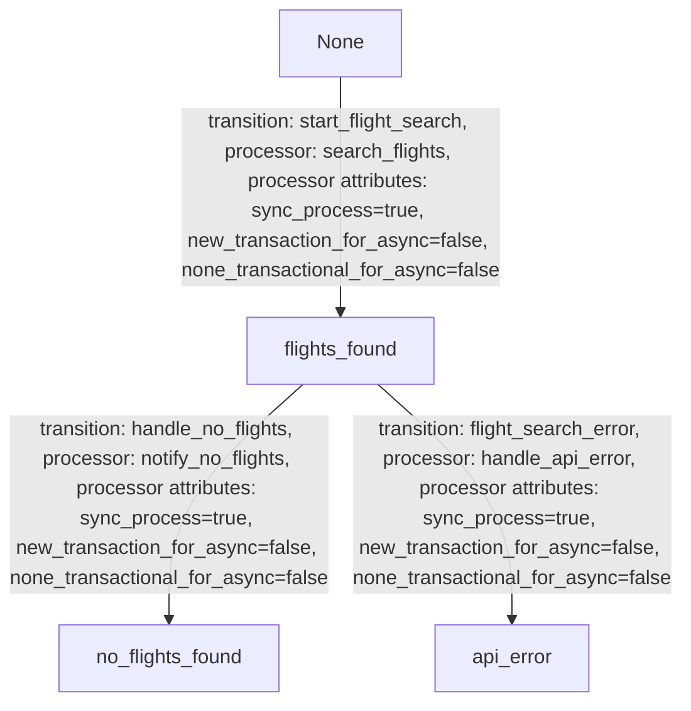
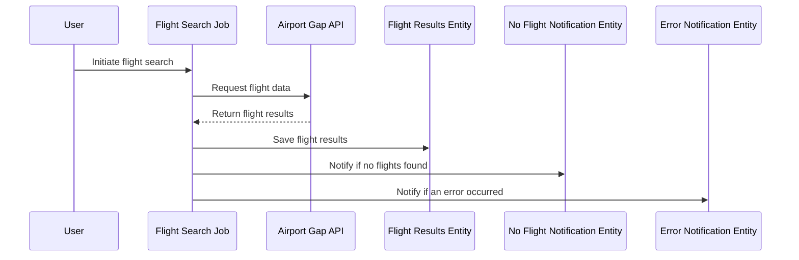
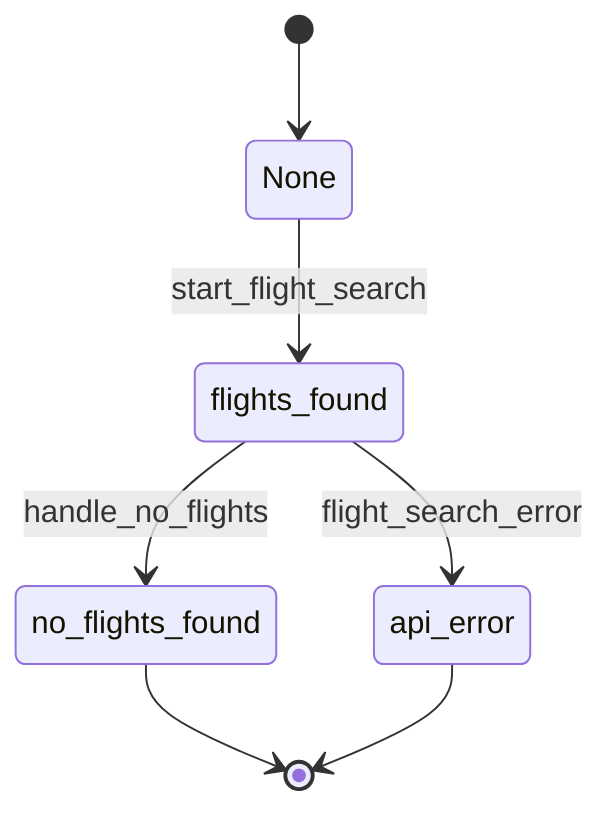
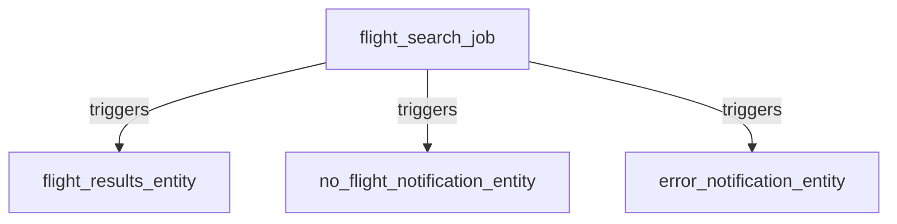

# Product Requirements Document (PRD) for Cyoda Design

## Introduction

This document provides an overview of the Cyoda design for a flight search application that utilizes the Airport Gap API. The design outlines how workflows are structured and how they respond to user inputs, emphasizing the event-driven architecture that is core to Cyoda. 

The subsequent sections explain each entity and its workflow, demonstrating how the design aligns with the application requirements. Additionally, relevant diagrams are included to visualize the processes and workflows involved.

## Cyoda Design Overview

The Cyoda design consists of several key entities that interact to facilitate flight search operations. Each entity is defined with its type, source, and workflow. 

### Entities Overview

- **flight_search_job**: Represents the job that triggers the flight search based on user input. It manages the workflow transitions related to searching for flights, handling errors, and notifying users.
  
- **flight_results_entity**: Stores the flight search results obtained from the Airport Gap API. This entity is triggered by the flight search job.
  
- **no_flight_notification_entity**: Notifies the user when no flights are found based on their search criteria. It is also triggered by the flight search job.
  
- **error_notification_entity**: Handles error notifications when issues arise during the API call for flight searches.

### Workflow Flowcharts

For each entity with transitions, we provide a flowchart to visualize its workflow.

#### Flight Search Job Workflow

```mermaid
flowchart TD
    A[None] -->|transition: start_flight_search, processor: search_flights, processor attributes: sync_process=true, new_transaction_for_async=false, none_transactional_for_async=false| B[flights_found]
    B -->|transition: handle_no_flights, processor: notify_no_flights, processor attributes: sync_process=true, new_transaction_for_async=false, none_transactional_for_async=false| C[no_flights_found]
    B -->|transition: flight_search_error, processor: handle_api_error, processor attributes: sync_process=true, new_transaction_for_async=false, none_transactional_for_async=false| D[api_error]

    class A,B,C,D automated;
```

## Sequence Diagram

The sequence diagram illustrates the interactions between users and the flight search job.

```mermaid
sequenceDiagram
    participant User
    participant Flight Search Job
    participant Airport Gap API
    participant Flight Results Entity
    participant No Flight Notification Entity
    participant Error Notification Entity

    User->>Flight Search Job: Initiate flight search
    Flight Search Job->>Airport Gap API: Request flight data
    Airport Gap API-->>Flight Search Job: Return flight results
    Flight Search Job->>Flight Results Entity: Save flight results
    Flight Search Job->>No Flight Notification Entity: Notify if no flights found
    Flight Search Job->>Error Notification Entity: Notify if an error occurred
```

## State Diagram

The state diagram captures the lifecycle of the flight search job.

```mermaid
stateDiagram
    [*] --> None
    None --> flights_found: start_flight_search
    flights_found --> no_flights_found: handle_no_flights
    flights_found --> api_error: flight_search_error
    no_flights_found --> [*]
    api_error --> [*]
```

## Graph Diagram

This diagram illustrates the relationships between the entities in the Cyoda design.

```mermaid
graph TD;
    A[flight_search_job] -->|triggers| B[flight_results_entity];
    A -->|triggers| C[no_flight_notification_entity];
    A -->|triggers| D[error_notification_entity];
```

## Conclusion

The Cyoda design efficiently aligns with the requirements of the flight search application by defining clear entities and workflows that respond to user actions and API interactions. The event-driven architecture allows for dynamic processing of flight searches, error handling, and responsive notifications to users. 

This PRD serves as a comprehensive guide for the implementation of the Cyoda architecture, ensuring that the development team has a clear understanding of the required components and their interactions.
