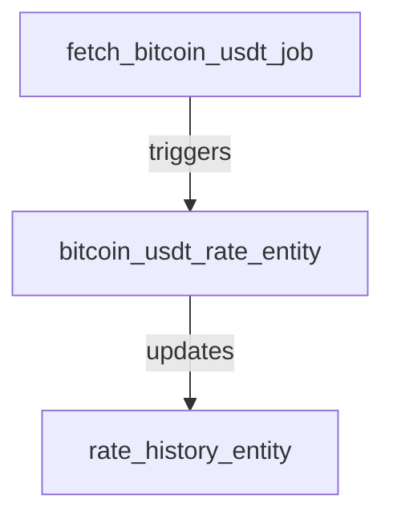
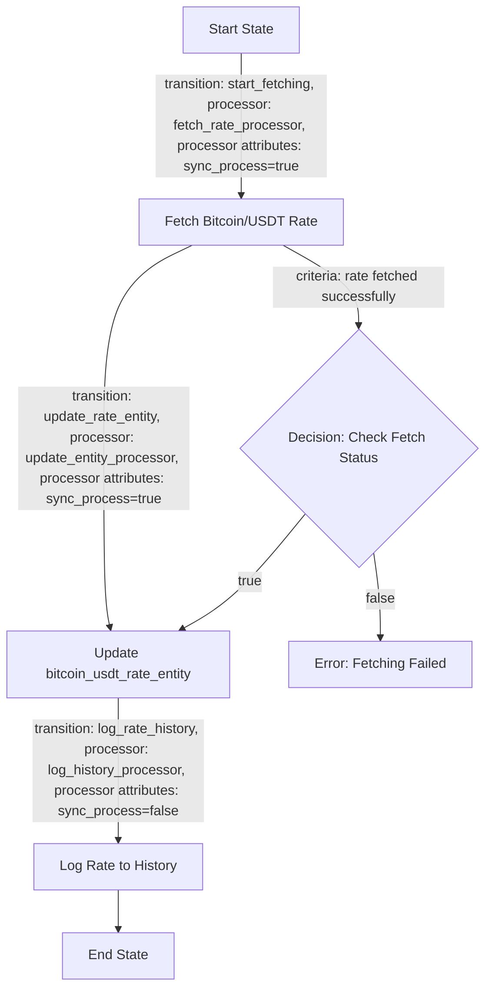

Sure! Below is the complete Product Requirements Document (PRD) for the Cyoda application designed to manage the fetching of Bitcoin/USDT rates from the Binance API.

---

# Product Requirements Document (PRD) for Cyoda Bitcoin/USDT Rate Fetching Application

## Introduction

This document outlines the Cyoda-based application designed to connect to the Binance API and fetch the Bitcoin/USDT exchange rate every 5 seconds. It details the entity structure, workflows, and event-driven architecture that supports the application, ensuring a scalable and efficient data processing system.

## What is Cyoda?

Cyoda is a serverless, event-driven framework that facilitates the management of workflows through entities representing jobs and data. Each entity has a defined state, and transitions between states are governed by events that occur within the system, enabling a responsive and scalable architecture.

## Cyoda Entity Database

### Entities Overview

1. **fetch_bitcoin_usdt_job**:
   - **Type**: JOB
   - **Source**: SCHEDULED
   - **Description**: Responsible for fetching the Bitcoin/USDT rate every 5 seconds.
   
2. **bitcoin_usdt_rate_entity**:
   - **Type**: CURRENT_RATE
   - **Source**: ENTITY_EVENT
   - **Description**: Stores the latest Bitcoin/USDT exchange rate retrieved from the Binance API.
   
3. **rate_history_entity**:
   - **Type**: RATE_HISTORY
   - **Source**: ENTITY_EVENT
   - **Description**: Keeps track of historical Bitcoin/USDT rates for analysis.

### Entities Diagram

```mermaid
graph TD;
    A[fetch_bitcoin_usdt_job] -->|triggers| B[bitcoin_usdt_rate_entity];
    B -->|updates| C[rate_history_entity];
```

### JSON Examples of Data Models

1. **fetch_bitcoin_usdt_job**
```json
{
  "entity_name": "fetch_bitcoin_usdt_job",
  "entity_type": "JOB",
  "entity_source": "SCHEDULED",
  "schedule": "*/5 * * * * *"
}
```

2. **bitcoin_usdt_rate_entity**
```json
{
  "entity_name": "bitcoin_usdt_rate_entity",
  "entity_type": "CURRENT_RATE",
  "entity_source": "ENTITY_EVENT",
  "current_rate": 50000.25,
  "timestamp": "2023-10-01T12:00:00Z"
}
```

3. **rate_history_entity**
```json
{
  "entity_name": "rate_history_entity",
  "entity_type": "RATE_HISTORY",
  "entity_source": "ENTITY_EVENT",
  "historical_rates": [
    {
      "rate": 50000.00,
      "timestamp": "2023-10-01T11:59:55Z"
    },
    {
      "rate": 50000.25,
      "timestamp": "2023-10-01T12:00:00Z"
    }
  ]
}
```

## Proposed Workflows

### Orchestration Entity: fetch_bitcoin_usdt_job
- **Workflow Name**: fetch_bitcoin_usdt_workflow
- **Description**: This workflow orchestrates the fetching of the Bitcoin/USDT rate and updates the relevant entities.

### Workflow Flowchart

```mermaid
flowchart TD
   A[Start State] -->|transition: start_fetching, processor: fetch_rate_processor, processor attributes: sync_process=true| B[Fetch Bitcoin/USDT Rate]
   B -->|transition: update_rate_entity, processor: update_entity_processor, processor attributes: sync_process=true| C[Update bitcoin_usdt_rate_entity]
   C -->|transition: log_rate_history, processor: log_history_processor, processor attributes: sync_process=false| D[Log Rate to History]
   D --> E[End State]

   %% Decision point for criteria
   B -->|criteria: rate fetched successfully| D1{Decision: Check Fetch Status}
   D1 -->|true| C
   D1 -->|false| E1[Error: Fetching Failed]

   class A,B,C,D,D1 automated;
```

### Explanation of the Workflow Steps
- **Start State**: Triggered by the fetch_bitcoin_usdt_job.
- **Fetch Bitcoin/USDT Rate**: The process retrieves the current rate from the Binance API.
- **Update bitcoin_usdt_rate_entity**: If successful, the entity is updated with the new rate.
- **Log Rate to History**: The updated rate is logged into the rate_history_entity.
- **Decision Point**: Checks if the fetching was successful and routes the workflow accordingly.

## Event-Driven Architecture

In the Cyoda framework, when an entity is created or updated, an event is emitted. This allows for automated workflows to be executed based on the changes in entities. For example, after the fetch_bitcoin_usdt_job triggers an update to the bitcoin_usdt_rate_entity, a corresponding event will signal the logging of the rate in the rate_history_entity.

## Conclusion

The Cyoda design effectively aligns with the requirements for creating a robust application that fetches the Bitcoin/USDT rate from Binance. By utilizing an event-driven model, the application can efficiently manage the state transitions of each entity involved, ensuring a smooth and automated process.

This PRD serves as a foundation for implementation and development, guiding the technical team through the specifics of the Cyoda architecture while providing clarity for users who are new to the Cyoda framework.

---

Feel free to let me know if you need any modifications or additional information!