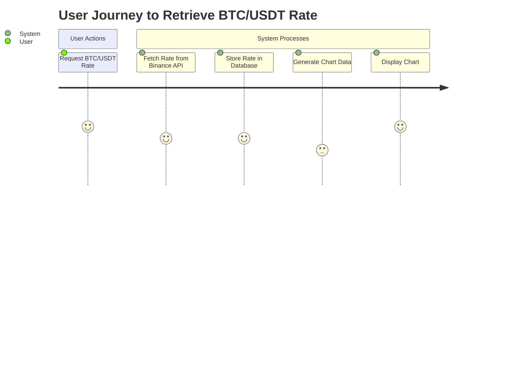
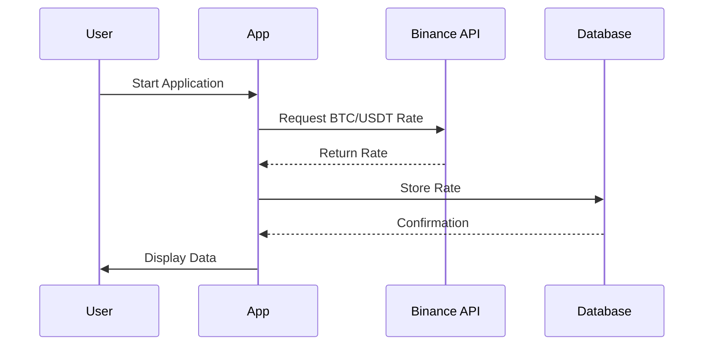
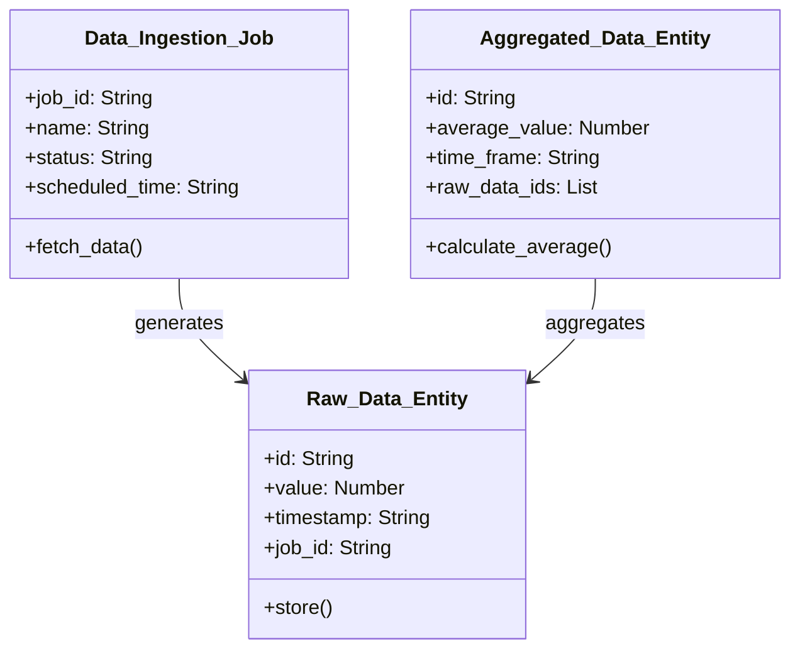
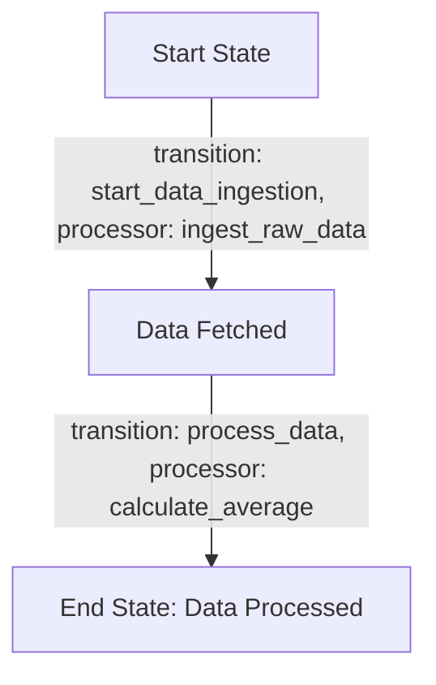
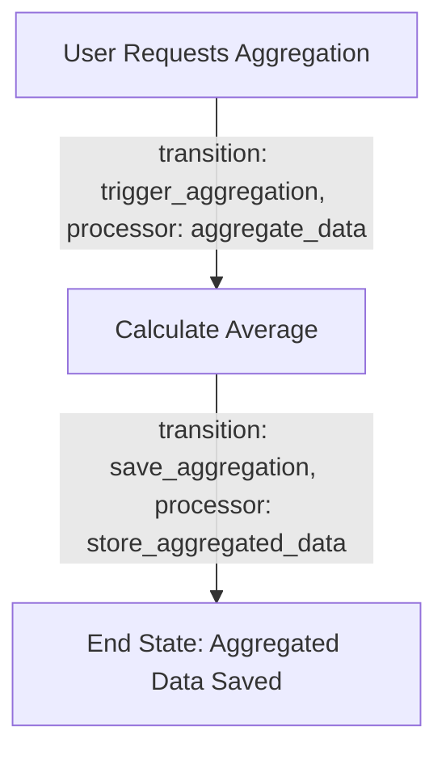

### Product Requirements Document (PRD) for Cyoda Design

#### Introduction

This document outlines the requirements for the Cyoda application, specifically focusing on the design that enables the aggregation of BTC/USDT rates from the Binance API. The goal is to create a system that efficiently retrieves, stores, and processes cryptocurrency exchange rates, allowing users to perform aggregations and view the data as needed.

#### User Requirement

**Requirement Statement**: Create an application that retrieves the BTC/USDT exchange rate from the Binance API every 5 seconds, stores the data in a database, and allows for future aggregations and chart displays based on user requests.

### User Stories

1. **As a User**, I want to receive real-time updates of the BTC/USDT exchange rate from the Binance API every 5 seconds so that I can monitor price fluctuations.
2. **As a User**, I want to store the retrieved exchange rates in a database so that I can access historical data for analysis.
3. **As a User**, I want to trigger an aggregation function that calculates the average exchange rate, so I can make informed decisions based on the data.
4. **As a User**, I want to view the aggregated data in charts over different timeframes (5 min, 30 min, 1 day, 1 week) for better visualization of trends.

### Journey Diagram


```mermaid
journey
    title User Journey to Retrieve BTC/USDT Rate
    section User Actions
      Request BTC/USDT Rate: 5: User
    section System Processes
      Fetch Rate from Binance API: 4: System
      Store Rate in Database: 4: System
      Generate Chart Data: 3: System
      Display Chart: 5: System
```

### Sequence Diagram


```mermaid
sequenceDiagram
    participant User
    participant App
    participant Binance API
    participant Database

    User->>App: Start Application
    App->>Binance API: Request BTC/USDT Rate
    Binance API-->>App: Return Rate
    App->>Database: Store Rate
    Database-->>App: Confirmation
    App->>User: Display Data
```

### Entities Overview

1. **Data Ingestion Job**
   - **Description**: Responsible for fetching the BTC/USDT rate from the Binance API.
   - **Saving Method**: Triggered by a scheduled job or an API call.

2. **Raw Data Entity**
   - **Description**: Stores the unprocessed data obtained from the Binance API.
   - **Saving Method**: Saved via an ENTITY_EVENT generated by the Data Ingestion Job.

3. **Aggregated Data Entity**
   - **Description**: Contains the average values calculated from the Raw Data.
   - **Saving Method**: Generated through a workflow associated with a user action.

### Entities Diagram


```mermaid
classDiagram
    class Data_Ingestion_Job {
        +job_id: String
        +name: String
        +status: String
        +scheduled_time: String
        +fetch_data()
    }
    class Raw_Data_Entity {
        +id: String
        +value: Number
        +timestamp: String
        +job_id: String
        +store()
    }
    class Aggregated_Data_Entity {
        +id: String
        +average_value: Number
        +time_frame: String
        +raw_data_ids: List
        +calculate_average()
    }
    Data_Ingestion_Job --> Raw_Data_Entity: generates
    Aggregated_Data_Entity --> Raw_Data_Entity: aggregates
```

### Workflows and Flowcharts

#### Data Ingestion Job Workflow


```mermaid
flowchart TD
  A[Start State] -->|transition: start_data_ingestion, processor: ingest_raw_data| B[Data Fetched]
  B -->|transition: process_data, processor: calculate_average| C[End State: Data Processed]
```

#### Aggregation Workflow


```mermaid
flowchart TD
  A[User Requests Aggregation] -->|transition: trigger_aggregation, processor: aggregate_data| B[Calculate Average]
  B -->|transition: save_aggregation, processor: store_aggregated_data| C[End State: Aggregated Data Saved]
```

### JSON Examples of Data Models

1. **Data Ingestion Job**
   ```json
   {
     "job_id": "job_001",
     "name": "data_ingestion_job",
     "status": "completed",
     "scheduled_time": "2023-10-01T10:00:00Z"
   }
   ```

2. **Raw Data Entity**
   ```json
   {
     "id": "raw_data_001",
     "value": 30000,
     "timestamp": "2023-10-01T10:00:00Z",
     "job_id": "job_001"
   }
   ```

3. **Aggregated Data Entity**
   ```json
   {
     "id": "aggregated_data_001",
     "average_value": 29500,
     "time_frame": "1 hour",
     "raw_data_ids": ["raw_data_001"]
   }
   ```

### Conclusion

This PRD outlines a comprehensive plan for the Cyoda application, focusing on the key functionalities required to meet user needs. By enabling real-time data ingestion, storage, and aggregation, the application will empower users to make informed decisions based on the latest exchange rate information. If you have any further questions or need adjustments, please let me know! I'm here to support you as we move forward with this exciting project.