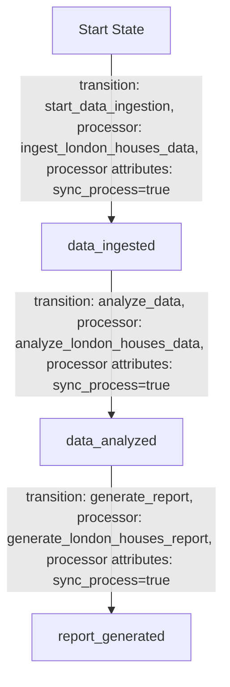
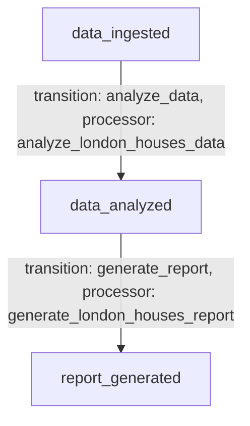
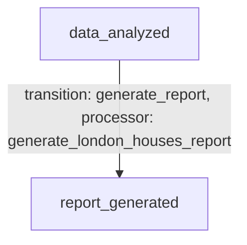
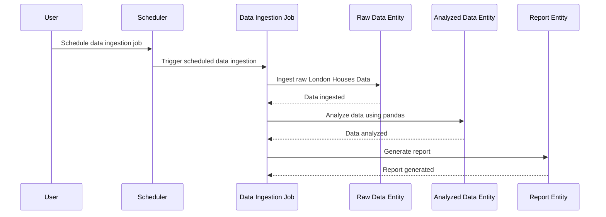
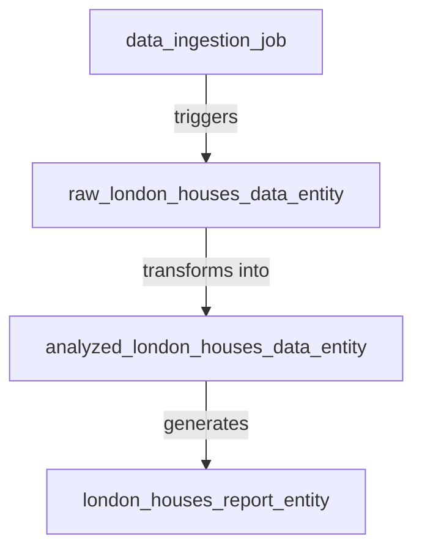
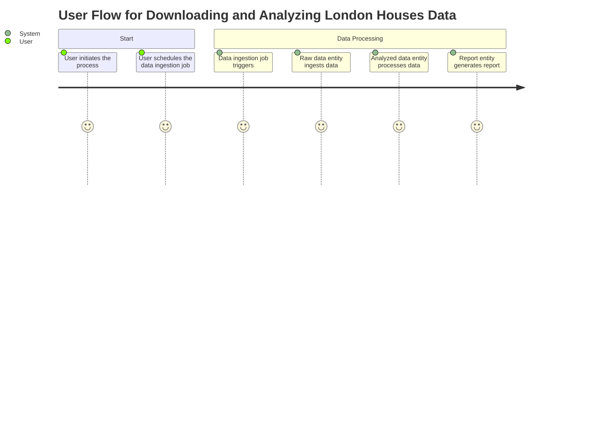

# Product Requirements Document (PRD) for Cyoda Design

## Introduction

This document outlines the Cyoda-based application designed to download London Houses Data, analyze it using pandas, and generate a report. The design aligns with the specified requirements and provides a comprehensive overview of the entities, workflows, and the event-driven architecture that facilitates the application's functionality. The design is represented in a human-readable format with accompanying diagrams for clarity.

## What is Cyoda?

Cyoda is a serverless, event-driven framework that manages workflows through entities representing jobs and data. Each entity has a defined state, and transitions between states are governed by events triggered within the system. This architecture enables responsive and scalable applications.

## Cyoda Design JSON Explanation

The provided Cyoda design JSON includes several key entities, each with its respective workflows and transitions:

1. **Data Ingestion Job (`data_ingestion_job`)**:
   - **Type**: JOB
   - **Source**: SCHEDULED
   - **Workflow**: Initiates the process of downloading London Houses Data from the specified API.

2. **Raw London Houses Data Entity (`raw_london_houses_data_entity`)**:
   - **Type**: EXTERNAL_SOURCES_PULL_BASED_RAW_DATA
   - **Source**: ENTITY_EVENT
   - **Workflow**: Processes the raw data once it has been ingested.

3. **Analyzed London Houses Data Entity (`analyzed_london_houses_data_entity`)**:
   - **Type**: SECONDARY_DATA
   - **Source**: ENTITY_EVENT
   - **Workflow**: Handles the analysis of the raw data using pandas.

4. **London Houses Report Entity (`london_houses_report_entity`)**:
   - **Type**: SECONDARY_DATA
   - **Source**: ENTITY_EVENT
   - **Workflow**: Generates the final report based on the analyzed data.

### Workflow Flowcharts

For each workflow, we provide a flowchart illustrating the transitions and processes involved.

#### Data Ingestion Job Workflow

```mermaid
flowchart TD
    A[Start State] -->|transition: start_data_ingestion, processor: ingest_london_houses_data, processor attributes: sync_process=true| B[data_ingested]
    B -->|transition: analyze_data, processor: analyze_london_houses_data, processor attributes: sync_process=true| C[data_analyzed]
    C -->|transition: generate_report, processor: generate_london_houses_report, processor attributes: sync_process=true| D[report_generated]

    class A,B,C,D automated;
```

#### Raw London Houses Data Workflow

```mermaid
flowchart TD
    A[data_ingested] -->|transition: analyze_data, processor: analyze_london_houses_data| B[data_analyzed]
    B -->|transition: generate_report, processor: generate_london_houses_report| C[report_generated]

    class A,B,C automated;
```

#### Analyzed London Houses Data Workflow

```mermaid
flowchart TD
    A[data_analyzed] -->|transition: generate_report, processor: generate_london_houses_report| B[report_generated]

    class A,B automated;
```

### Sequence Diagram

```mermaid
sequenceDiagram
    participant User
    participant Scheduler
    participant Data Ingestion Job
    participant Raw Data Entity
    participant Analyzed Data Entity
    participant Report Entity

    User->>Scheduler: Schedule data ingestion job
    Scheduler->>Data Ingestion Job: Trigger scheduled data ingestion
    Data Ingestion Job->>Raw Data Entity: Ingest raw London Houses Data
    Raw Data Entity-->>Data Ingestion Job: Data ingested
    Data Ingestion Job->>Analyzed Data Entity: Analyze data using pandas
    Analyzed Data Entity-->>Data Ingestion Job: Data analyzed
    Data Ingestion Job->>Report Entity: Generate report
    Report Entity-->>Data Ingestion Job: Report generated
```

### Entity Relationships Diagram

```mermaid
graph TD;
    A[data_ingestion_job] -->|triggers| B[raw_london_houses_data_entity];
    B -->|transforms into| C[analyzed_london_houses_data_entity];
    C -->|generates| D[london_houses_report_entity];
```

### Journey Diagram

```mermaid
journey
    title User Flow for Downloading and Analyzing London Houses Data
    section Start
      User initiates the process: 5: User
      User schedules the data ingestion job: 5: User
    section Data Processing
      Data ingestion job triggers: 5: System
      Raw data entity ingests data: 5: System
      Analyzed data entity processes data: 5: System
      Report entity generates report: 5: System
```

## Conclusion

The Cyoda design effectively aligns with the requirements for downloading and analyzing London Houses Data. The structured workflows, transitions, and event-driven approach ensure a seamless and automated process from data ingestion to report generation. This PRD provides a clear foundation for implementation and development, guiding the technical team through the specifics of the Cyoda architecture while ensuring clarity for users unfamiliar with the framework.