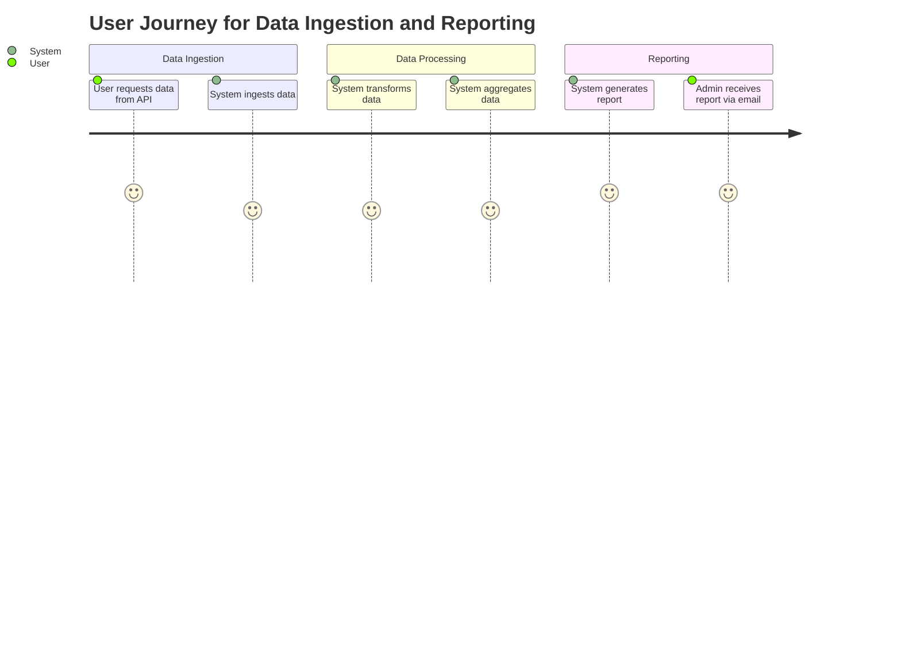
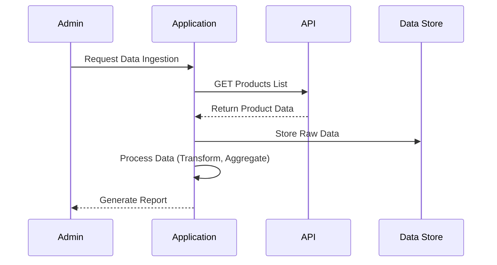
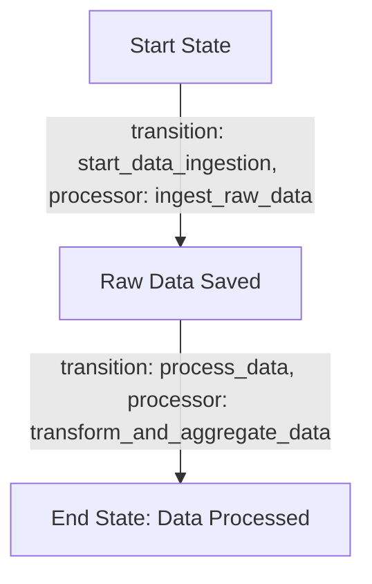

### Product Requirement Document (PRD)

#### Introduction

This document outlines the requirements for the application designed to ingest data from the Automation Exercise API. The primary goal is to create an efficient system that can retrieve, process, and report on product data, meeting the specified user needs.

#### User Requirement Overview

- **User Requirement**: Build an application that ingests data from the Automation Exercise API, performs transformations, aggregates data, generates reports, and publishes the findings to an admin email.
- **Key Components**: 
  - Data Ingestion
  - Data Transformation
  - Aggregation
  - Reporting
  - Publishing
  - Scheduled Ingestion

#### User Stories

1. **As an admin**, I want to ingest data from the Automation Exercise API so that I can manage product information effectively.
2. **As an admin**, I want the application to transform and aggregate data so that I can analyze product details.
3. **As an admin**, I want to receive daily reports summarizing the data, including key metrics like count by type and average price.
4. **As a user**, I want to be notified of any errors during data ingestion so that I can take appropriate action.

#### Journey Diagram


```mermaid
journey
    title User Journey for Data Ingestion and Reporting
    section Data Ingestion
      User requests data from API: 5: User
      System ingests data: 4: System
    section Data Processing
      System transforms data: 4: System
      System aggregates data: 4: System
    section Reporting
      System generates report: 5: System
      Admin receives report via email: 5: User
```

#### Sequence Diagram


```mermaid
sequenceDiagram
    participant A as Admin
    participant B as Application
    participant C as API
    participant D as Data Store

    A->>B: Request Data Ingestion
    B->>C: GET Products List
    C-->>B: Return Product Data
    B->>D: Store Raw Data
    B->>B: Process Data (Transform, Aggregate)
    B-->>A: Generate Report
```

### Entities Overview

1. **Data Ingestion Job**
   - **Example JSON**:
   ```json
   {
     "job_id": "job_001",
     "job_name": "Daily Data Ingestion Job",
     "scheduled_time": "2023-10-01T00:00:00Z",
     "status": "pending",
     "workflow": {
       "name": "data_ingestion_workflow",
       "transitions": ["start_data_ingestion", "schedule_daily_ingestion"]
     }
   }
   ```
   - **Saved Through**: Scheduled via a cron job or a time-based trigger.

2. **Raw Data Entity**
   - **Example JSON**:
   ```json
   {
     "raw_data_id": "raw_data_001",
     "products": [
       {
         "id": 1,
         "name": "Blue Top",
         "price": "Rs. 500"
       },
       {
         "id": 2,
         "name": "Men Tshirt",
         "price": "Rs. 400"
       }
     ]
   }
   ```
   - **Saved Through**: Directly from the API call during the data ingestion job.

3. **Processed Data Entity**
   - **Example JSON**:
   ```json
   {
     "processed_data_id": "processed_data_001",
     "aggregated_results": {
       "total_products": 10,
       "average_price": "Rs. 750"
     }
   }
   ```
   - **Saved Through**: Workflow of the Raw Data Entity after processing.

4. **Report Entity**
   - **Example JSON**:
   ```json
   {
     "report_id": "report_001",
     "report_name": "Daily Product Summary",
     "generated_at": "2023-10-01T01:00:00Z",
     "content": "Total Products: 10, Average Price: Rs. 750"
   }
   ```
   - **Saved Through**: Generated and sent via email based on the aggregated data.

### Workflows and Flowcharts

#### Data Ingestion Job Workflow


```mermaid
flowchart TD
  A[Start State] -->|transition: start_data_ingestion, processor: ingest_raw_data| B[Raw Data Saved]
  B -->|transition: process_data, processor: transform_and_aggregate_data| C[End State: Data Processed]
```

This flowchart represents the workflow associated with the Data Ingestion Job, highlighting the transitions that occur during the data ingestion process.

### Conclusion

The PRD provides a comprehensive overview of the requirements, user stories, entity models, and workflows necessary for the successful development of the application. If you have any further questions or need additional modifications, please let me know! I'm here to assist you in bringing your vision to life!