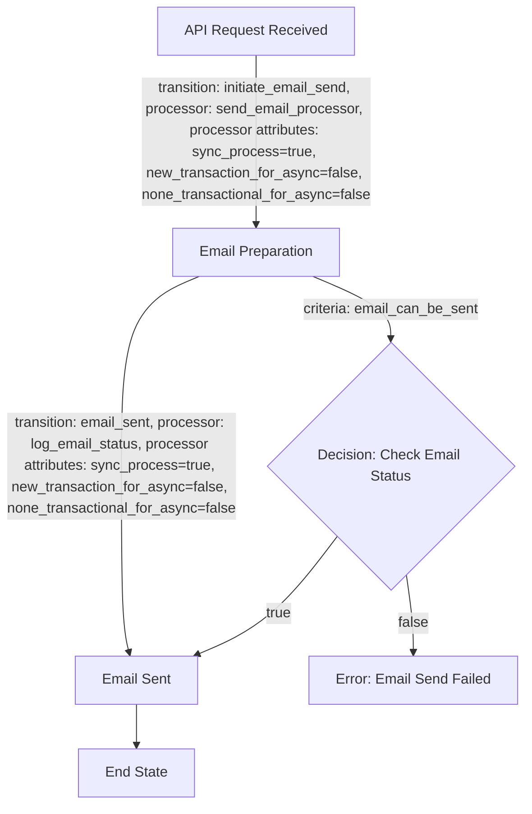

Sure! Here’s a complete Product Requirements Document (PRD) for your Email Notification Service using the Cyoda framework:

---

# Product Requirements Document (PRD) for Email Notification Service

## Introduction

This document outlines the requirements for an Email Notification Service designed using the Cyoda framework. The service aims to automate the process of sending emails based on specific events, ensuring timely notifications to users. This PRD includes details about entities, workflows, event-driven architecture, and diagrams for clear understanding.

## What is Cyoda?

Cyoda is a serverless, event-driven framework that facilitates the management of workflows through entities. Each entity represents a process or data component, transitioning through defined states based on events that occur within the system. This architecture promotes scalability and efficiency by automating responses to changes.

## Entities Overview

1. **Email Notification Job (`email_notification_job`)**
   - **Type**: JOB
   - **Source**: SCHEDULED
   - **Description**: Triggers the process of sending emails based on specific events.

2. **Email Entity (`email_entity`)**
   - **Type**: SECONDARY_DATA
   - **Source**: ENTITY_EVENT
   - **Description**: Holds information about each generated email, such as recipient details and content.

3. **Orchestration Entity (`api_request`)**
   - **Type**: API_REQUEST
   - **Source**: API_REQUEST
   - **Description**: Initiates the email notification workflow when an API call is made.

### JSON Examples of Entities

#### Email Notification Job
```json
{
  "job_id": "email_job_001",
  "job_name": "Daily Email Notification Job",
  "scheduled_time": "2023-10-01T08:00:00Z",
  "status": "scheduled",
  "trigger_event": "data_change_event"
}
```

#### Email Entity
```json
{
  "email_id": "email_001",
  "recipient": {
    "name": "Admin User",
    "email": "admin@example.com"
  },
  "subject": "Daily Report",
  "body": "This is your daily report...",
  "sent_status": "pending",
  "sent_at": null
}
```

#### Orchestration Entity
```json
{
  "request_id": "request_001",
  "endpoint": "/send-email",
  "method": "POST",
  "payload": {
    "job_id": "email_job_001",
    "recipient": {
      "name": "Admin User",
      "email": "admin@example.com"
    }
  },
  "status": "initiated",
  "created_at": "2023-10-01T07:00:00Z"
}
```

## Proposed Workflows

### Orchestration Entity Workflow (`api_request`)
- **Description**: This workflow handles the initiation of the email notification process when an API request is made.

**Workflow Launch Information**:
- The workflow is launched when an API request is received at the `/send-email` endpoint.

#### Workflow Flowchart

```mermaid
flowchart TD
    A[API Request Received] -->|transition: initiate_email_send, processor: send_email_processor, processor attributes: sync_process=true, new_transaction_for_async=false, none_transactional_for_async=false| B[Email Preparation]
    B -->|transition: email_sent, processor: log_email_status, processor attributes: sync_process=true, new_transaction_for_async=false, none_transactional_for_async=false| C[Email Sent]
    C --> D[End State]

    %% Decision point for email sending success
    B -->|criteria: email_can_be_sent| D1{Decision: Check Email Status}
    D1 -->|true| C
    D1 -->|false| E[Error: Email Send Failed]

    class A,B,C,D,D1 automated;
```

## Event-Driven Architecture

In Cyoda, entities emit events when they are saved or updated. For example, when an `email_entity` is created after preparing the email, an event is triggered to signal the sending process. This allows the application to respond automatically to changes, ensuring a smooth workflow.

## Conclusion

This PRD outlines the essential components of the Email Notification Service within the Cyoda framework. By implementing the described entities, workflows, and event-driven architecture, the application will efficiently manage the process of sending timely email notifications based on specific events. This document serves as a foundation for the implementation and development phases, ensuring clarity and guidance for the technical team.

---

Feel free to let me know if you need any modifications or additional information! I'm here to help! 😊