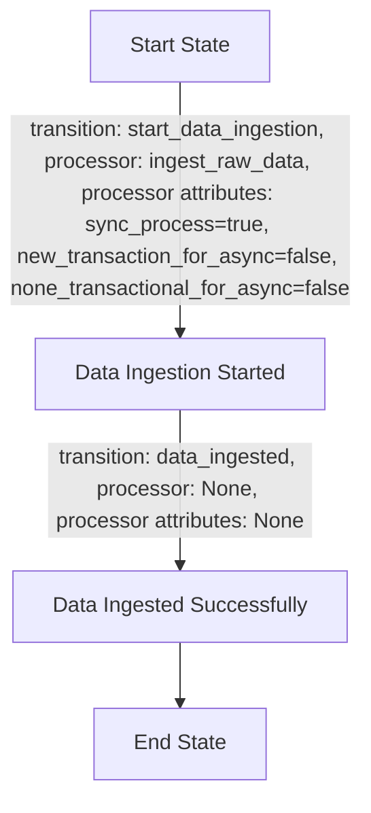

Sure! Here's a complete Product Requirements Document (PRD) based on your requirements and the previous discussions.

# Product Requirements Document (PRD) for Data Processing Application

## Introduction

This document outlines the requirements and design for a data processing application that ingests data from specified sources, aggregates the data, and generates reports. The application will utilize the Cyoda framework to manage workflows in an event-driven architecture, ensuring that processes are automated and responsive.

## Objectives
- **Ingest Data**: Automatically fetch data from specified data sources.
- **Aggregate Data**: Process and summarize the ingested data.
- **Generate Reports**: Create structured reports based on the aggregated data.

## Key Features
1. **Data Ingestion**: Scheduled ingestion of data from external sources.
2. **Data Aggregation**: Processing of raw data to extract meaningful insights.
3. **Report Generation**: Creation and distribution of reports to stakeholders.

## Entities Overview

### 1. Data Ingestion Job
- **Entity Name**: `data_ingestion_job`
- **Entity Type**: JOB
- **Entity Source**: SCHEDULED
- **Description**: Initiates data ingestion from specified sources at scheduled times.

### 2. Raw Data Entity
- **Entity Name**: `raw_data_entity`
- **Entity Type**: EXTERNAL_SOURCES_PULL_BASED_RAW_DATA
- **Entity Source**: ENTITY_EVENT
- **Description**: Stores the raw data retrieved from the data sources.

### 3. Aggregated Data Entity
- **Entity Name**: `aggregated_data_entity`
- **Entity Type**: SECONDARY_DATA
- **Entity Source**: ENTITY_EVENT
- **Description**: Holds the processed and aggregated data ready for reporting.

### 4. Report Entity
- **Entity Name**: `report_entity`
- **Entity Type**: REPORT
- **Entity Source**: ENTITY_EVENT
- **Description**: Contains the final report generated from aggregated data.

## Workflows Overview

### Data Ingestion Job Workflow
- **Workflow Name**: `data_ingestion_workflow`
- **Description**: Responsible for handling the data ingestion process from external sources.
- **Transitions**:
  - **Scheduled Ingestion**: Triggered by a scheduled event to initiate the data ingestion.

#### Flowchart for Data Ingestion Job Workflow

```mermaid
flowchart TD
   A[Start State] -->|transition: start_data_ingestion, processor: ingest_raw_data, processor attributes: sync_process=true, new_transaction_for_async=false, none_transactional_for_async=false| B[Data Ingestion Started]
   B -->|transition: data_ingested, processor: None, processor attributes: None| C[Data Ingested Successfully]
   C --> D[End State]

   class A,B,C,D automated;
```

## Event-Driven Architecture
- In this application, each entity's lifecycle is tied to events:
  - When a `data_ingestion_job` is triggered, it emits an event that creates a `raw_data_entity`.
  - Once raw data is stored, further events lead to the creation of `aggregated_data_entity` and finally the `report_entity`.
- This automation allows for seamless transitions between states without manual intervention.

## JSON Examples for Each Entity
### 1. Data Ingestion Job
```json
{
  "entity_name": "data_ingestion_job",
  "entity_type": "JOB",
  "entity_source": "SCHEDULED",
  "next_run": "2023-10-02T10:00:00Z",
  "status": "scheduled"
}
```

### 2. Raw Data Entity
```json
{
  "entity_name": "raw_data_entity",
  "entity_type": "EXTERNAL_SOURCES_PULL_BASED_RAW_DATA",
  "data": [
    {
      "id": 1,
      "title": "Sample Data 1",
      "description": "Data fetched from the source.",
      "timestamp": "2023-10-01T10:05:00Z"
    },
    {
      "id": 2,
      "title": "Sample Data 2",
      "description": "Another data entry.",
      "timestamp": "2023-10-01T10:06:00Z"
    }
  ]
}
```

### 3. Aggregated Data Entity
```json
{
  "entity_name": "aggregated_data_entity",
  "entity_type": "SECONDARY_DATA",
  "summary": {
    "total_records": 2,
    "processed_records": 2,
    "aggregation_timestamp": "2023-10-01T10:10:00Z"
  }
}
```

### 4. Report Entity
```json
{
  "entity_name": "report_entity",
  "entity_type": "REPORT",
  "report_id": "monthly_report_2023_10",
  "generated_at": "2023-10-01T10:15:00Z",
  "content": "This report summarizes the aggregated data.",
  "status": "sent"
}
```

## Conclusion
This PRD outlines a comprehensive plan for building a data processing application using the Cyoda framework. By leveraging an event-driven architecture, the application will efficiently manage data ingestion, aggregation, and reporting processes. 

If there are any further details you would like to add or modify, feel free to let me know!