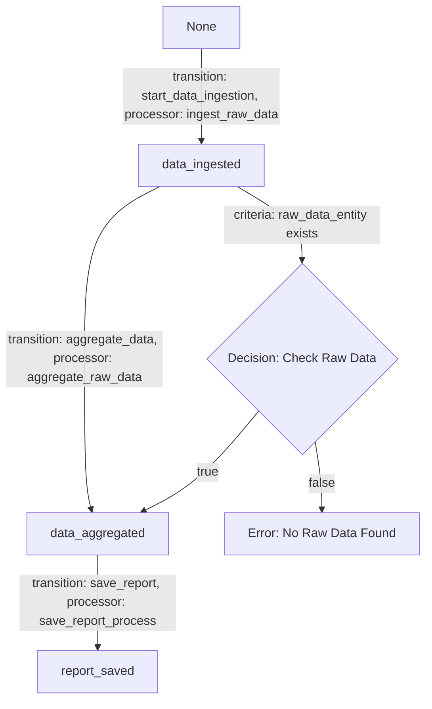
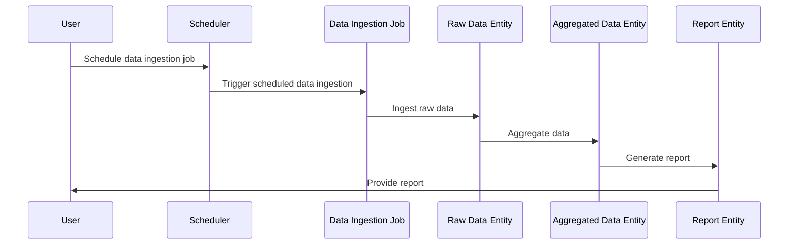
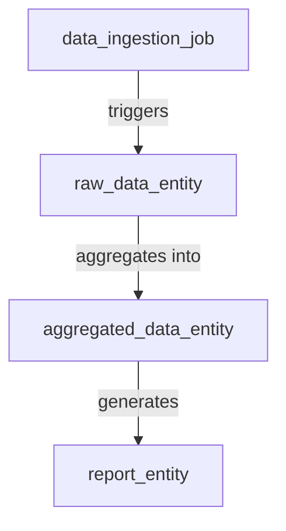
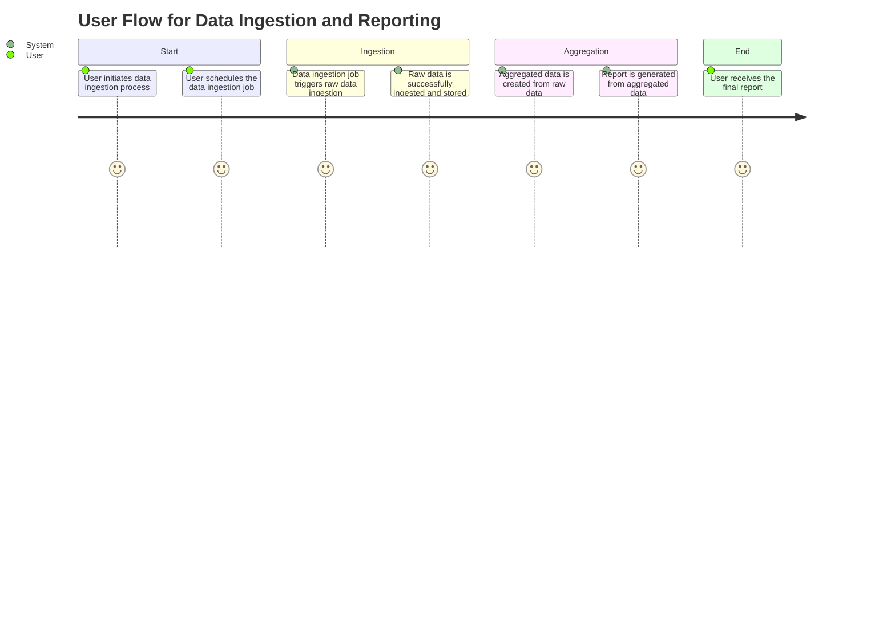
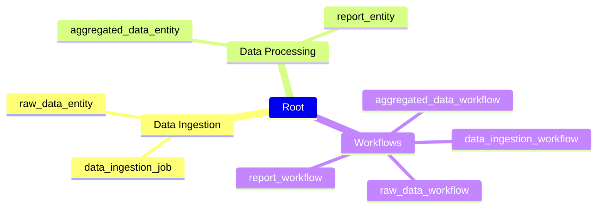
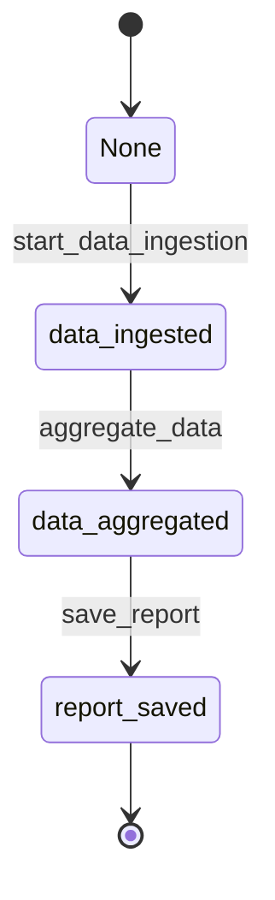

# Product Requirements Document (PRD) for Cyoda Design

## Overview
This document outlines the design of the Cyoda application, which is developed to ingest, aggregate, and save data reports. The design aligns with the requirements specified, ensuring a fluid workflow from data ingestion through to reporting.

## Requirement Alignment
The main requirement is to create an application that:
1. Ingests data from a specified data source.
2. Aggregates the ingested data.
3. Saves the aggregated data to a report.

The Cyoda design JSON specifies the following entities and workflows that fulfill these requirements:

1. **data_ingestion_job**: This JOB entity is scheduled to initiate the data ingestion process. It has a transition to start the ingestion of raw data from the specified source.
2. **raw_data_entity**: This entity represents the ingested data. It is an external pull-based data source that will trigger further processes once data has been ingested.
3. **aggregated_data_entity**: This SECONDARY_DATA entity is used to store the aggregated results of the ingested data, allowing for reporting.
4. **report_entity**: This entity captures the final report generated from the aggregated data.

## Workflows and Diagrams

### Flowchart for Data Ingestion Job

```mermaid
flowchart TD
    A[None] -->|transition: start_data_ingestion, processor: ingest_raw_data| B[data_ingested]
    B -->|transition: aggregate_data, processor: aggregate_raw_data| C[data_aggregated]
    C -->|transition: save_report, processor: save_report_process| D[report_saved]

    %% Decision point for criteria
    B -->|criteria: raw_data_entity exists| D1{Decision: Check Raw Data}
    D1 -->|true| C
    D1 -->|false| E[Error: No Raw Data Found]

    class A,B,C,D,D1 automated;
```

### Sequence Diagram for Data Ingestion Process

```mermaid
sequenceDiagram
    participant User
    participant Scheduler
    participant Data Ingestion Job
    participant Raw Data Entity
    participant Aggregated Data Entity
    participant Report Entity

    User->>Scheduler: Schedule data ingestion job
    Scheduler->>Data Ingestion Job: Trigger scheduled data ingestion
    Data Ingestion Job->>Raw Data Entity: Ingest raw data
    Raw Data Entity->>Aggregated Data Entity: Aggregate data
    Aggregated Data Entity->>Report Entity: Generate report
    Report Entity->>User: Provide report
```

### Entity Relationships Diagram

```mermaid
graph TD;
    A[data_ingestion_job] -->|triggers| B[raw_data_entity];
    B -->|aggregates into| C[aggregated_data_entity];
    C -->|generates| D[report_entity];
```

### Journey Diagram for User Interaction

```mermaid
journey
    title User Flow for Data Ingestion and Reporting
    section Start
      User initiates data ingestion process: 5: User
      User schedules the data ingestion job: 5: User
    section Ingestion
      Data ingestion job triggers raw data ingestion: 5: System
      Raw data is successfully ingested and stored: 5: System
    section Aggregation
      Aggregated data is created from raw data: 5: System
      Report is generated from aggregated data: 5: System
    section End
      User receives the final report: 5: User
```

### Mindmap of Cyoda Design

```mermaid
mindmap
  Root
    Data Ingestion
      data_ingestion_job
      raw_data_entity
    Data Processing
      aggregated_data_entity
      report_entity
    Workflows
      data_ingestion_workflow
      raw_data_workflow
      aggregated_data_workflow
      report_workflow
```

### State Diagram for Data Processing

```mermaid
stateDiagram
    [*] --> None
    None --> data_ingested: start_data_ingestion
    data_ingested --> data_aggregated: aggregate_data
    data_aggregated --> report_saved: save_report
    report_saved --> [*]
```

### Conclusion
The Cyoda design JSON efficiently captures the necessary workflows and entities to meet the specified requirements. The above diagrams visually represent the flow of processes, the relationships between entities, and the user journey, providing clarity on how the application operates in a structured manner. This PRD serves as a comprehensive overview of the data ingestion and reporting functionality within the Cyoda application.