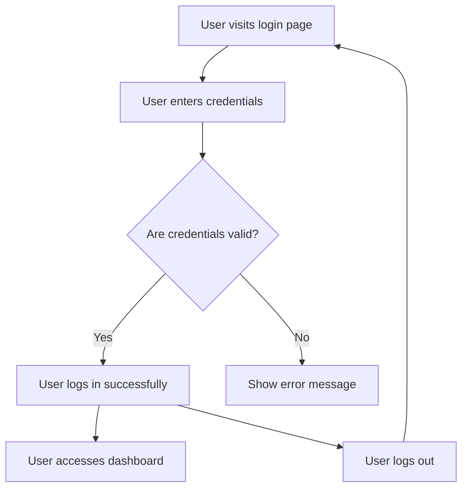
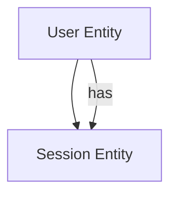
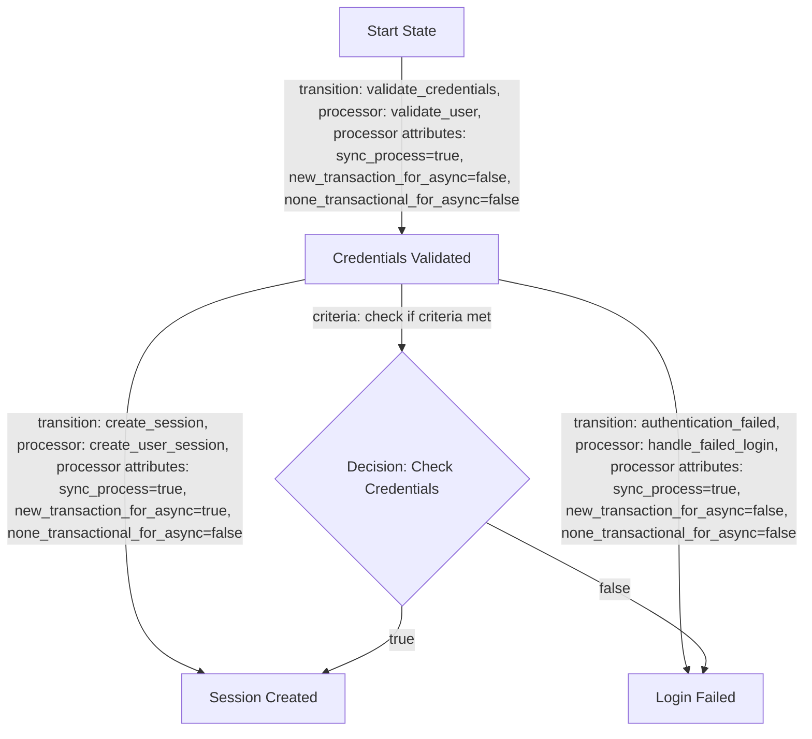

Sure! Here’s a complete Product Requirements Document (PRD) for your login feature, incorporating all the elements we've discussed:

---

# Product Requirements Document (PRD) for Login Feature

## Introduction

This document outlines the requirements for implementing a login feature in a web application using Django with PostgreSQL. The feature will enable users to create accounts, log in, manage sessions, and ensure secure authentication.

## User Requirements

### User Stories

1. **As a User**, I want to create an account so that I can log in to the application.
2. **As a User**, I want to log in so that I can access my account.
3. **As a User**, I want to log out to ensure my account stays secure.
4. **As a User**, I want to recover my password in case I forget it to regain access to my account.

### User Journey Diagram


```mermaid
graph TD;
    A[User visits login page] --> B[User enters credentials];
    B --> C{Are credentials valid?};
    C -->|Yes| D[User logs in successfully];
    C -->|No| E[Show error message];
    D --> F[User accesses dashboard];
    D --> G[User logs out];
    G --> A;
```

## Entities Outline

### 1. User Entity
- **Entity Type**: `USER`
- **Entity Source**: `ENTITY_EVENT`
- **Description**: Represents a user account with relevant information needed for authentication.

### 2. Session Entity
- **Entity Type**: `SESSION`
- **Entity Source**: `ENTITY_EVENT`
- **Description**: Represents a login session for the user, allowing tracking of active sessions.

### Entities Diagram


```mermaid
graph TD;
    A[User Entity] --> B[Session Entity];
    A -->|has| B;
```

## Workflows

### 1. Orchestration Entity: Login Workflow
- **Entity Type**: `JOB`
- **Entity Source**: `ENTITY_EVENT`
- **Description**: This workflow handles the user's login attempt, validating credentials and creating a session if successful.

### Workflow Launch Information

The workflow is launched when a user attempts to log in via the UI. It will be triggered by an API call that sends the user’s credentials to the server.

### Flowchart for Login Workflow


```mermaid
flowchart TD
   A[Start State] -->|transition: validate_credentials, processor: validate_user, processor attributes: sync_process=true, new_transaction_for_async=false, none_transactional_for_async=false| B[Credentials Validated]
   B -->|transition: create_session, processor: create_user_session, processor attributes: sync_process=true, new_transaction_for_async=true, none_transactional_for_async=false| C[Session Created]
   B -->|transition: authentication_failed, processor: handle_failed_login, processor attributes: sync_process=true, new_transaction_for_async=false, none_transactional_for_async=false| E[Login Failed]

   %% Decision point for criteria
   B -->|criteria: check if criteria met| D1{Decision: Check Credentials}
   D1 -->|true| C
   D1 -->|false| E

   class A,B,C,D,E,D1 automated;
```

## Example JSON Data Models

### User Entity

```json
{
  "user_id": "user_001",
  "username": "john_doe",
  "email": "john@example.com",
  "password_hash": "hashed_password_here",
  "created_at": "2023-10-01T10:00:00Z",
  "updated_at": "2023-10-01T12:00:00Z"
}
```

### Session Entity

```json
{
  "session_id": "session_001",
  "user_id": "user_001",
  "login_timestamp": "2023-10-01T12:00:00Z",
  "logout_timestamp": null,
  "ip_address": "192.168.1.1"
}
```

## Conclusion

The proposed login feature is designed to provide a secure and user-friendly experience for users. By leveraging Django and PostgreSQL, the implementation can ensure robust authentication and session management. This PRD outlines the necessary workflows, entities, and user requirements, serving as a comprehensive guide for development.

---

If you have any more adjustments or additional sections you'd like to include, just let me know! 😊