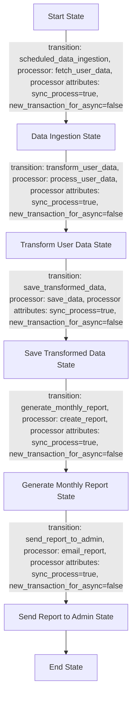

Sure! Here’s a complete Product Requirements Document (PRD) based on your requirement for the application performing batch processing on user data from the Fakerest API.

---

# Product Requirements Document (PRD) for User Data Batch Processing Application

## Introduction

This document outlines the requirements for building an application that performs batch processing on user data from the Fakerest API. The application will include functionalities for data ingestion, transformation, storage, reporting, and email notification.

## Goals

- **Data Ingestion**: Fetch user data from the Fakerest API at the beginning of each month.
- **Data Storage**: Save the transformed user data in a cloud database for future access.
- **Reporting**: Generate monthly reports about user data.
- **Publishing**: Send the monthly reports to the admin's email.

## Proposed Entities

1. **User Data Entity**
   - **Type**: Raw Data
   - **Schema**:
     ```json
     {
       "user_data": {
         "id": "integer",
         "name": "string",
         "email": "string",
         "created_at": "datetime",
         "updated_at": "datetime"
       }
     }
     ```

2. **Transformed User Data Entity**
   - **Type**: Derived Data
   - **Schema**:
     ```json
     {
       "transformed_user_data": {
         "id": "integer",
         "user_id": "integer",
         "transformed_name": "string",
         "transformed_email": "string",
         "status": "string",
         "transformation_timestamp": "datetime"
       }
     }
     ```

3. **Monthly Report Entity**
   - **Type**: Report Data
   - **Schema**:
     ```json
     {
       "monthly_report": {
         "report_id": "string",
         "month": "string",
         "total_users": "integer",
         "active_users": "integer",
         "inactive_users": "integer",
         "generated_at": "datetime",
         "comments": "string"
       }
     }
     ```

4. **Batch Processing Orchestration Entity**
   - **Type**: API Request
   - **Schema**:
     ```json
     {
       "batch_processing_orchestration": {
         "id": "string",
         "scheduled_time": "datetime",
         "api_url": "string",
         "data_ingestion_params": {
           "fetch_limit": "integer",
           "filter_criteria": "string"
         },
         "status": "string",
         "created_at": "datetime",
         "updated_at": "datetime"
       }
     }
     ```

## Proposed Workflows

### Workflow for Batch Processing Orchestration Entity

The workflow consists of the following transitions:

1. **Scheduled Data Ingestion**
2. **Transform User Data**
3. **Save Transformed Data**
4. **Generate Monthly Report**
5. **Send Report to Admin**

### Flowchart for Batch Processing Orchestration Workflow

```mermaid
flowchart TD
   A[Start State] -->|transition: scheduled_data_ingestion, processor: fetch_user_data, processor attributes: sync_process=true, new_transaction_for_async=false| B[Data Ingestion State]
   B -->|transition: transform_user_data, processor: process_user_data, processor attributes: sync_process=true, new_transaction_for_async=false| C[Transform User Data State]
   C -->|transition: save_transformed_data, processor: save_data, processor attributes: sync_process=true, new_transaction_for_async=false| D[Save Transformed Data State]
   D -->|transition: generate_monthly_report, processor: create_report, processor attributes: sync_process=true, new_transaction_for_async=false| E[Generate Monthly Report State]
   E -->|transition: send_report_to_admin, processor: email_report, processor attributes: sync_process=true, new_transaction_for_async=false| F[Send Report to Admin State]
   F --> G[End State]

   class A,B,C,D,E,F automated;
```

## How the Workflow is Launched

The workflow is automatically triggered at the scheduled time set in the Batch Processing Orchestration Entity. Once the scheduled time arrives, it initiates the sequence of transitions, ensuring a smooth and automated process.

## Conclusion

This PRD provides a comprehensive overview of the requirements, proposed entities, and workflow for building a batch processing application that handles user data from the Fakerest API. Each entity has been carefully designed to maintain data consistency and support the application's goals effectively.

---

Let me know if you need any changes or additional information! 😊