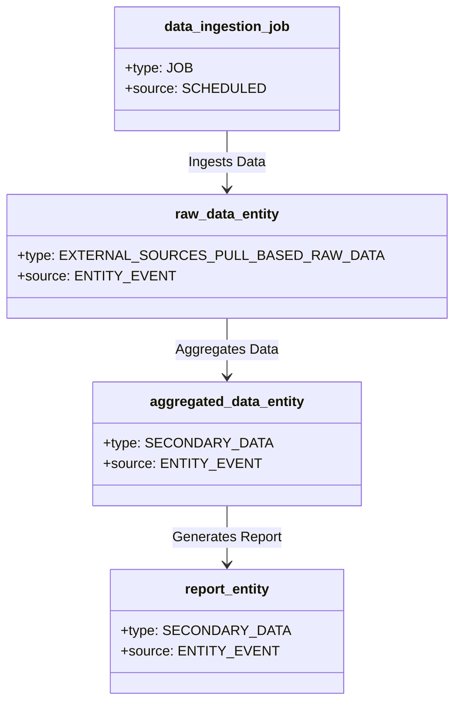
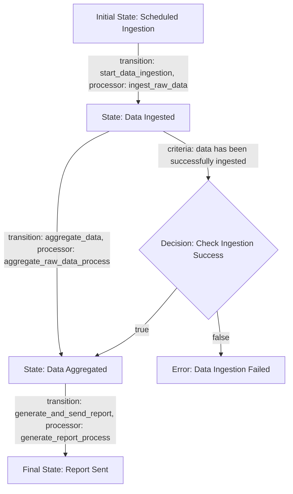

Here's a complete Product Requirements Document (PRD) for your application based on the requirements you've provided.

# Product Requirements Document (PRD) for Data Processing Application

## Introduction

This document outlines the design and structure of a data processing application that ingests data from a specified source, aggregates it, and generates a report. The application is built using the Cyoda framework, which leverages an event-driven architecture to efficiently manage workflows and state transitions.

## Requirements Summary

- **Data Ingestion**: Ingest data from a specified data source on a scheduled basis.
- **Data Aggregation**: Aggregate the ingested data for reporting.
- **Report Generation**: Generate and save a report summarizing the aggregated data.

## Entities Overview

### 1. Data Ingestion Job (`data_ingestion_job`)
- **Type**: JOB
- **Source**: SCHEDULED
- **Description**: Responsible for fetching data from the designated source on a daily schedule.

### 2. Raw Data Entity (`raw_data_entity`)
- **Type**: EXTERNAL_SOURCES_PULL_BASED_RAW_DATA
- **Source**: ENTITY_EVENT
- **Description**: Stores the unprocessed data from the ingestion process.

### 3. Aggregated Data Entity (`aggregated_data_entity`)
- **Type**: SECONDARY_DATA
- **Source**: ENTITY_EVENT
- **Description**: Holds the summarized data resulting from aggregation.

### 4. Report Entity (`report_entity`)
- **Type**: SECONDARY_DATA
- **Source**: ENTITY_EVENT
- **Description**: Contains the generated report that is saved after aggregation.

## Entity Diagram


```mermaid
classDiagram
    class data_ingestion_job {
        +type: JOB
        +source: SCHEDULED
    }

    class raw_data_entity {
        +type: EXTERNAL_SOURCES_PULL_BASED_RAW_DATA
        +source: ENTITY_EVENT
    }

    class aggregated_data_entity {
        +type: SECONDARY_DATA
        +source: ENTITY_EVENT
    }

    class report_entity {
        +type: SECONDARY_DATA
        +source: ENTITY_EVENT
    }

    data_ingestion_job --> raw_data_entity : Ingests Data
    raw_data_entity --> aggregated_data_entity : Aggregates Data
    aggregated_data_entity --> report_entity : Generates Report
```

## Workflow Overview

### Workflow for `data_ingestion_job`

This workflow encompasses the complete data ingestion, aggregation, and reporting process.

- **Workflow Launch**: The workflow is triggered automatically based on a scheduled configuration.
  
### Workflow Flowchart


```mermaid
flowchart TD
   A[Initial State: Scheduled Ingestion] -->|transition: start_data_ingestion, processor: ingest_raw_data| B[State: Data Ingested]
   B -->|transition: aggregate_data, processor: aggregate_raw_data_process| C[State: Data Aggregated]
   C -->|transition: generate_and_send_report, processor: generate_report_process| D[Final State: Report Sent]

   %% Decision point for criteria
   B -->|criteria: data has been successfully ingested| D1{Decision: Check Ingestion Success}
   D1 -->|true| C
   D1 -->|false| E[Error: Data Ingestion Failed]

   class A,B,C,D,D1 automated;
```

## Explanation of Workflow Launch

The `data_ingestion_job` workflow is launched automatically based on a predefined schedule, typically set to run daily. This job initiates the data ingestion process, triggering subsequent transitions for aggregation and report generation.

## Event-Driven Architecture

In the Cyoda framework, events are emitted whenever entities are created, updated, or deleted. For instance:
- When new raw data is ingested, an event will trigger the aggregation of that data.
- Each transition within the workflow will also emit events that allow the application to respond accordingly.

## JSON Examples for Each Entity

### 1. Data Ingestion Job
```json
{
    "id": 1,
    "job_name": "Daily Data Ingestion",
    "schedule": "0 0 * * *",   
    "status": "active"
}
```

### 2. Raw Data Entity
```json
{
    "id": 1,
    "data": [
        {
            "title": "Activity 1",
            "due_date": "2025-01-22T21:36:27Z",
            "completed": false
        },
        {
            "title": "Activity 2",
            "due_date": "2025-01-22T22:36:27Z",
            "completed": true
        }
    ],
    "ingestion_timestamp": "2023-10-01T10:00:00Z"
}
```

### 3. Aggregated Data Entity
```json
{
    "id": 1,
    "total_activities": 2,
    "completed_activities": 1,
    "pending_activities": 1,
    "aggregation_timestamp": "2023-10-01T10:00:00Z",
    "comments": "This data reflects the current status of activities."
}
```

### 4. Report Entity
```json
{
    "report_id": "report_2023_10_01",
    "generated_at": "2023-10-01T10:05:00Z",
    "report_title": "Daily Data Report",
    "total_entries": 150,
    "successful_ingests": 145,
    "failed_ingests": 5,
    "overall_status": "Partially Completed",
    "comments": "This report summarizes the day's data ingestion activities."
}
```

## Conclusion

This PRD serves as a comprehensive guide for implementing a data processing application using the Cyoda framework. The outlined entities, workflows, and event-driven patterns provide a strong foundation for successfully building and maintaining the application. If there are any questions or further details needed, feel free to ask!