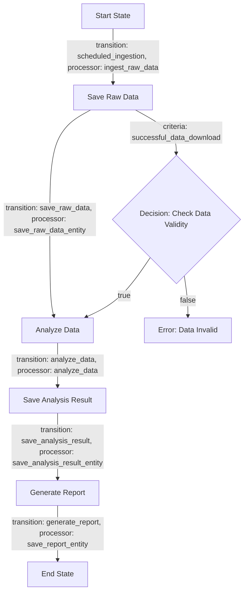

Sure! Here’s a complete Product Requirements Document (PRD) tailored to your requirement of downloading London houses data, analyzing it, and saving the report. 

# Product Requirements Document (PRD) for London Houses Data Analysis Application

## Introduction

This document outlines the requirements for an application designed to download, analyze, and report on London houses data using Pandas. The purpose of the application is to automate the process, ensuring that users can easily obtain insights from housing data with minimal manual intervention.

## What is this Application?

The application serves as an event-driven data processing tool, leveraging Cyoda's architecture. It encompasses several entities that manage the workflow, from data ingestion to report generation, employing a scheduled job to drive the process.

### Key Features

- **Data Download**: Automatically fetches London houses data from specified sources.
- **Data Analysis**: Uses Pandas to perform analysis on the retrieved data.
- **Report Generation**: Saves the results of the analysis in a report format.

## Cyoda Entity Database

The following entities are central to the application:

1. **Data Ingestion Job (`data_ingestion_job`)**
   - **Type**: JOB
   - **Source**: SCHEDULED
   - **Description**: Manages the process of downloading housing data.

2. **Raw Data Entity (`raw_data_entity`)**
   - **Type**: EXTERNAL_SOURCES_PULL_BASED_RAW_DATA
   - **Source**: ENTITY_EVENT
   - **Description**: Stores the unprocessed data obtained from the download.

3. **Analysis Result Entity (`analysis_result_entity`)**
   - **Type**: SECONDARY_DATA
   - **Source**: ENTITY_EVENT
   - **Description**: Contains the results of the analysis performed on the raw data.

4. **Report Entity (`report_entity`)**
   - **Type**: SECONDARY_DATA
   - **Source**: ENTITY_EVENT
   - **Description**: Stores the final report generated from analysis results.

## Workflows Overview

The primary workflow orchestrated by the `data_ingestion_job` includes transitions that define the sequence of operations from data download to report generation.

### Workflow Flowchart


```mermaid
flowchart TD
    A[Start State] -->|transition: scheduled_ingestion, processor: ingest_raw_data| B[Save Raw Data]
    B -->|transition: save_raw_data, processor: save_raw_data_entity| C[Analyze Data]
    C -->|transition: analyze_data, processor: analyze_data| D[Save Analysis Result]
    D -->|transition: save_analysis_result, processor: save_analysis_result_entity| E[Generate Report]
    E -->|transition: generate_report, processor: save_report_entity| F[End State]

    %% Decision point for criteria
    B -->|criteria: successful_data_download| D1{Decision: Check Data Validity}
    D1 -->|true| C
    D1 -->|false| E1[Error: Data Invalid]

    class A,B,C,D,E,F,D1 automated;
```

## Event-Driven Approach

In Cyoda, entities play a crucial role in implementing the event-driven pattern:

- **Event Emission**: Events are triggered when entities are created or updated, such as when data is downloaded successfully.
- **Event Handling**: These events initiate workflows, advancing the state of entities through their defined transitions.

## Example JSON Data Models

Here are example JSON data models for each entity based on the application requirements:

1. **Data Ingestion Job**
   ```json
   {
       "entity_name": "data_ingestion_job",
       "entity_type": "JOB",
       "entity_source": "SCHEDULED",
       "next_run_time": "2023-10-01T10:00:00Z"
   }
   ```

2. **Raw Data Entity**
   ```json
   {
       "entity_name": "raw_data_entity",
       "data": [
           {
               "id": 1,
               "address": "123 Baker St, London",
               "price": 500000,
               "bedrooms": 3,
               "bathrooms": 2,
               "description": "Beautiful house in central London."
           },
           {
               "id": 2,
               "address": "456 Elm St, London",
               "price": 750000,
               "bedrooms": 4,
               "bathrooms": 3,
               "description": "Spacious family home."
           }
       ]
   }
   ```

3. **Analysis Result Entity**
   ```json
   {
       "entity_name": "analysis_result_entity",
       "average_price": 625000,
       "total_houses": 2,
       "most_expensive": {
           "id": 2,
           "price": 750000
       }
   }
   ```

4. **Report Entity**
   ```json
   {
       "entity_name": "report_entity",
       "report_title": "London Houses Analysis Report",
       "generated_at": "2023-10-01T10:05:00Z",
       "summary": "Analysis of London houses data with average pricing and insights.",
       "details": {
           "average_price": 625000,
           "total_houses": 2
       }
   }
   ```

## Conclusion

This PRD encapsulates the requirements and design of the London houses data analysis application. Through the use of Cyoda's event-driven architecture, the application can efficiently manage the workflow from data ingestion to report generation, ensuring a seamless experience for users. 

Feel free to reach out if you need more details or any adjustments! I'm here to help! 😊