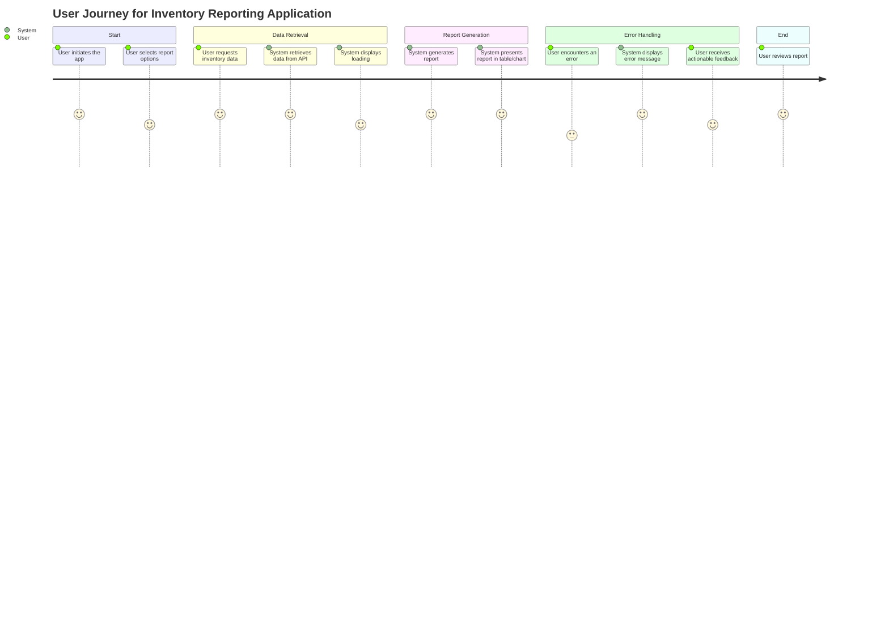
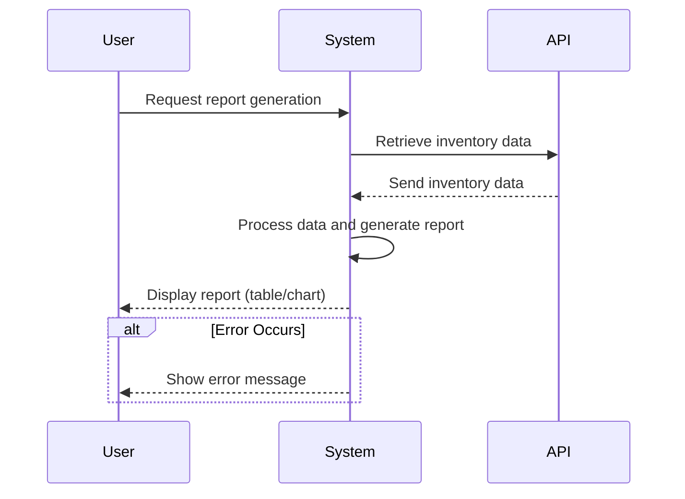

Sure! Here’s a complete Product Requirements Document (PRD) for your inventory reporting application. 

---

# Product Requirements Document (PRD) for Inventory Reporting Application

## Introduction

This document outlines the requirements for an inventory reporting application designed to retrieve data from the SwaggerHub API and generate insightful reports. The primary goal is to provide stakeholders with actionable insights derived from the inventory data, enabling efficient decision-making regarding inventory management.

## User Requirements

### User Stories

1. **As a user**, I want to retrieve inventory data from the API so that I can analyze the current stock levels.
2. **As a user**, I want the application to generate a report summarizing key metrics like total items and average price so that I can make informed decisions.
3. **As a user**, I want to view the reports in a clear format (table/chart) so that I can quickly understand the data.
4. **As a user**, I want to be informed of any errors during data retrieval or report generation so that I can take action.

### User Journey Diagram


```mermaid
journey
    title User Journey for Inventory Reporting Application
    section Start
      User initiates the app: 5: User
      User selects report options: 4: User
    section Data Retrieval
      User requests inventory data: 5: User
      System retrieves data from API: 5: System
      System displays loading: 4: System
    section Report Generation
      System generates report: 5: System
      System presents report in table/chart: 5: System
    section Error Handling
      User encounters an error: 3: User
      System displays error message: 5: System
      User receives actionable feedback: 4: User
    section End
      User reviews report: 5: User
```

### Sequence Diagram


```mermaid
sequenceDiagram
    participant User
    participant System
    participant API
    User->>System: Request report generation
    System->>API: Retrieve inventory data
    API-->>System: Send inventory data
    System->>System: Process data and generate report
    System-->>User: Display report (table/chart)
    alt Error Occurs
        System-->>User: Show error message
    end
```

## Entity Overview

### Entities

1. **Data Ingestion Job**
   - **Description:** Responsible for retrieving inventory data from the API.
   - **Save Method:** Scheduled (via scheduler).

   ```mermaid
   flowchart TD
       A[Start State] -->|transition: start_data_ingestion, processor: ingest_raw_data| B[Data Retrieved]
       B -->|transition: process_data, processor: process_inventory_data| C[Data Processed]
       C --> D[End State]
   class A,B,C,D automated;
   ```

   - **JSON Example:**
     ```json
     {
       "entity_name": "data_ingestion_job",
       "entity_source": "SCHEDULED",
       "data": {
         "job_id": "12345",
         "schedule_time": "2023-10-01T10:00:00Z",
         "status": "completed",
         "retrieved_data": [
           {
             "id": "item1",
             "name": "Widget",
             "price": 25.00,
             "quantity": 100
           },
           ...
         ]
       }
     }
     ```

2. **Raw Data Entity**
   - **Description:** Stores the raw inventory data retrieved from the API.
   - **Save Method:** ENTITY_EVENT (via ingestion job).

   ```mermaid
   flowchart TD
       A[Start State] -->|transition: save_raw_data, processor: save_raw_inventory| B[Raw Data Saved]
       B --> C[End State]
   class A,B,C automated;
   ```

   - **JSON Example:**
     ```json
     {
       "entity_name": "raw_data_entity",
       "entity_source": "ENTITY_EVENT",
       "data": {
         "id": "item1",
         "name": "Widget",
         "dueDate": "2023-10-01T12:00:00Z",
         "completed": false,
         "source": "API"
       }
     }
     ```

3. **Secondary Data Entity**
   - **Description:** Contains processed data derived from the raw data.
   - **Save Method:** ENTITY_EVENT (after processing).

   ```mermaid
   flowchart TD
       A[Start State] -->|transition: process_secondary_data, processor: transform_data| B[Secondary Data Processed]
       B --> C[End State]
   class A,B,C automated;
   ```

   - **JSON Example:**
     ```json
     {
       "entity_name": "secondary_data_entity",
       "entity_source": "ENTITY_EVENT",
       "data": {
         "total_items": 100,
         "average_price": 25.00,
         "total_value": 2500.00,
         ...
       }
     }
     ```

4. **Report Entity**
   - **Description:** Stores generated reports summarizing key metrics.
   - **Save Method:** Direct API call (after report generation).

   ```mermaid
   flowchart TD
       A[Start State] -->|transition: create_report, processor: generate_report| B[Report Generated]
       B --> C[End State]
   class A,B,C automated;
   ```

   - **JSON Example:**
     ```json
     {
       "entity_name": "report_entity",
       "entity_source": "DIRECT_API_CALL",
       "data": {
         "report_id": "report_001",
         "generated_at": "2023-10-01T15:00:00Z",
         "content": "Total items: 100, Average price: $25.00, Total value: $2500.00",
         ...
       }
     }
     ```

## Conclusion

This PRD serves as a comprehensive guide for developing the inventory reporting application. It clearly outlines user requirements, entity structures, workflows, and interactions to ensure that the final product aligns with user needs and expectations. If you have any further refinements or additions, just let me know!