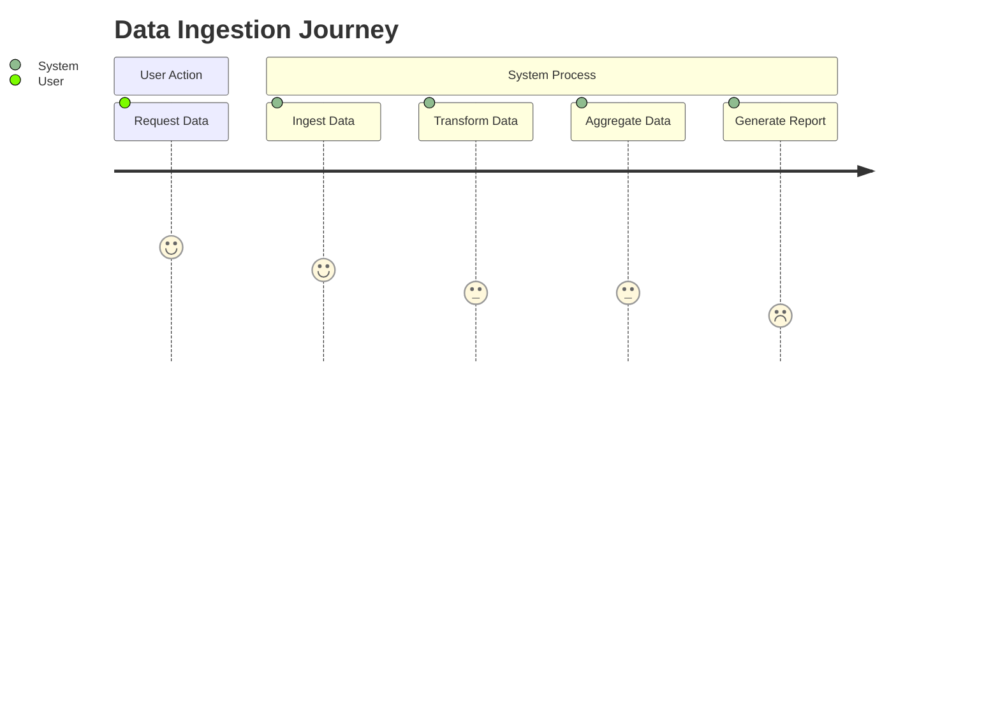
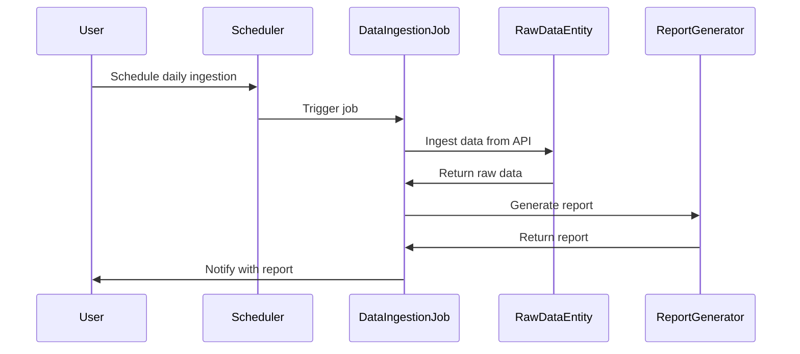
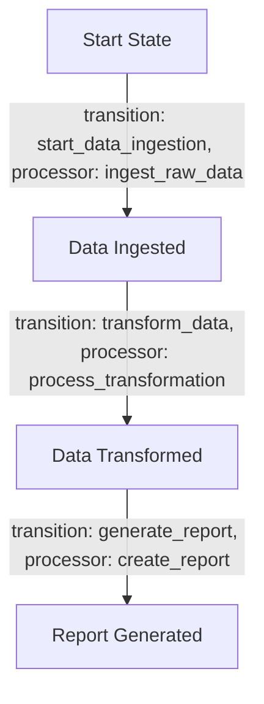

# Product Requirement Document (PRD) for Data Ingestion Application

## Introduction
This document outlines the requirements for developing an application that ingests data from the Automation Exercise API. The primary goal is to automate the process of retrieving, transforming, and reporting product data. This PRD includes user stories, entity diagrams, workflows, and detailed specifications for the application.

## Overview of User Requirement
The user (you) has specified the need to build an application that:
1. Ingests data from the Automation Exercise API.
2. Transforms the data by renaming fields and aggregating information.
3. Generates reports based on the aggregated data.
4. Schedules the data ingestion process to occur daily.

## User Stories
Based on the requirement, the following user stories have been identified:
- **User Story 1**: As a user, I want to ingest product data from the Automation Exercise API so that I can analyze available products.
- **User Story 2**: As a user, I want to transform the ingested data by renaming fields and aggregating information based on categories and brands.
- **User Story 3**: As a user, I want to generate reports that provide insights into the product data, including average prices and quantities by category.
- **User Story 4**: As a user, I want the data ingestion process to be scheduled daily so that I always have the most up-to-date information.

## Journey Diagram

```mermaid
journey
    title Data Ingestion Journey
    section User Action
      Request Data: 5: User
    section System Process
      Ingest Data: 4: System
      Transform Data: 3: System
      Aggregate Data: 3: System
      Generate Report: 2: System
```

## Sequence Diagram

```mermaid
sequenceDiagram
    participant User
    participant Scheduler
    participant DataIngestionJob
    participant RawDataEntity
    participant ReportGenerator
    
    User->>Scheduler: Schedule daily ingestion
    Scheduler->>DataIngestionJob: Trigger job
    DataIngestionJob->>RawDataEntity: Ingest data from API
    RawDataEntity->>DataIngestionJob: Return raw data
    DataIngestionJob->>ReportGenerator: Generate report
    ReportGenerator->>DataIngestionJob: Return report
    DataIngestionJob->>User: Notify with report
```

## Entities Outline
### 1. Data Ingestion Job
- **JSON Example**:
```json
{
  "job_id": "job_001",
  "status": "pending",
  "workflow_name": "data_ingestion_workflow",
  "scheduled_time": "2023-10-01T00:00:00Z"
}
```
- **Saved Through**: Workflow of a different entity (ENTITY_EVENT).

### 2. Raw Data Entity
- **JSON Example**:
```json
{
  "id": "1",
  "name": "Blue Top",
  "price": "Rs. 500",
  "brand": "Polo",
  "category": {
    "userType": {
      "gender": "Women"
    },
    "category": "Tops"
  }
}
```
- **Saved Through**: Directly via API call during data ingestion.

### 3. Transformed Data Entity
- **JSON Example**:
```json
{
  "id": "1",
  "renamed_field_1": "Product Name",
  "renamed_field_2": "Product Price",
  "aggregation_results": {
    "category_count": {
      "Tops": 5,
      "Dresses": 3
    },
    "average_price": "Rs. 600"
  }
}
```
- **Saved Through**: Workflow of a different entity (SECONDARY_DATA).

### 4. Aggregated Data Entity
- **JSON Example**:
```json
{
  "category": "Tops",
  "count": 5,
  "average_price": "Rs. 600"
}
```
- **Saved Through**: Workflow of a different entity (SECONDARY_DATA).

### 5. Report Entity
- **JSON Example**:
```json
{
  "report_id": "report_001",
  "generated_at": "2023-10-01T01:00:00Z",
  "summary": "Monthly sales report for October.",
  "details": {
    "total_sales": 15000,
    "average_price": 600,
    "product_count": 25
  }
}
```
- **Saved Through**: Workflow of a different entity (SECONDARY_DATA).

## Workflows and Flowcharts
### Data Ingestion Job Workflow

```mermaid
flowchart TD
  A[Start State] -->|transition: start_data_ingestion, processor: ingest_raw_data| B[Data Ingested]
  B -->|transition: transform_data, processor: process_transformation| C[Data Transformed]
  C -->|transition: generate_report, processor: create_report| D[Report Generated]
```

### Conclusion
This PRD provides a comprehensive overview of the requirements for the data ingestion application. It includes user stories, diagrams, JSON examples for entities, and workflows that outline the processes involved. If you have any further requests or need additional information, please let me know! I'm here to help and ensure that we have a successful project.
