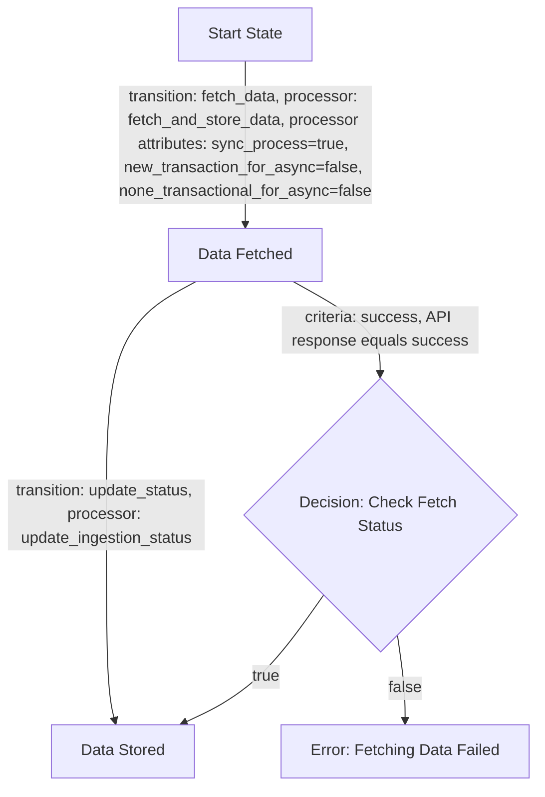

Sure! Here's a complete Product Requirements Document (PRD) for your crocodile data application.

# Product Requirements Document (PRD) for Crocodile Data Application

## Introduction
This document outlines the design and requirements for an application that ingests, stores, and filters crocodile data from an external API. The application allows users to query data based on specific criteria such as name, sex, and age.

## Requirements Overview
- **Data Ingestion**: Fetch crocodile data from the API.
- **Storage**: Persist the data in a reliable database.
- **Filtering**: Provide users with the ability to filter and view data based on specified attributes.

## Proposed Entities
1. **Crocodile Data Entity**
   ```json
   {
     "id": "string",
     "name": "string",
     "sex": "string",
     "age": "integer",
     "weight": "float",
     "length": "float",
     "date_caught": "string",
     "location": "string"
   }
   ```

2. **User Filter Entity**
   ```json
   {
     "filter_id": "string",
     "name": "string",
     "sex": "string",
     "age_range": {
       "min_age": "integer",
       "max_age": "integer"
     },
     "last_updated": "string"
   }
   ```

3. **Orchestration Entity (API Request)**
   ```json
   {
     "request_id": "string",
     "api_endpoint": "string",
     "request_method": "string",
     "parameters": {
       "pagination": "integer",
       "filter_criteria": {
         "name": "string",
         "sex": "string",
         "age_range": {
           "min_age": "integer",
           "max_age": "integer"
         }
       }
     },
     "last_run": "string",
     "status": "string"
   }
   ```

## Proposed Workflows
### Workflow for the Orchestration Entity (Data Ingestion)

#### Workflow Flowchart

```mermaid
flowchart TD
   A[Start State] -->|transition: fetch_data, processor: fetch_and_store_data, processor attributes: sync_process=true, new_transaction_for_async=false, none_transactional_for_async=false| B[Data Fetched]
   B -->|transition: update_status, processor: update_ingestion_status| C[Data Stored]

   %% Decision point for success
   B -->|criteria: success, API response equals success| C1{Decision: Check Fetch Status}
   C1 -->|true| C
   C1 -->|false| E[Error: Fetching Data Failed]

   class A,B,C,E automated;
```

#### Workflow Description
- **Triggering the Workflow**: The orchestration workflow can be triggered manually or automatically based on a schedule.
- **State Transitions**:
  - Start with data ingestion.
  - Fetch data from the API and store it.
  - Update the status of the data ingestion request.
- **Decision Point**: Checks if the fetch was successful before proceeding.

## Event-Driven Architecture
The application will utilize an event-driven approach where:
- Events are triggered when an entity is created or updated (e.g., when new crocodile data is saved).
- Other components of the application can listen for these events to take appropriate actions, such as updating the user interface or further processing the data.

## Conclusion
This PRD provides a comprehensive overview of the requirements and design for the crocodile data application. It outlines the entities involved, their data models, the workflow for data ingestion, and the event-driven architecture that will support the application's functionality. This document will serve as a guide for the implementation and development of the application.

Let me know if there's anything else you'd like to add or modify! 😊