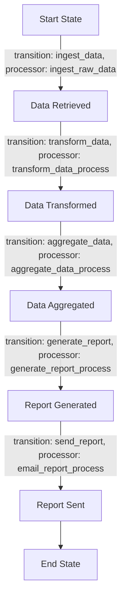

Sure! Here's a complete Product Requirements Document (PRD) for your application:

# Product Requirements Document (PRD) for Data Ingestion Application

## Introduction

This document outlines the requirements for a data ingestion application that interacts with the Automation Exercise API. The application will perform data ingestion, transformation, aggregation, reporting, and notifications. This PRD serves as a foundation for implementation and development.

## Requirements Overview

The application must encompass the following key functionalities:

1. **Data Ingestion**: Retrieve data from various endpoints available in the API (e.g., product list, categories).
2. **Data Transformation**: Clean and format the data for analysis.
3. **Aggregation**: Aggregate the relevant data based on specified criteria (such as total sales, category-wise products).
4. **Reporting**: Generate a report summarizing the aggregated data.
5. **Publishing**: Send the generated report to the admin email.
6. **Scheduling**: The data ingestion process should occur daily at a specified time.

## Proposed Entities

1. **Ingestion Job Entity**
   ```json
   {
     "job_id": "job_001",
     "job_name": "Daily Data Ingestion Job",
     "scheduled_time": "2023-10-01T05:00:00Z",
     "status": "completed",
     "start_time": "2023-10-01T05:00:00Z",
     "end_time": "2023-10-01T05:05:00Z",
     "total_records_processed": 100,
     "successful_records": 95,
     "failed_records": 5,
     "failure_reason": ["Timeout while fetching data", "API limit reached"]
   }
   ```

2. **Raw Data Entity**
   ```json
   {
     "entity_id": "raw_data_001",
     "job_id": "job_001",
     "endpoint": "product_list",
     "fetched_at": "2023-10-01T05:00:00Z",
     "data": [
       {
         "product_id": 1,
         "name": "Product A",
         "category": "Category 1",
         "price": 100,
         "stock": 50
       },
       {
         "product_id": 2,
         "name": "Product B",
         "category": "Category 2",
         "price": 150,
         "stock": 30
       }
     ]
   }
   ```

3. **Transformed Data Entity**
   ```json
   {
     "transformed_data_id": "transformed_data_001",
     "raw_data_id": "raw_data_001",
     "cleaned_data": [
       {
         "product_id": 1,
         "name": "Product A",
         "category": "Category 1",
         "formatted_price": "$100.00",
         "in_stock": true
       },
       {
         "product_id": 2,
         "name": "Product B",
         "category": "Category 2",
         "formatted_price": "$150.00",
         "in_stock": true
       }
     ],
     "transformed_at": "2023-10-01T05:10:00Z"
   }
   ```

4. **Aggregated Data Entity**
   ```json
   {
     "aggregated_data_id": "aggregated_data_001",
     "transformed_data_id": "transformed_data_001",
     "category_summary": {
       "Category 1": {
         "total_sales": 5000,
         "number_of_products": 5
       },
       "Category 2": {
         "total_sales": 4500,
         "number_of_products": 3
       }
     },
     "aggregated_at": "2023-10-01T05:15:00Z"
   }
   ```

5. **Report Entity**
   ```json
   {
     "report_id": "report_001",
     "aggregated_data_id": "aggregated_data_001",
     "generated_at": "2023-10-01T05:20:00Z",
     "admin_email": "admin@example.com",
     "report_content": "Summary of sales and products by category.",
     "is_sent": false,
     "sent_at": null
   }
   ```

6. **Orchestration Entity (Optional)**
   ```json
   {
     "orchestration_id": "orchestration_001",
     "job_id": "job_001",
     "raw_data_id": "raw_data_001",
     "transformed_data_id": "transformed_data_001",
     "aggregated_data_id": "aggregated_data_001",
     "report_id": "report_001",
     "status": "In Progress",
     "parameters": {
       "data_source": "Automation Exercise API",
       "schedule": "daily",
       "notification_email": "admin@example.com"
     }
   }
   ```

## Proposed Workflows

### Orchestration Workflow

**Workflow Transitions**:
1. **ingest_data**: Triggered to initiate data retrieval from the API.
2. **transform_data**: Triggered to clean and format the raw data.
3. **aggregate_data**: Triggered to summarize the transformed data.
4. **generate_report**: Triggered to create a report from the aggregated data.
5. **send_report**: Triggered to send the report to the admin's email.

**Flowchart**:


```mermaid
flowchart TD
   A[Start State] -->|transition: ingest_data, processor: ingest_raw_data| B[Data Retrieved]
   B -->|transition: transform_data, processor: transform_data_process| C[Data Transformed]
   C -->|transition: aggregate_data, processor: aggregate_data_process| D[Data Aggregated]
   D -->|transition: generate_report, processor: generate_report_process| E[Report Generated]
   E -->|transition: send_report, processor: email_report_process| F[Report Sent]
   F --> G[End State]

   class A,B,C,D,E,F automated;
```

### Explanation of Workflow Launch

The orchestration workflow is initiated based on a schedule defined in the ingestion job. When the scheduled time arrives, the first transition starts, leading to the execution of the data ingestion process.

## Conclusion

This PRD outlines the essential requirements, proposed entities, and workflows for the data ingestion application. By following this structure, developers will have a clear guide to implement the application effectively.

Let me know if there are any changes or additions you'd like to make! 😊