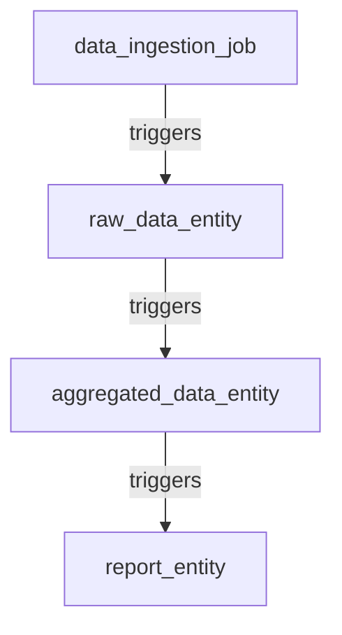
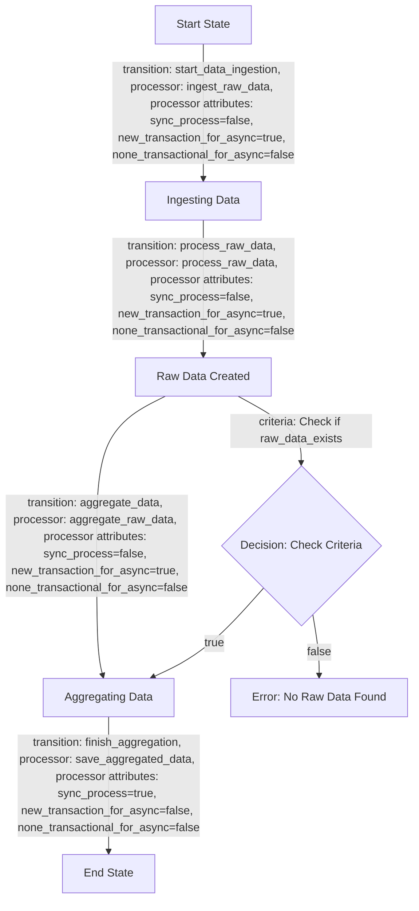

Sure! Here’s a complete Product Requirements Document (PRD) based on the previous discussions and requirements you've provided.

---

# Product Requirements Document (PRD) for Cyoda Data Processing Application

## Introduction

This document outlines the specifications for a Cyoda-based application designed to manage data ingestion, aggregation, report generation, and email notification. The aim is to create a seamless workflow that allows for efficient processing of data from a specified source to generating reports.

## What is Cyoda?

Cyoda is a serverless, event-driven framework that facilitates the management of workflows through entities representing jobs and data. Each entity has a defined state, and transitions between states are governed by events that occur within the system.

## Entities Overview

1. **Data Ingestion Job (`data_ingestion_job`)**
   - **Entity Type**: JOB
   - **Entity Source**: SCHEDULED
   - **Purpose**: Represents the scheduled task that ingests data from a specified source.

2. **Raw Data Entity (`raw_data_entity`)**
   - **Entity Type**: EXTERNAL_SOURCES_PULL_BASED_RAW_DATA
   - **Entity Source**: ENTITY_EVENT
   - **Purpose**: Stores unprocessed raw data retrieved by the data ingestion job.

3. **Aggregated Data Entity (`aggregated_data_entity`)**
   - **Entity Type**: SECONDARY_DATA
   - **Entity Source**: ENTITY_EVENT
   - **Purpose**: Contains the aggregated data derived from the raw data for reporting.

4. **Report Entity (`report_entity`)**
   - **Entity Type**: SECONDARY_DATA
   - **Entity Source**: ENTITY_EVENT
   - **Purpose**: Holds the generated report summarizing the aggregated data.

## Entity Diagram


```mermaid
graph TD;
    A[data_ingestion_job] -->|triggers| B[raw_data_entity];
    B -->|triggers| C[aggregated_data_entity];
    C -->|triggers| D[report_entity];
```

## Workflows

### Data Ingestion Job Workflow

- **Start Data Ingestion**: Triggered on a scheduled basis.
- **Process Raw Data**: After ingestion, raw data is created.
- **Aggregate Data**: Aggregated data is processed and saved.

### Workflow Flowchart


```mermaid
flowchart TD
   A[Start State] -->|transition: start_data_ingestion, processor: ingest_raw_data, processor attributes: sync_process=false, new_transaction_for_async=true, none_transactional_for_async=false| B[Ingesting Data]
   B -->|transition: process_raw_data, processor: process_raw_data, processor attributes: sync_process=false, new_transaction_for_async=true, none_transactional_for_async=false| C[Raw Data Created]
   C -->|transition: aggregate_data, processor: aggregate_raw_data, processor attributes: sync_process=false, new_transaction_for_async=true, none_transactional_for_async=false| D[Aggregating Data]
   D -->|transition: finish_aggregation, processor: save_aggregated_data, processor attributes: sync_process=true, new_transaction_for_async=false, none_transactional_for_async=false| E[End State]

   %% Decision point for criteria
   C -->|criteria: Check if raw_data_exists| D1{Decision: Check Criteria}
   D1 -->|true| D
   D1 -->|false| E1[Error: No Raw Data Found]

   class A,B,C,D,D1,E,E1 automated;
```

## Event-Driven Architecture

Entities in Cyoda leverage event-driven patterns by emitting events when they are created, modified, or removed. For instance, when the `raw_data_entity` is created after data ingestion, it triggers further processing steps, allowing the system to react and continue the workflow automatically.

## JSON Examples for Each Entity

### 1. Data Ingestion Job
```json
{
  "id": "ingestion_job_001",
  "status": "scheduled",
  "schedule_time": "2023-10-01T10:00:00Z",
  "source": "API",
  "created_at": "2023-09-30T10:00:00Z"
}
```

### 2. Raw Data Entity
```json
{
  "id": "raw_data_001",
  "job_id": "ingestion_job_001",
  "data": [
    {
      "title": "Book 1",
      "description": "A fascinating book about..."
    },
    {
      "title": "Book 2",
      "description": "Another interesting book on..."
    }
  ],
  "ingested_at": "2023-10-01T10:01:00Z"
}
```

### 3. Aggregated Data Entity
```json
{
  "id": "aggregated_data_001",
  "raw_data_id": "raw_data_001",
  "aggregated_summary": {
    "total_books": 2,
    "processed_at": "2023-10-01T10:02:00Z"
  }
}
```

### 4. Report Entity
```json
{
  "id": "report_2023_10_01",
  "generated_at": "2023-10-01T10:05:00Z",
  "report_title": "Monthly Data Overview",
  "summary": "Processed 2 books in the data ingestion job.",
  "status": "completed"
}
```

## Conclusion

This PRD outlines the necessary requirements for developing a Cyoda-based application to manage data ingestion, aggregation, and report generation. The proposed workflows, entities, and event-driven architecture ensure a robust and scalable solution that aligns with the specified needs.

Please let me know if you need any additional details or adjustments!