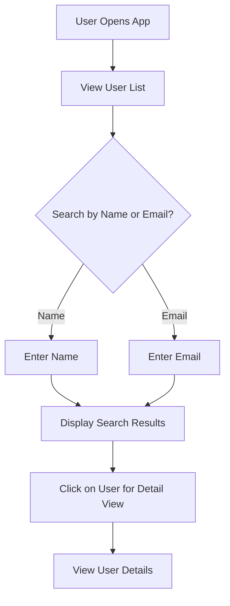
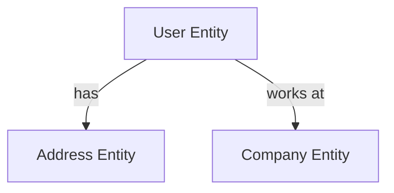
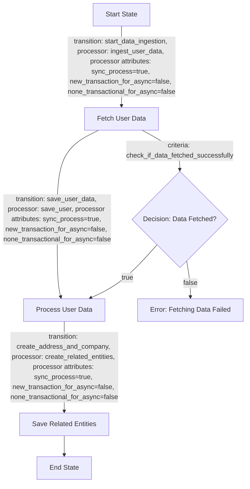

Sure! Here’s a complete Product Requirements Document (PRD) for your User Directory Application, incorporating all the elements we've discussed, including user requirements, entity definitions, workflows, and diagrams.

---

# Product Requirements Document (PRD) for User Directory Application

## Introduction

This document outlines the requirements for the User Directory Application that lists users along with their basic contact details. It includes data ingestion from an external API, user interaction features for searching and filtering, as well as detailed views to enhance the user experience.

## User Requirements

### User Stories

1. **As a user, I want to view a list of all users**, so that I can easily see their basic contact details.
2. **As a user, I want to search for users by name**, so that I can find specific individuals quickly.
3. **As a user, I want to search for users by email**, so that I can locate users based on their email addresses.
4. **As a user, I want to click on a user to view detailed information**, so that I can see additional information like address and company details.

### User Journey


```mermaid
graph TD;
    A[User Opens App] --> B[View User List]
    B --> C{Search by Name or Email?}
    C -->|Name| D[Enter Name]
    C -->|Email| E[Enter Email]
    D --> F[Display Search Results]
    E --> F
    F --> G[Click on User for Detail View]
    G --> H[View User Details]
```

## Entities

### Entities Outline

1. **User Entity**
   - **Type**: PRIMARY_DATA
   - **Source**: EXTERNAL_SOURCES_PULL_BASED_RAW_DATA
   - **Description**: Represents individual users and contains their basic contact details.

2. **Address Entity**
   - **Type**: SECONDARY_DATA
   - **Source**: ENTITY_EVENT
   - **Description**: Represents the address details for a user, linked to the User entity.

3. **Company Entity**
   - **Type**: SECONDARY_DATA
   - **Source**: ENTITY_EVENT
   - **Description**: Represents the company information for a user, also linked to the User entity.

### Entities Diagram


```mermaid
graph TD;
    A[User Entity] -->|has| B[Address Entity];
    A -->|works at| C[Company Entity];
```

### JSON Examples of Data Models

1. **User Entity**
```json
{
  "id": 1,
  "name": "Leanne Graham",
  "username": "Bret",
  "email": "Sincere@april.biz",
  "phone": "1-770-736-8031 x56442",
  "website": "hildegard.org"
}
```

2. **Address Entity**
```json
{
  "userId": 1,
  "street": "Kulas Light",
  "suite": "Apt. 556",
  "city": "Gwenborough",
  "zipcode": "92998-3874",
  "geo": {
    "lat": "-37.3159",
    "lng": "81.1496"
  }
}
```

3. **Company Entity**
```json
{
  "userId": 1,
  "name": "Romaguera-Crona",
  "catchPhrase": "Multi-layered client-server neural-net",
  "bs": "harness real-time e-markets"
}
```

## Workflows

### User Workflow

- **Launch Information**: This workflow is launched when an API call is made to start the data ingestion process. It can be triggered by a user action or scheduled to run at defined intervals.

#### Flowchart


```mermaid
flowchart TD
    A[Start State] -->|transition: start_data_ingestion, processor: ingest_user_data, processor attributes: sync_process=true, new_transaction_for_async=false, none_transactional_for_async=false| B[Fetch User Data]
    B -->|transition: save_user_data, processor: save_user, processor attributes: sync_process=true, new_transaction_for_async=false, none_transactional_for_async=false| C[Process User Data]
    C -->|transition: create_address_and_company, processor: create_related_entities, processor attributes: sync_process=true, new_transaction_for_async=false, none_transactional_for_async=false| D[Save Related Entities]
    D --> E[End State]

    %% Decision point for handling potential errors
    B -->|criteria: check_if_data_fetched_successfully| D1{Decision: Data Fetched?}
    D1 -->|true| C
    D1 -->|false| E1[Error: Fetching Data Failed]

    class A,B,C,D,D1 automated;
```

## Conclusion

The User Directory Application is designed to provide a seamless user experience by allowing users to efficiently view, search, and filter through user data. The outlined entities, workflows, and diagrams serve as a blueprint for the development process, ensuring that all requirements are met while utilizing the Cyoda framework effectively.

---

Let me know if you need any changes or additional sections in this PRD, or if there’s anything else I can help with!