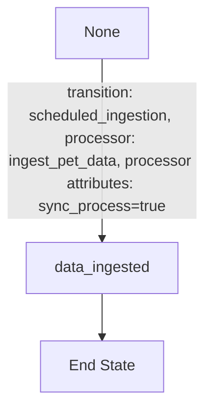
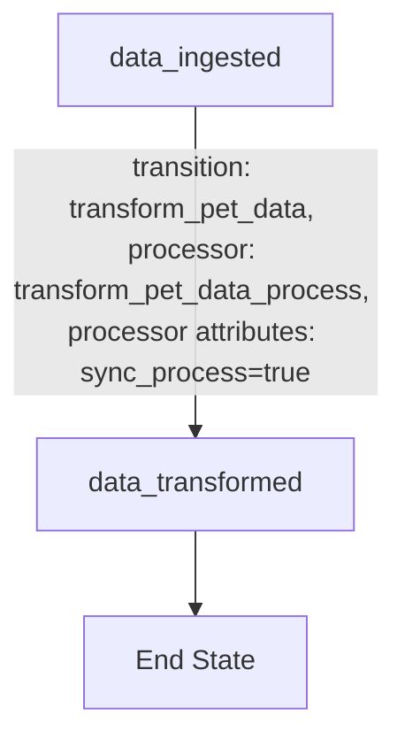
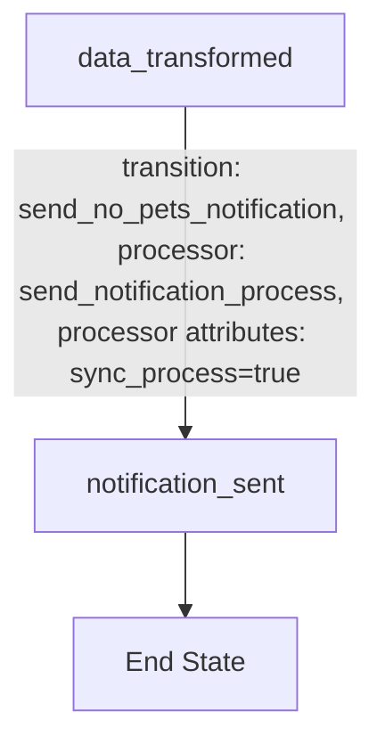
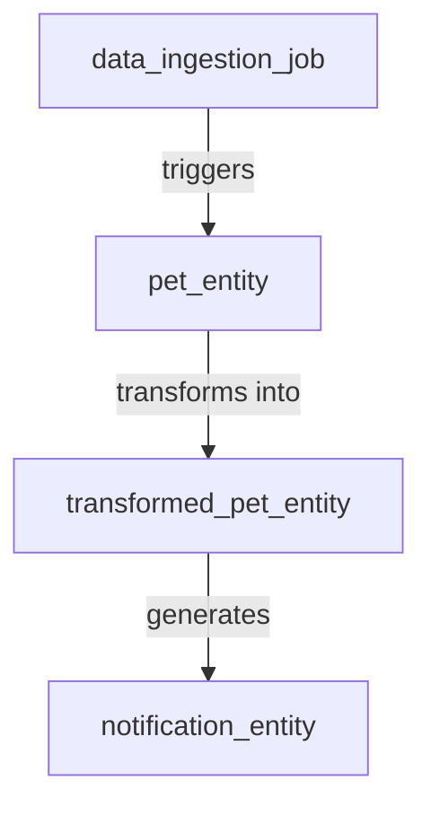
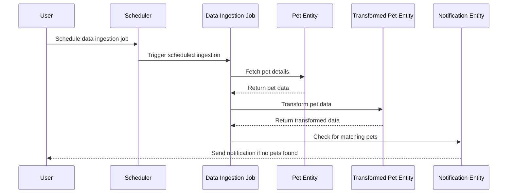

# Product Requirements Document (PRD) for Cyoda Design

## Introduction

This document outlines the Cyoda design for a pet details application, illustrating how the design aligns with the specified requirements. The design JSON encompasses various entities, their workflows, and the transitions that allow for efficient data ingestion, transformation, and user notifications.

## Cyoda Design Overview

Cyoda is an event-driven framework that employs entities representing jobs and data, managing workflows through defined state transitions. The design focuses on a structured approach to handle the entire lifecycle of pet data, from ingestion to transformation and user notifications.

### Key Entities and Their Roles

1. **Data Ingestion Job (`data_ingestion_job`)**: Responsible for fetching pet details from an external API based on user-defined parameters.
2. **Pet Entity (`pet_entity`)**: Represents the raw data of pets fetched from the API.
3. **Transformed Pet Entity (`transformed_pet_entity`)**: Holds the transformed data after processing, which includes renaming fields and adding extra attributes.
4. **User Interaction Entity (`user_interaction_entity`)**: Stores user-defined search parameters and preferences.
5. **Notification Entity (`notification_entity`)**: Represents alerts sent to users when no matching pets are found.

## Workflow Overview

The workflows define the processes tied to each job entity, focusing on how each transition facilitates the flow of data through the system.

### Workflows and Flowcharts

#### Data Ingestion Workflow

```mermaid
flowchart TD
    A[None] -->|transition: scheduled_ingestion, processor: ingest_pet_data, processor attributes: sync_process=true| B[data_ingested]
    B --> C[End State]

    class A,B,C automated;
```

#### Data Transformation Workflow

```mermaid
flowchart TD
    A[data_ingested] -->|transition: transform_pet_data, processor: transform_pet_data_process, processor attributes: sync_process=true| B[data_transformed]
    B --> C[End State]

    class A,B,C automated;
```

#### Notification Workflow

```mermaid
flowchart TD
    A[data_transformed] -->|transition: send_no_pets_notification, processor: send_notification_process, processor attributes: sync_process=true| B[notification_sent]
    B --> C[End State]

    class A,B,C automated;
```

## Entity Relationships

The relationships between various entities illustrate how they interact within the application.

```mermaid
graph TD;
    A[data_ingestion_job] -->|triggers| B[pet_entity];
    B -->|transforms into| C[transformed_pet_entity];
    C -->|generates| D[notification_entity];
```

## Sequence Diagram

The sequence of events in the application from the user's perspective is depicted in the sequence diagram below:

```mermaid
sequenceDiagram
    participant User
    participant Scheduler
    participant Data Ingestion Job
    participant Pet Entity
    participant Transformed Pet Entity
    participant Notification Entity

    User->>Scheduler: Schedule data ingestion job
    Scheduler->>Data Ingestion Job: Trigger scheduled ingestion
    Data Ingestion Job->>Pet Entity: Fetch pet details
    Pet Entity-->>Data Ingestion Job: Return pet data
    Data Ingestion Job->>Transformed Pet Entity: Transform pet data
    Transformed Pet Entity-->>Data Ingestion Job: Return transformed data
    Data Ingestion Job->>Notification Entity: Check for matching pets
    Notification Entity-->>User: Send notification if no pets found
```

## Conclusion

The Cyoda design effectively aligns with the requirements for constructing a robust application to manage pet details. By leveraging an event-driven model, the application can efficiently coordinate various processes—from data ingestion through transformation to user notifications. 

This PRD serves as a comprehensive guide for implementation, ensuring clarity for the technical team while addressing the needs of users new to the Cyoda framework.
