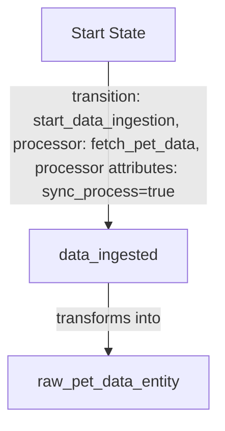
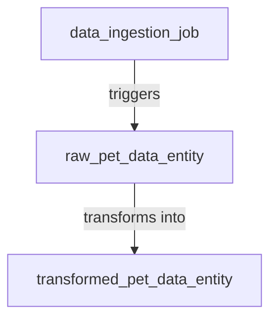
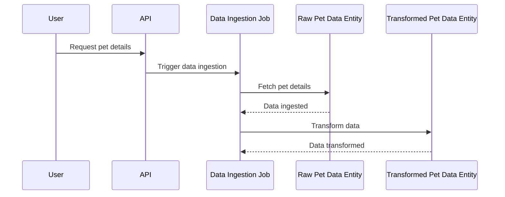
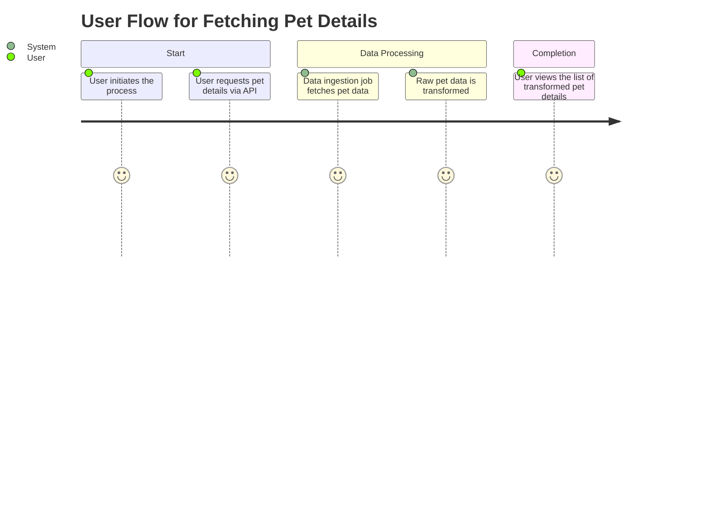

# Product Requirements Document (PRD) for Cyoda Design

## Introduction

This document provides a comprehensive overview of the Cyoda-based application designed to retrieve and transform pet details based on specified parameters. It explains the Cyoda design JSON format, which outlines the required entities, workflows, and their relationships. The document also includes various diagrams to visualize the workflows and entity interactions.

## What is Cyoda?

Cyoda is a serverless, event-driven framework that facilitates workflow management through entities representing data and processes. Each entity undergoes defined state transitions triggered by events, allowing the application to respond dynamically and efficiently to changes.

### Cyoda Design JSON Overview

The Cyoda design JSON specifies the following key components:

1. **Entities**: Fundamental components that represent data and processes.
2. **Workflows**: Define the transitions associated with each job entity and how they orchestrate processes.
3. **Transitions**: Indicate how entities move from one state to another, defining the actions taken during processing.

## Cyoda Design JSON Structure

The JSON structure contains three primary entities:

1. **Data Ingestion Job (`data_ingestion_job`)**:
   - **Type**: JOB
   - **Source**: API_REQUEST
   - **Workflow**:
     - Starts the data ingestion process from an API to fetch pet details based on status.

2. **Raw Pet Data Entity (`raw_pet_data_entity`)**:
   - **Type**: EXTERNAL_SOURCES_PULL_BASED_RAW_DATA
   - **Source**: ENTITY_EVENT
   - **Workflow**:
     - Transforms the raw pet data into a user-friendly format.

3. **Transformed Pet Data Entity (`transformed_pet_data_entity`)**:
   - **Type**: SECONDARY_DATA
   - **Source**: ENTITY_EVENT
   - **Workflow**: None (no transitions associated).

## Workflow Overview

### Flowchart for Data Ingestion Job Workflow

```mermaid
flowchart TD
    A[Start State] -->|transition: start_data_ingestion, processor: fetch_pet_data, processor attributes: sync_process=true| B[data_ingested]
    B -->|transforms into| C[raw_pet_data_entity]
    
    class A,B,C automated;
```

### Entity Relationships Diagram

```mermaid
graph TD;
    A[data_ingestion_job] -->|triggers| B[raw_pet_data_entity];
    B -->|transforms into| C[transformed_pet_data_entity];
```

### Sequence Diagram

```mermaid
sequenceDiagram
    participant User
    participant API
    participant Data Ingestion Job
    participant Raw Pet Data Entity
    participant Transformed Pet Data Entity

    User->>API: Request pet details
    API->>Data Ingestion Job: Trigger data ingestion
    Data Ingestion Job->>Raw Pet Data Entity: Fetch pet details
    Raw Pet Data Entity-->>Data Ingestion Job: Data ingested
    Data Ingestion Job->>Transformed Pet Data Entity: Transform data
    Transformed Pet Data Entity-->>Data Ingestion Job: Data transformed
```

### User Journey Diagram

```mermaid
journey
    title User Flow for Fetching Pet Details
    section Start
      User initiates the process: 5: User
      User requests pet details via API: 5: User
    section Data Processing
      Data ingestion job fetches pet data: 5: System
      Raw pet data is transformed: 5: System
    section Completion
      User views the list of transformed pet details: 5: User
```

## Conclusion

The Cyoda design effectively supports the requirements for a pet details retrieval and transformation application. By utilizing an event-driven architecture, the application manages state transitions for each entity involved, from data ingestion to transformation, ensuring a smooth and automated process.

This PRD serves as a foundation for implementation and development, guiding the technical team through the specifics of the Cyoda architecture while providing clarity for users who may be new to the Cyoda framework.