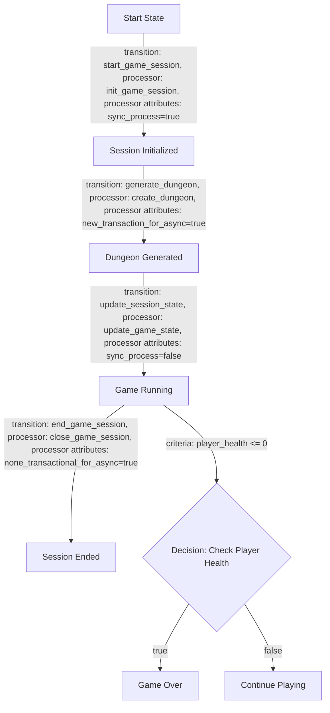

Sure! Here’s a complete Product Requirements Document (PRD) for your dungeon rogue-like game back-end, incorporating the entities, workflows, and explanations we discussed.

---

# Product Requirements Document (PRD) for Dungeon Rogue-Like Game Back-End

## Introduction

This document outlines the requirements and architecture for a back-end system designed for a dungeon rogue-like game. It covers the necessary entities, workflows, and event-driven architecture that will support game functionality, such as player sessions, dungeon generation, enemy encounters, and loot collection.

## What is the System?

The system is a serverless back-end application designed to manage the mechanics of a dungeon rogue-like game. It involves orchestrating player interactions, generating dungeons, managing enemies and loot, and tracking player progress.

## Proposed Entities

1. **Game Session Entity**
   - **Type**: `API_REQUEST`
   - **Source**: Represents the start of a game session initiated by a user.

2. **Dungeon Entity**
   - **Type**: `EXTERNAL_SOURCES_PULL_BASED_RAW_DATA`
   - **Source**: Represents the generated dungeon structure.

3. **Enemy Entity**
   - **Type**: `SECONDARY_DATA`
   - **Source**: Represents enemies within the dungeon.

4. **Loot Entity**
   - **Type**: `SECONDARY_DATA`
   - **Source**: Represents items available for collection.

5. **Player Entity**
   - **Type**: `EXTERNAL_SOURCES_PUSH_BASED_RAW_DATA`
   - **Source**: Represents player stats and inventory.

## Proposed Workflows

### 1. Game Session Workflow (Orchestration Entity)
- **Purpose**: Manage the initiation and progress of the game session.
- **Launch Trigger**: Launched when a player starts a new game session.

#### Game Session Workflow Flowchart

```mermaid
flowchart TD
   A[Start State] -->|transition: start_game_session, processor: init_game_session, processor attributes: sync_process=true| B[Session Initialized]
   B -->|transition: generate_dungeon, processor: create_dungeon, processor attributes: new_transaction_for_async=true| C[Dungeon Generated]
   C -->|transition: update_session_state, processor: update_game_state, processor attributes: sync_process=false| D[Game Running]
   D -->|transition: end_game_session, processor: close_game_session, processor attributes: none_transactional_for_async=true| E[Session Ended]

   %% Decision point for criteria
   D -->|criteria: player_health <= 0| D1{Decision: Check Player Health}
   D1 -->|true| F[Game Over]
   D1 -->|false| G[Continue Playing]

   class A,B,C,D,E,D1 automated;
```

## Event-Driven Architecture

In this system, entities are essential for implementing the event-driven architecture. When an entity is created, updated, or deleted, it emits an event that triggers related processes. For instance:

- When the `Loot Entity` is collected, it updates the `Player Entity`, which then triggers a session update.
- The `Dungeon Entity` creation event initiates the game session.

## Conclusion

This PRD outlines the necessary components to build a robust back-end for a dungeon rogue-like game. The entities, workflows, and event-driven architecture ensure that the game logic operates smoothly and efficiently, providing players with an engaging experience. This document serves as a guide for the development team to implement the described system while providing clarity for anyone new to the Cyoda framework.

---

Let me know if you need any changes or additional details! I'm here to help!