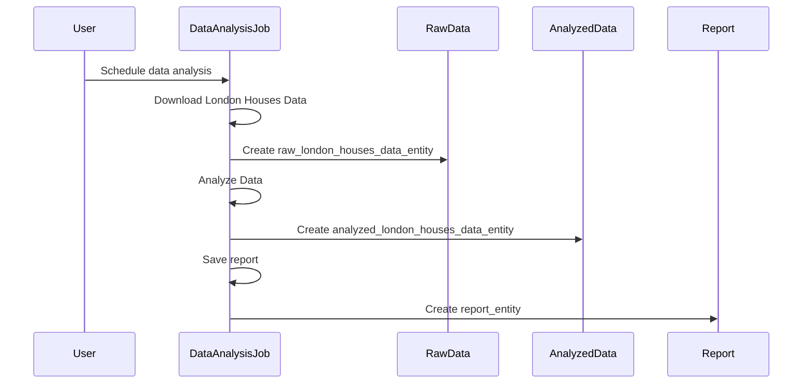

# Product Requirements Document for Cyoda Design

## Overview

This document provides an explanation of the Cyoda design JSON generated for the requirement of downloading London Houses data, analyzing it using pandas, and saving a report. It aims to clarify the structure of the design and how it aligns with the user requirements. 

## What is Cyoda?

Cyoda is an event-driven application framework that organizes workflows around entities and their states. Each entity represents a specific piece of data or a process, and transitions between states are managed automatically or manually based on events that occur within the system. 

### Key Concepts

- **Entities**: These are the fundamental data structures in Cyoda. They can represent jobs, raw data, processed data, and reports. Each entity has specific properties defining its type, source, dependencies, and workflow.
  
- **Workflows**: These are sequences of operations that define how data is processed and transformed. Workflows have states, and transitions dictate how entities move from one state to another based on actions taken.

- **Event-Driven Architecture**: In this architecture, events trigger workflows and transitions. For example, when a job entity is scheduled, it can initiate the download of data, leading to further processing steps.

## Requirement Alignment

The requirement is to download London Houses data, analyze it, and save the results as a report. The Cyoda design provides a structured approach to meet this requirement through the following entities and workflows:

### Entities Breakdown

1. **data_analysis_job**
   - **Type**: JOB
   - **Source**: SCHEDULED
   - **Workflow**: Contains transitions for downloading data, analyzing it, and saving a report.
   - **Purpose**: This job entity orchestrates the entire workflow, ensuring that data is downloaded and processed according to the specified steps.

2. **raw_london_houses_data_entity**
   - **Type**: EXTERNAL_SOURCES_PULL_BASED_RAW_DATA
   - **Source**: ENTITY_EVENT
   - **Dependency**: Dependent on the `data_analysis_job`.
   - **Workflow**: This entity doesn't have a specific workflow attached, as it represents the raw data once downloaded.

3. **analyzed_london_houses_data_entity**
   - **Type**: SECONDARY_DATA
   - **Source**: ENTITY_EVENT
   - **Dependency**: Dependent on the `data_analysis_job`.
   - **Workflow**: Also does not have a specific workflow as it represents the processed analysis data.

4. **report_entity**
   - **Type**: SECONDARY_DATA
   - **Source**: ENTITY_EVENT
   - **Dependency**: Dependent on the `data_analysis_job`.
   - **Workflow**: Represents the final output of the analysis, which is the report.

### Workflow Diagram

```mermaid
graph LR
    A[data_analysis_job] -->|triggers| B[download_london_houses_data]
    B -->|produces| C[raw_london_houses_data_entity]
    C -->|feeds into| D[analyze_data]
    D -->|produces| E[analyzed_london_houses_data_entity]
    E -->|finalizes| F[save_report]
    F -->|produces| G[report_entity]
```

### Sequence Diagram

```mermaid
sequenceDiagram
    participant User
    participant DataAnalysisJob
    participant RawData
    participant AnalyzedData
    participant Report

    User->>DataAnalysisJob: Schedule data analysis
    DataAnalysisJob->>DataAnalysisJob: Download London Houses Data
    DataAnalysisJob->>RawData: Create raw_london_houses_data_entity
    DataAnalysisJob->>DataAnalysisJob: Analyze Data
    DataAnalysisJob->>AnalyzedData: Create analyzed_london_houses_data_entity
    DataAnalysisJob->>DataAnalysisJob: Save report
    DataAnalysisJob->>Report: Create report_entity
```

## How the Event-Driven Approach Works

In this design, the entire process is initiated by scheduling the `data_analysis_job`. The sequences of operations are:
1. **Downloading Data**: The job is scheduled to download data from an external source. This triggers the first transition in the workflow.
2. **Data Processing**: Once the data is downloaded (represented by the `raw_london_houses_data_entity`), the job transitions to analyze the data using pandas.
3. **Report Generation**: After analysis, the final step is to save the report, which results in the creation of the `report_entity`.

The event-driven architecture allows for automatic execution of these steps based on entity states, making the process efficient and scalable.

## Conclusion

The Cyoda design JSON provides a structured approach to manage data workflow for downloading, analyzing, and reporting on London Houses data. By utilizing entities and workflows, the design aligns with the requirement effectively, ensuring a smooth process from data collection to report generation. This document can serve as a foundational overview for users new to the Cyoda framework.