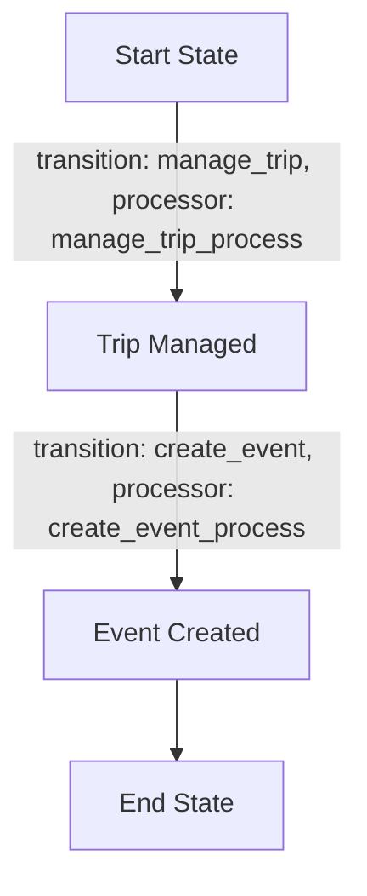
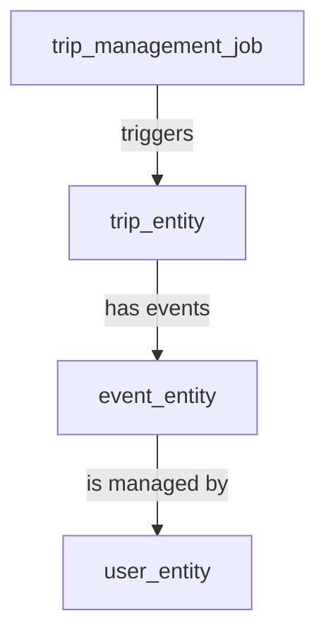
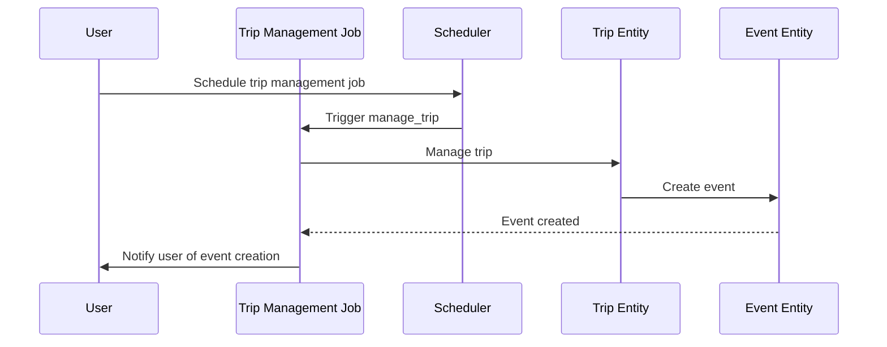

# Product Requirements Document (PRD) for Cyoda Design

## Introduction

This document provides an overview of the Cyoda-based application designed to manage trip scheduling for a group of users. The Cyoda design aligns with the specified requirements by outlining the structure of entities, workflows, and the event-driven architecture that powers the application. The design is represented in a Cyoda JSON format, which is translated into a human-readable document for clarity.

## What is Cyoda?

Cyoda is a serverless, event-driven framework that facilitates the management of workflows through entities representing jobs and data. Each entity has a defined state, and transitions between states are governed by events that occur within the system—enabling a responsive and scalable architecture.

## Cyoda Entity Database

The Cyoda design JSON outlines several entities for our trip scheduling application:

1. **Trip Management Job (`trip_management_job`)**:
   - **Type**: JOB
   - **Source**: SCHEDULED
   - **Description**: This job is responsible for managing trip scheduling and user assignments within the application.

2. **Trip Entity (`trip_entity`)**:
   - **Type**: BUSINESS_ENTITY
   - **Source**: ENTITY_EVENT
   - **Description**: This entity represents a trip that can have multiple users associated with it.

3. **Event Entity (`event_entity`)**:
   - **Type**: SECONDARY_DATA
   - **Source**: ENTITY_EVENT
   - **Description**: This entity holds events created within trips.

4. **User Entity (`user_entity`)**:
   - **Type**: BUSINESS_ENTITY
   - **Source**: ENTITY_EVENT
   - **Description**: This entity represents users in the application, allowing them to coordinate trips and events.

### Workflows

The workflows in Cyoda define how each job entity operates through a series of transitions. The `trip_management_job` includes the following transitions:

- **Manage Trip**: Initiates the trip management process, allowing users to add/remove participants and handle events.
- **Create Event**: Allows users to create events within the context of a trip.

### Flowchart for Trip Management Job Workflow

```mermaid
flowchart TD
    A[Start State] -->|transition: manage_trip, processor: manage_trip_process| B[Trip Managed]
    B -->|transition: create_event, processor: create_event_process| C[Event Created]
    C --> D[End State]
```

### Entity Relationships Diagram

```mermaid
graph TD;
    A[trip_management_job] -->|triggers| B[trip_entity];
    B -->|has events| C[event_entity];
    C -->|is managed by| D[user_entity];
```

### Sequence Diagram for User Interaction

```mermaid
sequenceDiagram
    participant User
    participant Trip Management Job
    participant Scheduler
    participant Trip Entity
    participant Event Entity

    User->>Scheduler: Schedule trip management job
    Scheduler->>Trip Management Job: Trigger manage_trip
    Trip Management Job->>Trip Entity: Manage trip
    Trip Entity->>Event Entity: Create event
    Event Entity-->>Trip Management Job: Event created
    Trip Management Job->>User: Notify user of event creation
```

## Event-Driven Approach

An event-driven architecture allows the application to respond automatically to changes or triggers. For the specific requirement, the following key events occur:

1. **Trip Management**: The trip management job is triggered, initiating the process of managing trips and users.
2. **Event Creation**: Once the trip is managed, an event is created and stored in the event entity.

## Conclusion

The Cyoda design effectively aligns with the requirements for creating a robust trip scheduling application. The outlined entities—trip management job, trip entity, event entity, and user entity—successfully capture the needs of the application. The workflows ensure a smooth and automated process for managing trips and events, allowing users to collaborate efficiently.

This PRD serves as a foundation for implementation and development, guiding the technical team through the specifics of the Cyoda architecture while providing clarity for users who may be new to the Cyoda framework.