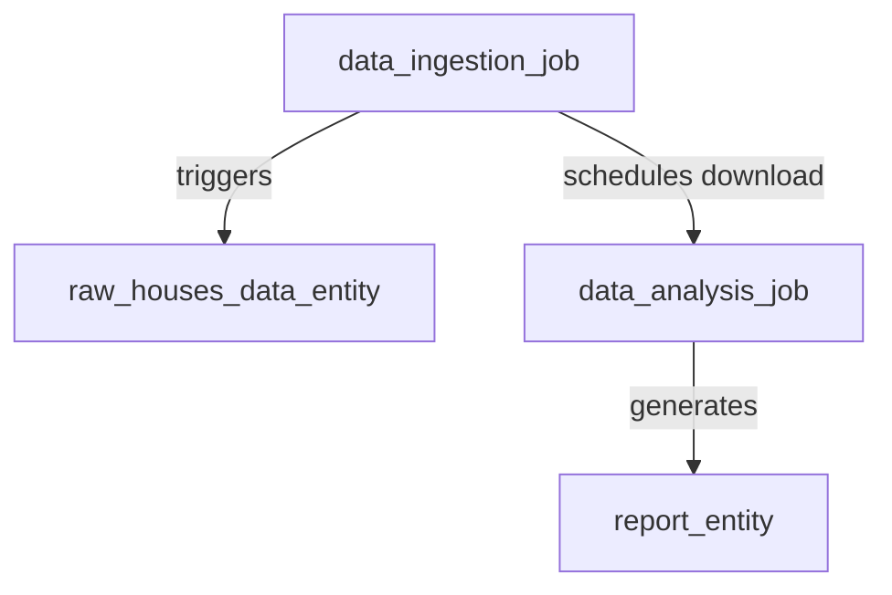
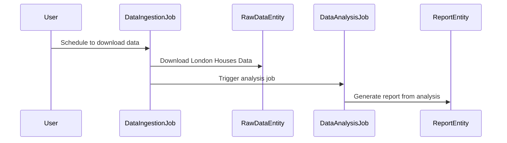

# Product Requirements Document (PRD) for Cyoda Design: London Houses Data Analysis

## Overview of Cyoda

**Cyoda** is an event-driven application framework that allows users to manage workflows dynamically based on entity events. This approach helps in orchestrating processes related to different data entities as state machines, enabling efficient data processing and integration.

### What is an Entity Database in Cyoda?

In Cyoda, an **entity** is a fundamental building block that represents a specific piece of data or functionality. Each entity has defined properties, a type, and a workflow associated with it. The entity database stores various entities, allowing for easy retrieval, modification, and triggering of workflows based on events.

### How Does the Event-Driven Approach Work?

Cyoda utilizes an **event-driven architecture**, meaning that workflows are triggered by events such as the creation or modification of entities. When an event occurs, it can initiate a corresponding process that transitions the entity through different states in its lifecycle. This method provides a responsive and efficient way to manage data workflows.

---

## Requirement Alignment

The requirement requested the downloading of **London Houses Data**, followed by analysis using **pandas**, and saving a report. The Cyoda design JSON structure accommodates these requirements as follows:

### Entities Overview

1. **data_ingestion_job**: 
   - **Type**: JOB
   - **Source**: SCHEDULED
   - **Purpose**: This job triggers the process to download London Houses Data.
   - **Workflow**: It includes a transition that downloads the data and saves it as a raw entity.

2. **raw_houses_data_entity**: 
   - **Type**: EXTERNAL_SOURCES_PULL_BASED_RAW_DATA
   - **Source**: ENTITY_EVENT
   - **Purpose**: This entity stores the raw data downloaded from the ingestion job.
   - **Workflow**: This entity is ready to be processed further but does not have any transitions.

3. **data_analysis_job**: 
   - **Type**: JOB
   - **Source**: SCHEDULED
   - **Purpose**: This job analyzes the downloaded data using pandas.
   - **Workflow**: It incorporates a transition that processes the raw data and generates a report entity.

4. **report_entity**: 
   - **Type**: SECONDARY_DATA
   - **Source**: ENTITY_EVENT
   - **Purpose**: This entity holds the report generated from the data analysis job.
   - **Workflow**: Similar to the raw data entity, it is prepared to capture outputs but does not have defined transitions.

### Diagram of Entities

```mermaid
graph TD;
    A[data_ingestion_job] -->|triggers| B[raw_houses_data_entity];
    A -->|schedules download| C[data_analysis_job];
    C -->|generates| D[report_entity];
```

### Workflow Sequence Diagram

```mermaid
sequenceDiagram
    participant User
    participant DataIngestionJob
    participant RawDataEntity
    participant DataAnalysisJob
    participant ReportEntity

    User->>DataIngestionJob: Schedule to download data
    DataIngestionJob->>RawDataEntity: Download London Houses Data
    DataIngestionJob->>DataAnalysisJob: Trigger analysis job
    DataAnalysisJob->>ReportEntity: Generate report from analysis
```

---

## Detailed Explanation of Each Entity and Workflow

### 1. Data Ingestion Job

- **Purpose**: This job is triggered on a schedule to initiate the downloading of data.
- **Transition**: 
  - **Name**: `download_london_houses_data`
  - **Description**: Downloads data from the specified source.
  - **Process**: This process invokes a method (`download_data_process`) that handles the actual data fetching operation.

### 2. Raw Houses Data Entity

- **Purpose**: Represents the unprocessed data that is downloaded.
- **Workflow**: No transitions are defined here as it serves primarily as a storage entity for future steps.

### 3. Data Analysis Job

- **Purpose**: Once the raw data is available, this job is responsible for processing it to extract useful insights.
- **Transition**: 
  - **Name**: `analyze_houses_data`
  - **Description**: Applies data analysis techniques using pandas.
  - **Process**: The method (`analyze_data_process`) triggers the analysis logic and prepares the results.

### 4. Report Entity

- **Purpose**: This entity captures the output report generated from the analysis.
- **Workflow**: It acts as a final output store but does not interact with other entities in this design.

---

## Conclusion

This Cyoda design effectively addresses the requirements for downloading and analyzing the London Houses Data. By employing an event-driven architecture, it enables seamless transitions between jobs and entities while managing data efficiently. The use of clear entities and their associated workflows allows for a structured approach to data ingestion and analysis, aligning closely with the user's objectives.

This document serves as an introductory guide for new users to understand how Cyoda operates and how the proposed design meets the application requirements.