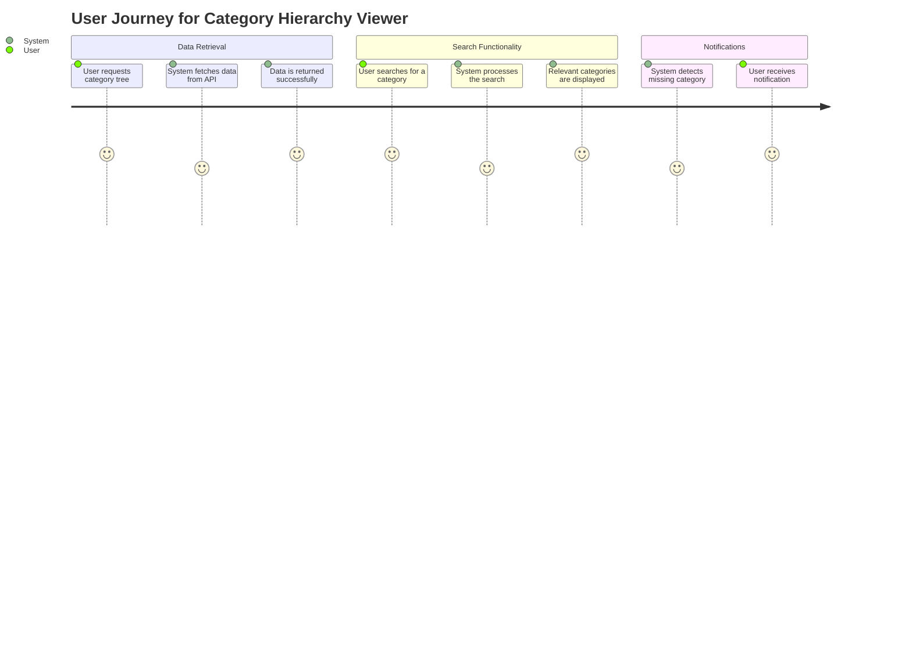
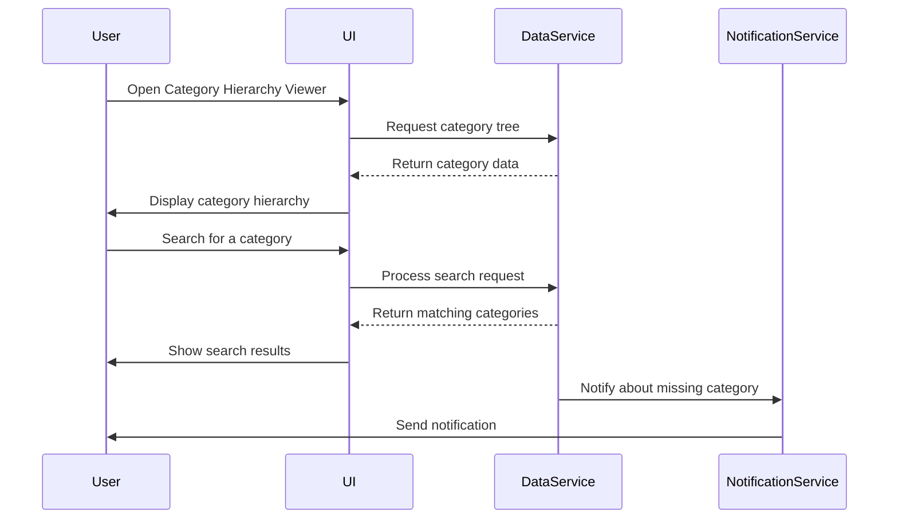
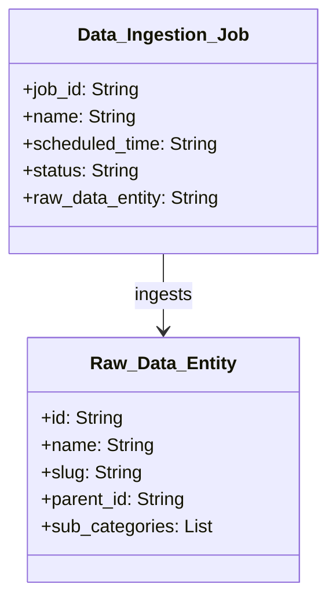
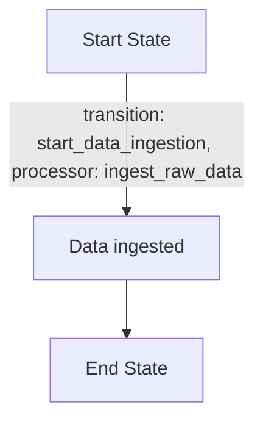

Here’s the complete Product Requirements Document (PRD) for the **Category Hierarchy Viewer Application**. This document includes all relevant sections, including the introduction, detailed requirements, workflows, and diagrams.

---

# Product Requirements Document (PRD) for Category Hierarchy Viewer Application

## Introduction

This document outlines the requirements for developing the **Category Hierarchy Viewer Application**. The primary goal of this application is to visualize category hierarchies using data from the **Practice Software Testing API**. This PRD will serve as a guide for the development team to ensure that the application meets user needs and functions effectively.

## Objectives

- To create an application that retrieves and visualizes category hierarchies from the specified API.
- To enable users to search for specific categories and receive notifications about data availability.
- To design an event-driven architecture that supports efficient data ingestion and processing.

## Key Features

1. **Data Ingestion**: 
   - Retrieve the complete category tree structure using the API.
   - Implement a job that schedules and manages the data retrieval process.

2. **Data Transformation**: 
   - Convert raw category data into a structured format suitable for visualization.
   - Implement workflows that define the transitions between data states.

3. **Data Display**: 
   - Present the category hierarchy in a user-friendly tree view.
   - Allow users to explore sub-categories and related category IDs.

4. **User Interaction**: 
   - Enable users to search for specific categories by name or ID.
   - Provide notifications when selected categories do not exist.

5. **Event-Driven Architecture**: 
   - Utilize an event-driven model to manage workflows and transitions.
   - Ensure scalability and efficiency in data processing.

## Requirements Overview

### User Requirement Document

```markdown
# User Requirement Document for Category Hierarchy Viewer Application
## Overview
This document outlines the requirements for the Category Hierarchy Viewer Application, which aims to visualize category hierarchies using data from the Practice Software Testing API.
## User Stories
1. **As a User**, I want to retrieve the complete category tree structure so that I can view all categories and their sub-categories.
2. **As a User**, I want to search for specific categories by name or ID, allowing me to quickly find relevant information.
3. **As a User**, I want to receive notifications if a selected category or sub-category does not exist, so I am aware of any issues with the data.
## Journey Diagram

```mermaid
journey
    title User Journey for Category Hierarchy Viewer
    section Data Retrieval
      User requests category tree: 5: User
      System fetches data from API: 4: System
      Data is returned successfully: 5: System
    section Search Functionality
      User searches for a category: 5: User
      System processes the search: 4: System
      Relevant categories are displayed: 5: System
    section Notifications
      System detects missing category: 4: System
      User receives notification: 5: User
```
## Sequence Diagram

```mermaid
sequenceDiagram
    participant User
    participant UI
    participant DataService
    participant NotificationService
    User->>UI: Open Category Hierarchy Viewer
    UI->>DataService: Request category tree
    DataService-->>UI: Return category data
    UI->>User: Display category hierarchy
    User->>UI: Search for a category
    UI->>DataService: Process search request
    DataService-->>UI: Return matching categories
    UI->>User: Show search results
    DataService->>NotificationService: Notify about missing category
    NotificationService->>User: Send notification
```

### Entities Outline

1. **Data Ingestion Job (`data_ingestion_job`)**
   - **Description**: Responsible for retrieving the complete category tree structure from the Practice Software Testing API.
   - **Example JSON**:
     ```json
     {
       "job_id": "job_001",
       "name": "Data Ingestion Job",
       "scheduled_time": "2023-10-01T10:00:00Z",
       "status": "pending",
       "raw_data_entity": "raw_data_entity",
       "workflow": {
         "name": "data_ingestion_workflow",
         "transitions": ["start_data_ingestion"]
       }
     }
     ```
   - **Saving Method**: Saved through an ENTITY_EVENT when the job is triggered based on a scheduled time.

2. **Raw Data Entity (`raw_data_entity`)**
   - **Description**: Stores the unprocessed data obtained from the API call to retrieve the category tree.
   - **Example JSON**:
     ```json
     {
       "id": "01JKR602ZXDRRXNZ1M5Y1T4496",
       "name": "Hand Tools",
       "slug": "hand-tools",
       "parent_id": null,
       "sub_categories": [
         {
           "id": "01JKR60308DYZWDKN07F15F1MS",
           "name": "Hammer",
           "slug": "hammer",
           "parent_id": "01JKR602ZXDRRXNZ1M5Y1T4496",
           "sub_categories": []
         }
       ]
     }
     ```
   - **Saving Method**: Saved directly via an API call during the data ingestion process.

### Entities Diagram


```mermaid
classDiagram
    class Data_Ingestion_Job {
        +job_id: String
        +name: String
        +scheduled_time: String
        +status: String
        +raw_data_entity: String
    }
    class Raw_Data_Entity {
        +id: String
        +name: String
        +slug: String
        +parent_id: String
        +sub_categories: List
    }
    Data_Ingestion_Job --> Raw_Data_Entity: ingests
```

### Workflows and Flowcharts

#### Workflow for Data Ingestion Job


```mermaid
flowchart TD
  A[Start State] -->|transition: start_data_ingestion, processor: ingest_raw_data| B[Data ingested]
  B --> C[End State]
```

## Conclusion

This PRD provides a comprehensive overview of the requirements for the **Category Hierarchy Viewer Application**. It outlines the key features, user stories, entity diagrams, and workflows necessary for the successful development of the application. By adhering to this document, the development team can ensure that the application meets user needs and operates efficiently.

If you have any further questions or need additional modifications, please let me know! I'm here to help and support you throughout this process!