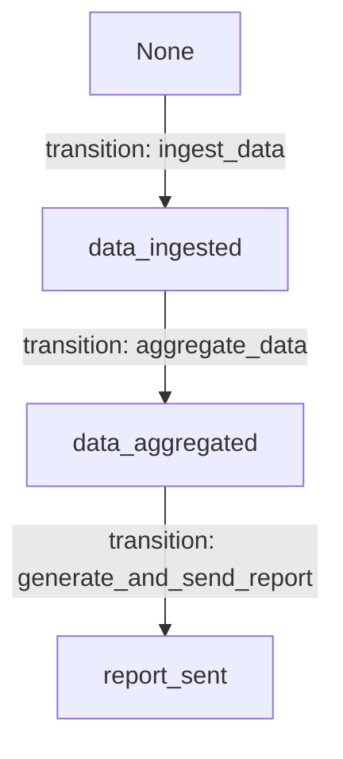
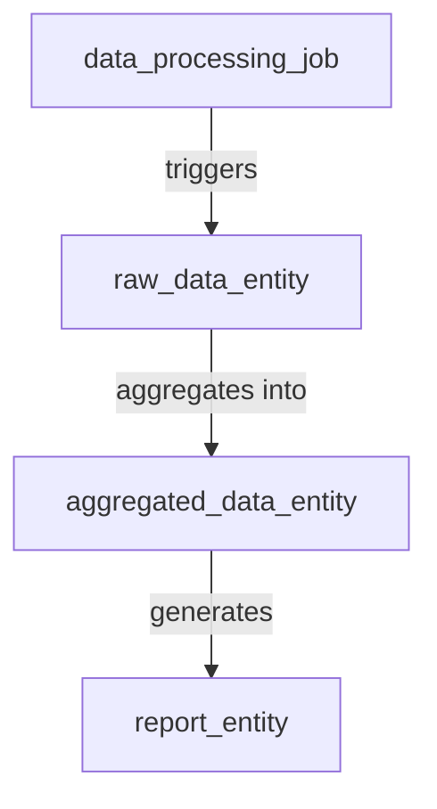
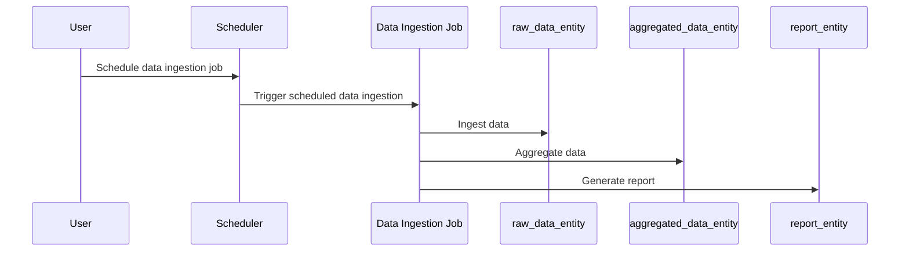
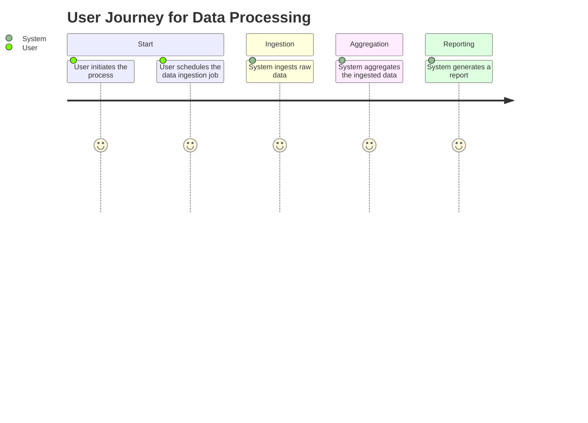

# Product Requirements Document (PRD) for Cyoda Design JSON

## Overview

The goal of this document is to outline the design of a Cyoda application that handles data ingestion, aggregation, and report generation based on the provided requirement: "I would like to develop an application that ingests data from a specified data source, aggregates the data, and saves the aggregated data to a report."

The Cyoda design utilizes a workflow-oriented approach to achieve these functionalities through a series of defined entities and their interactions. The following sections provide a detailed explanation of the entities, their relationships, and the workflows that dictate their operations.

## Cyoda Design JSON Explanation

### Entities

1. **Data Processing Job (`data_processing_job`)**: 
   - **Type**: JOB
   - **Source**: SCHEDULED
   - **Workflow**: Contains multiple transitions to process data, including ingestion from a specific data source, aggregation of the ingested data, and generation of a report.
   - **Transitions**:
     - **Ingest Data**: This transition ingests raw data from the specified source.
     - **Aggregate Data**: This transition aggregates the previously ingested data.
     - **Generate and Send Report**: This transition generates a report based on the aggregated data.

2. **Raw Data Entity (`raw_data_entity`)**: 
   - **Type**: EXTERNAL_SOURCES_PULL_BASED_RAW_DATA
   - **Source**: ENTITY_EVENT
   - **Depends on**: `data_processing_job`
   - **Workflow**: Currently, it has no transitions defined, acting as a data store for ingested raw data.

3. **Aggregated Data Entity (`aggregated_data_entity`)**: 
   - **Type**: SECONDARY_DATA
   - **Source**: ENTITY_EVENT
   - **Depends on**: `data_processing_job`
   - **Workflow**: Similar to `raw_data_entity`, it holds aggregated data without any transitions.

4. **Report Entity (`report_entity`)**: 
   - **Type**: SECONDARY_DATA
   - **Source**: ENTITY_EVENT
   - **Depends on**: `data_processing_job`
   - **Workflow**: Holds the final report generated from the aggregated data.

### Workflow Diagram Flowcharts

Each entity workflow with transitions is represented in a flowchart format.

#### Data Processing Job Workflow

```mermaid
flowchart TD
    A[None] -->|transition: ingest_data| B[data_ingested]
    B -->|transition: aggregate_data| C[data_aggregated]
    C -->|transition: generate_and_send_report| D[report_sent]

    class A,B,C,D automated;
```

### Entity Relationship Diagram
This diagram illustrates the relationships between entities.

```mermaid
graph TD;
    A[data_processing_job] -->|triggers| B[raw_data_entity];
    B -->|aggregates into| C[aggregated_data_entity];
    C -->|generates| D[report_entity];
```

### Sequence Diagram
This diagram describes the sequence of operations initiated by a user scheduling the data ingestion job.

```mermaid
sequenceDiagram
    participant User
    participant Scheduler
    participant Data Ingestion Job

    User->>Scheduler: Schedule data ingestion job
    Scheduler->>Data Ingestion Job: Trigger scheduled data ingestion
    Data Ingestion Job->>raw_data_entity: Ingest data
    Data Ingestion Job->>aggregated_data_entity: Aggregate data
    Data Ingestion Job->>report_entity: Generate report
```

### Journey Diagram
This diagram captures the user journey throughout the data processing workflow.

```mermaid
journey
    title User Journey for Data Processing
    section Start
      User initiates the process: 5: User
      User schedules the data ingestion job: 5: User
    section Ingestion
      System ingests raw data: 5: System
    section Aggregation
      System aggregates the ingested data: 5: System
    section Reporting
      System generates a report: 5: System
```

## Conclusion

The Cyoda design outlined in this document effectively aligns with the given requirements for ingesting, aggregating, and reporting on data. Each component plays a critical role in ensuring the seamless flow of data from ingestion to reporting.

The visual diagrams provide a clear understanding of the workflows, relationships, and sequences involved, helping stakeholders grasp the operational structure of the Cyoda application.