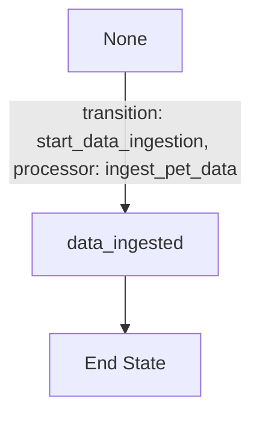
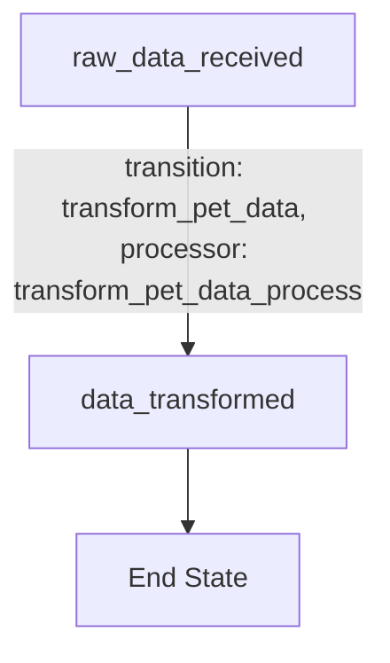
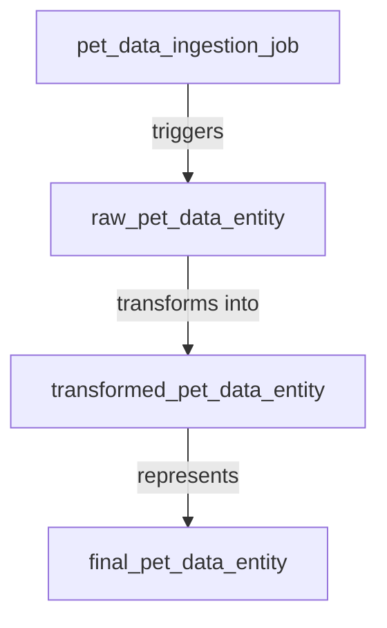
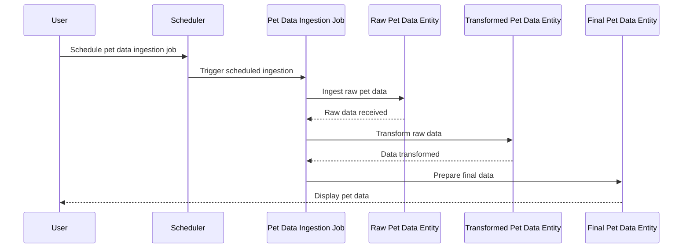

# Product Requirements Document (PRD) for Cyoda Design

## Introduction

This document outlines the Cyoda-based application designed to retrieve pet details through specified parameters, including data ingestion, transformation, and user interaction. It explains how the Cyoda design aligns with the specified requirements and provides an overview of the entities and workflows involved. Furthermore, it includes various visual diagrams to illustrate the system's architecture.

## Cyoda Design JSON Overview

The Cyoda design JSON represents the application's structure, focusing on entities, their types, sources, workflows, and transitions. The following entities have been defined based on the requirements:

1. **Pet Data Ingestion Job (`pet_data_ingestion_job`)**:
   - **Type**: JOB
   - **Source**: SCHEDULED
   - **Description**: Responsible for ingesting pet data based on user-defined parameters.

2. **Raw Pet Data Entity (`raw_pet_data_entity`)**:
   - **Type**: EXTERNAL_SOURCES_PULL_BASED_RAW_DATA
   - **Source**: ENTITY_EVENT
   - **Description**: Stores raw pet data received from the ingestion job.

3. **Transformed Pet Data Entity (`transformed_pet_data_entity`)**:
   - **Type**: SECONDARY_DATA
   - **Source**: ENTITY_EVENT
   - **Description**: Contains the transformed pet data, restructured for better usability.

4. **Final Pet Data Entity (`final_pet_data_entity`)**:
   - **Type**: SECONDARY_DATA
   - **Source**: ENTITY_EVENT
   - **Description**: Represents the final pet data ready for display to the user.

### Workflow Overview

The workflows associated with each job and data entity define how they transition through different states based on specific processes. Here are the workflows associated with the entities:

#### Workflow for Pet Data Ingestion Job

```mermaid
flowchart TD
    A[None] -->|transition: start_data_ingestion, processor: ingest_pet_data| B[data_ingested]
    B --> D[End State]
    class A,B,D automated;
```

#### Workflow for Transformed Pet Data Entity

```mermaid
flowchart TD
    A[raw_data_received] -->|transition: transform_pet_data, processor: transform_pet_data_process| B[data_transformed]
    B --> D[End State]
    class A,B,D automated;
```

### Entity Relationships

The following diagram illustrates the relationships between the entities in the system.

```mermaid
graph TD;
    A[pet_data_ingestion_job] -->|triggers| B[raw_pet_data_entity];
    B -->|transforms into| C[transformed_pet_data_entity];
    C -->|represents| D[final_pet_data_entity];
```

### Sequence Diagram

The sequence diagram below illustrates the interactions among the various actors involved in the pet data retrieval process.

```mermaid
sequenceDiagram
    participant User
    participant Scheduler
    participant Pet Data Ingestion Job
    participant Raw Pet Data Entity
    participant Transformed Pet Data Entity
    participant Final Pet Data Entity

    User->>Scheduler: Schedule pet data ingestion job
    Scheduler->>Pet Data Ingestion Job: Trigger scheduled ingestion
    Pet Data Ingestion Job->>Raw Pet Data Entity: Ingest raw pet data
    Raw Pet Data Entity-->>Pet Data Ingestion Job: Raw data received
    Pet Data Ingestion Job->>Transformed Pet Data Entity: Transform raw data
    Transformed Pet Data Entity-->>Pet Data Ingestion Job: Data transformed
    Pet Data Ingestion Job->>Final Pet Data Entity: Prepare final data
    Final Pet Data Entity-->>User: Display pet data
```

### Conclusion

The Cyoda design effectively aligns with the requirements for building an application that retrieves and processes pet details. By leveraging an event-driven architecture, the system can automatically respond to user input and efficiently manage data from ingestion to transformation and display. 

The outlined entities, workflows, and transitions comprehensively cover the needs of the application, ensuring a responsive and user-friendly experience.
