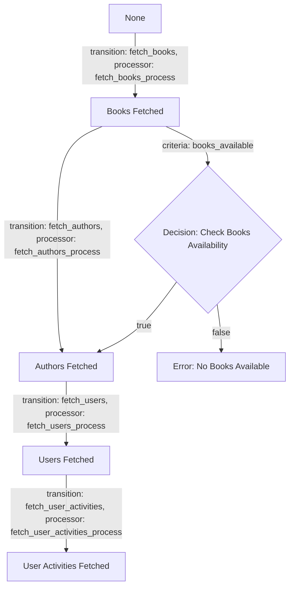
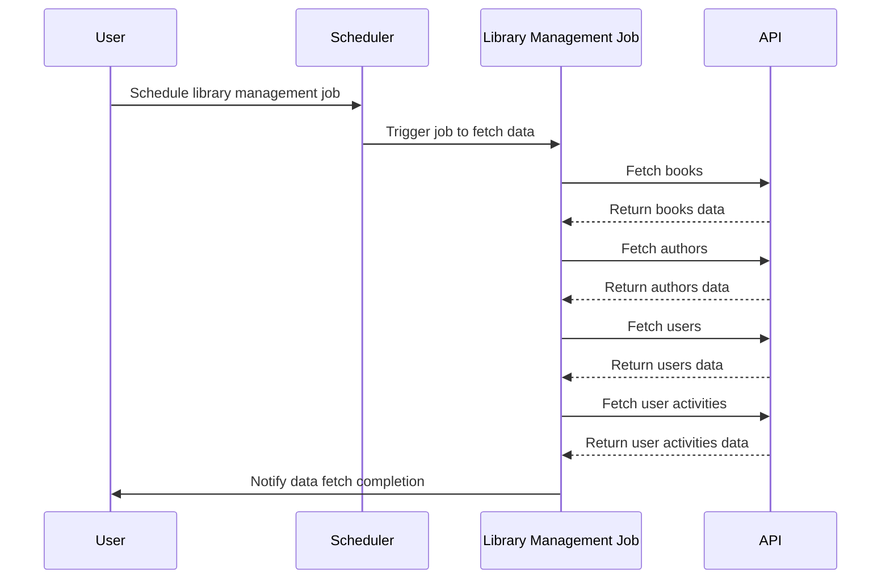
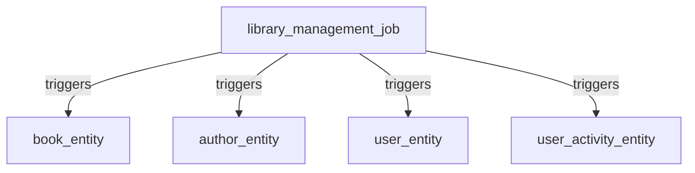
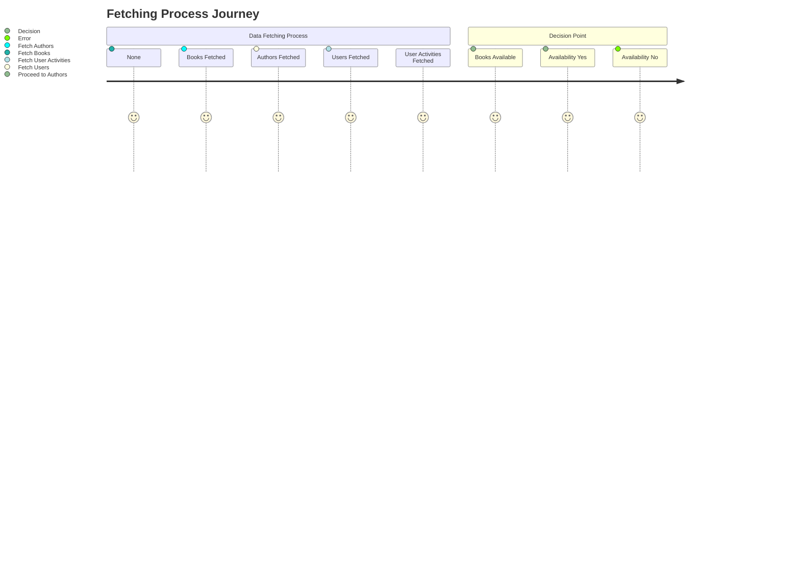

# Product Requirements Document (PRD) for Library Manager Pro Cyoda Design

## Introduction

This document provides a comprehensive overview of the updated Cyoda-based application design for Library Manager Pro. This system is intended to manage library operations, including book management, author management, user management, and user activity management via integration with the FakeRest API. The design outlined aligns directly with the specified requirements and focuses on the structure of entities, workflows, and the event-driven architecture that underpins the application.

## Cyoda Overview

Cyoda is a serverless, event-driven framework that simplifies workflow management through entities which represent jobs and data. Each entity in the framework has a defined state, with transitions between states governed by events. This enables a responsive and scalable architecture suitable for applications like Library Manager Pro.

## Cyoda Entity Database

The updated Cyoda design JSON outlines several key entities for the Library Manager Pro application:

1. **Library Management Job (`library_management_job`)**:
   - **Type**: JOB
   - **Source**: SCHEDULED
   - **Description**: Responsible for orchestrating workflows that fetch data from the FakeRest API for books, authors, users, and user activities.

2. **Book Entity (`book_entity`)**:
   - **Type**: EXTERNAL_SOURCES_PULL_BASED_RAW_DATA
   - **Source**: ENTITY_EVENT
   - **Description**: Stores data fetched about books.

3. **Author Entity (`author_entity`)**:
   - **Type**: EXTERNAL_SOURCES_PULL_BASED_RAW_DATA
   - **Source**: ENTITY_EVENT
   - **Description**: Stores data fetched about authors.

4. **User Entity (`user_entity`)**:
   - **Type**: EXTERNAL_SOURCES_PULL_BASED_RAW_DATA
   - **Source**: ENTITY_EVENT
   - **Description**: Stores data fetched about users.

5. **User Activity Entity (`user_activity_entity`)**:
   - **Type**: EXTERNAL_SOURCES_PULL_BASED_RAW_DATA
   - **Source**: ENTITY_EVENT
   - **Description**: Stores data fetched about user activities.

## Workflow Overview

The workflows in Cyoda are primarily managed through the `library_management_job`. This job coordinates the fetching of data from various API endpoints and saves them into their respective entities.

### Flowchart for Library Management Job

```mermaid
flowchart TD
    A[None] -->|transition: fetch_books, processor: fetch_books_process| B[Books Fetched]
    B -->|transition: fetch_authors, processor: fetch_authors_process| C[Authors Fetched]
    C -->|transition: fetch_users, processor: fetch_users_process| D[Users Fetched]
    D -->|transition: fetch_user_activities, processor: fetch_user_activities_process| E[User Activities Fetched]

    %% Decision point for criteria
    B -->|criteria: books_available| D1{Decision: Check Books Availability}
    D1 -->|true| C
    D1 -->|false| E1[Error: No Books Available]

    class A,B,C,D,E,D1,E1 automated;
```

## Event-Driven Architecture

The event-driven architecture allows the Library Manager Pro application to respond automatically to changes or triggers. In this case, the following events are significant:

1. **Data Fetching Events**: The library management job initiates at scheduled intervals to fetch data from various endpoints of the FakeRest API.
  
2. **Entity Updates**: Each fetched data set is stored within its respective entity, ready for future processing or presentation.

### Sequence Diagram for Library Management Job

```mermaid
sequenceDiagram
    participant User
    participant Scheduler
    participant Library Management Job
    participant API

    User->>Scheduler: Schedule library management job
    Scheduler->>Library Management Job: Trigger job to fetch data
    Library Management Job->>API: Fetch books
    API-->>Library Management Job: Return books data
    Library Management Job->>API: Fetch authors
    API-->>Library Management Job: Return authors data
    Library Management Job->>API: Fetch users
    API-->>Library Management Job: Return users data
    Library Management Job->>API: Fetch user activities
    API-->>Library Management Job: Return user activities data
    Library Management Job->>User: Notify data fetch completion
```

## Entities and Their Relationships

This section highlights the relationships between entities. The `library_management_job` orchestrates the fetching of data, which populates the respective data entities according to the following diagram:

```mermaid
graph TD;
    A[library_management_job] -->|triggers| B[book_entity];
    A -->|triggers| C[author_entity];
    A -->|triggers| D[user_entity];
    A -->|triggers| E[user_activity_entity];
```

```mermaid
journey
    title Fetching Process Journey
    section Data Fetching Process
      None: 5: Fetch Books:
      Books Fetched: 5: Fetch Authors:
      Authors Fetched: 5: Fetch Users:
      Users Fetched: 5: Fetch User Activities:
      User Activities Fetched: 5

    section Decision Point
      Books Available: 5: Decision: Check Books Availability:
      Availability Yes: 5: Proceed to Authors
      Availability No: 5: Error: No Books Available
```
## Conclusion

The updated Cyoda design aligns effectively with the requirements for the Library Manager Pro application. By utilizing the event-driven model, the application efficiently manages state transitions of each entity involved, from data fetching to storage. The outlined entities, workflows, and events comprehensively cover the needs of the application, ensuring a smooth and automated process for library management.

This PRD serves as a foundational guide for the implementation and development of the Library Manager Pro application using the Cyoda framework.
